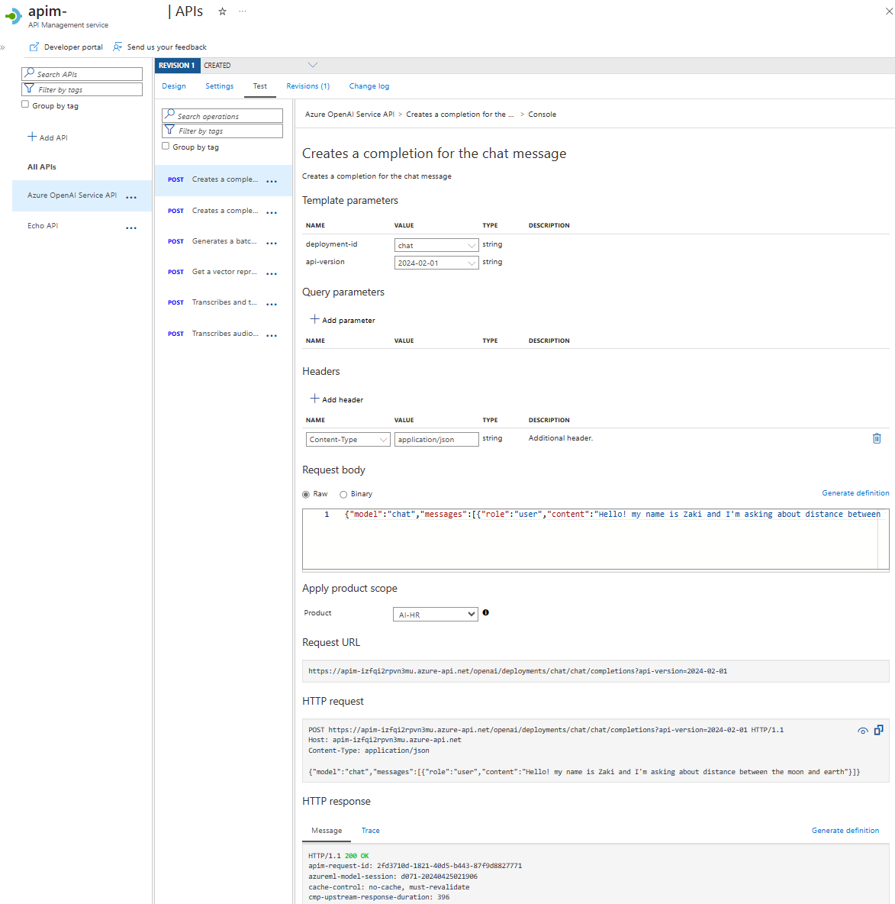

# 🏰 Citadel Governance Hub

<div align="center">
    
    <br>
    <strong>Enterprise AI Landing Zone</strong>
    <br>
    <em>A comprehensive solution accelerator for governing, observing, and accelerating AI deployments at scale with unified security, compliance, and intelligent orchestration.</em>
</div>

---

## 🎯 Transform Your AI Strategy

> **62%** of practitioners cite security concerns as the top blocker to wider AI adoption  
> **71%** of enterprises struggle to track AI usage, enforce quotas, and report costs  
> **47%** of organizations require explicit guardrails before deploying AI agents  
> **70%** of customers need an AI registry for agents and tools to scale AI adoption  

**AI Citadel Governance Hub turns these challenges into platform strengths** — governed access, transparent consumption, defensible guardrails, and a shared catalog of reusable AI capabilities.

---

## 🚀 What is AI Citadel Governance Hub?

Citadel Governance Hub is an **enterprise-grade AI landing zone** that establishes a centralized, governable, and observable control plane for all AI service consumption across multiple teams, use cases, and environments. 

Instead of fragmented, unmonitored, key-based model access, Citadel Governance Hub provides a **unified AI gateway pattern** built on Azure API Management (APIM), adding:
- ✅ Intelligent routing and load balancing
- ✅ Security enforcement and compliance guardrails  
- ✅ Usage analytics and cost attribution
- ✅ AI registry for agents, tools, and services
- ✅ Automated onboarding and governance workflows

This elevates AI consumption from **ad-hoc experimentation to scalable, auditable, and cost-attributable platform capability**.

---

## 🏛️ Three Pillars of AI Citadel

AI Citadel Governance Hub is built on three foundational pillars that address enterprise AI adoption challenges end-to-end:

### 1️⃣ **Governance & Security Pillar** – Trustworthy AI Operations at Scale

**🔐 Why Governance Matters:** Without centralized AI governance, organizations face unpredictable costs, reliability issues, security risks, developer friction, and compliance nightmares. AI Citadel fixes this by building guardrails into every AI call.

**Key Capabilities:**

| Capability | Description |
|------------|-------------|
| **🚪 Unified AI Gateway** | Central entry point (APIM) for all AI requests with consistent policy enforcement |
| **🗝️ Managed Credentials** | Gateway-keys pattern replaces master API keys with scoped, revocable tokens and support for JWT tokens |
| **🛡️ Policy Enforcement** | Granular access control, rate/token limiting, token quotas, and traffic mediation |
| **🌐 Multi-Cloud Support** | Govern Azure OpenAI, open-source models, third-party models under one umbrella |
| **🛡️ AI Content Safety** | Built-in Azure AI Content Safety with prompt shields, harmful content detection, and protected content checks |
| **📊 Cost Governance** | Centralized logging, usage tracking, and cost attribution by team/application |
| **📘 AI Registry** | Unified catalog for LLMs, AI tools (through Model Context Protocol (MCP)), and agents |
| **🔒 Data Security** | Built-in support for PII detection in addition to Microsoft Purview integration for sensitivity labels and data governance |

---

### 2️⃣ **Observability & Compliance Pillar** – End-to-End Monitoring, Evaluation & Trust

**📊 Full Visibility = Trust & Confidence:** AI Citadel provides holistic observability through a dual-layer approach ensuring teams can debug issues, assure quality, and govern compliance in real-time.

#### 🏗️ **Platform-Level Observability**
As part of AI Citadel Governance Hub, a centralized monitoring without requiring agent code changes provides:

| Feature | Description |
|---------|-------------|
| **📊 Central Application Performance Monitoring** | Azure Monitor and Application Insights for infrastructure metrics and system health |
| **📈 Usage Tracking** | Token consumption, request volumes, cost allocation by team/use case/agent |
| **🔍 Centralized AI Evaluation** | Automated quality evaluations (groundedness, relevance, coherence, safety) without code changes |
| **🚨 Enterprise Alerts** | Configurable alerts with automated remediation and compliance reporting |

Platform observability is enabled out-of-the-box for all AI workloads routing through the AI Citadel Governance Hub.

---

### 3️⃣ **AI Development Velocity Pillar** – Accelerating Innovation with Templates & Tools

**🚀 Build Fast, Build Right:** AI Citadel Governance Hub support integrating existing agents and tools in addition to support integrating new agents which enable teams to experiment and innovate quickly without sacrificing governance or quality.

AI Citadel Governance Hub provides automatable agent onboarding configurations through **Citadel Access & Publish Contracts** along with reusable blueprints and templates for common AI patterns.

**Key Capabilities:**

| Capability | Description |
|------------|-------------|
| **🚀 Citadel Access Contract** | Govern the required access to LLMs and centrally managed tools and agents |
| **🤖 Citadel Publish Contract** | Provide the ability to publish agents and tools on AI Citadel Governance Hub |
| **📘 Citadel AI Registry** | Central catalog for discovering, managing, and reusing AI assets across the enterprise |
| **🔄 DevOps Integration** | Automate and source control both access and public AI Citadel Contracts |

---

## 🏗️ Architecture Overview

AI Citadel Governance Hub follows a **hub-spoke architecture** that integrates seamlessly with your existing enterpriseAzure Landing Zone:


### 🎯 **Citadel Governance Hub (Citadel Governance Hub)** - Central Control Plane

The central governance layer that all AI workloads route through.

#### Core Components:

| Component | Purpose | Enterprise Features |
|-----------|---------|---------------------|
| **🚪 API Management** | Unified AI gateway | LLM governance, AI resiliency, AI registry gateway |
| **📘 API Center** | Universal AI Registry | Discovery of available AI tools, agents and AI services |
| **🔍 Microsoft Foundry** | Platform Observability | Platform AI Evaluations & Compliance reports |
| **📊 Log Analytics** | Logs, metrics & audits | Scalable enterprise telemetry ingestion and storage |
| **📊 Application Insights** | Platform monitoring | Performance dashboards, automated alerts |
| **📨 Event Hub** | Usage data streaming | Real-time usage streaming, custom logging |
| **🛡️ Content Safety** | LLM protection | Prompt Shield and Content Safety protections |
| **💳 Language Service** | PII detection | Natural language based PII entity detection, anonymization |
| **🗄️ Cosmos DB** | Usage analytics | Long-term storage of usage, automatic scaling |
| **⚡ Logic App** | Event processing | Workflow-based processing of usage/logs & AI Eval |
| **🔐 Managed Identity** | Zero-credential auth | Secure service-to-service communication |
| **🔗 Virtual Network** | Private connectivity | BYO-VNET support, private endpoints |

#### Security & Compliance

Supported by subscription wide security services:

| Service | Purpose |Enterprise Features |
|---------|---------|---------------------|
|**Defender for Cloud**|Threat protection|AI workload security posture management|
|**Purview**|Data governance|Sensitivity labeling, data classification|
|**Entra ID**|Identity & access management|Zero Trust architecture, conditional access|

#### AI Services

Optionally you can deploy one or more generative AI services in the hub:

| Service | Purpose | Enterprise Features |
|---------|---------|---------------------|
| **Microsoft Foundry** | LLM model hosting | Private endpoints, dedicated capacity, enterprise SLAs |

#### Optional Components

| Component | Purpose |
|-----------|---------|
| **Azure Managed Redis** | Caching layer for high-throughput AI workloads |


### 🌐 **Citadel Agent Spoke (CAS)** - AI Development Environments

Dedicated, secure environments for building and hosting AI agents:

| Component | Purpose |
|-----------|---------|
| **🤖 Azure AI Foundry** | AI agent development platform with Standard Agent Services |
| **🔍 Azure AI Search** | Vector and hybrid search for RAG patterns |
| **🗄️ Azure Cosmos DB** | Distributed database for agent state and conversations |
| **💾 Azure Storage** | Blob storage for documents and model artifacts |
| **🔐 Azure Key Vault** | Secrets and certificate management |
| **📊 Container Apps** | Containerized AI applications and microservices |
| **📦 Container Registry** | Container image registry for AI workloads |

> **Note:** CAS deployment is optional and represents the AI development velocity pillar. Multiple spokes can connect to a single Citadel Governance Hub.

---

## 📋 Prerequisites

**Azure Requirements:**
- Azure Account with [OpenAI access approved](https://aka.ms/oaiapply)
- Subscription with `Microsoft.Authorization/roleAssignments/write` permissions  
- Sufficient OpenAI capacity in target regions (East US, North Central US, East US 2)

**Development Tools:**
- [Azure Developer CLI (azd)](https://learn.microsoft.com/azure/developer/azure-developer-cli/install-azd)
- [Azure CLI](https://docs.microsoft.com/cli/azure/install-azure-cli)
- [VS Code](https://code.visualstudio.com/Download) (optional)

---

## 🚀 Quick Deploy

Deploy your Citadel Governance Hub in minutes with Azure Developer CLI:

```bash
# Authenticate and setup environment
azd auth login
azd env new citadel-governance-hub

# Deploy Citadel Governance Hub
azd up
```

> 💡 **Tip**: Use Azure Cloud Shell to avoid local setup. Review [main.bicep](./infra/main.bicep) configuration before deployment.

### ✅ Post-Deployment Validation

Once deployed, access your Citadel AI Gateway through Azure API Management:



**Key Endpoints:**
- **AI Gateway**: `https://<your-apim>.azure-api.net`
- **AI Registry**: Azure API Center portal
- **Monitoring Dashboard**: Application Insights
- **Usage Analytics**: Power BI Dashboard (optional)

---

## 📚 Comprehensive Documentation

Master Citadel implementation and operations with our detailed guides:

### 🏗️ **Architecture & Deployment**

| Guide | Description |
|-------|-------------|
| [Architecture Overview](./guides/architecture.md) | Complete system design and Citadel pillars |
| [Deployment Guide](./guides/deployment.md) | Step-by-step deployment instructions |
| [Enterprise Provisioning](./guides/enterprise-provisioning.md) | Branch-based deployment, CI/CD automation |
| [APIM Configuration](./guides/apim-configuration.md) | Advanced API Management policies and routing |
| [Bring Your Own Network](./guides/bring-your-own-network.md) | Deploy into existing VNets with private connectivity |
| [Deployment Troubleshooting](./guides/deployment-troubleshooting.md) | Common issues and solutions |

### 🔧 **AI Service Integration**

| Guide | Description |
|-------|-------------|
| [OpenAI Onboarding](./guides/openai-onboarding.md) | Add Azure OpenAI instances and models (including Realtime API) |
| [AI Search Integration](./guides/ai-search-integration.md) | Vector search and RAG capabilities |
| [AI Foundry Integration](./guides/ai-studio-integration.md) | Custom model deployment and AI Foundry projects |
| [Document Intelligence](./guides/doc-intell-onboarding.md) | Advanced document processing integration |
| [End-to-End Scenario](./guides/end-to-end-scenario.md) | Complete chat-with-data implementation |

### 🛡️ **Security & Compliance**

| Guide | Description |
|-------|-------------|
| [PII Detection & Masking](./guides/pii-masking-apim.md) | Automated sensitive data protection |
| [Entra ID Authentication](./guides/entraid-auth-validation.md) | JWT validation and Zero Trust implementation |
| [Use Case Onboarding](./guides/use-case-onboarding-decision-guide.md) | Multi-service AI solution patterns |
| [Citadel Access Contracts](./guides/Citadel-Access-Contracts.md) | AI Access & Publish Contract specifications |

### 📊 **Observability & Analytics**

| Guide | Description |
|-------|-------------|
| [Power BI Dashboard](./guides/power-bi-dashboard.md) | Usage analytics and cost allocation dashboards |
| [Throttling Events Monitoring](./guides/throttling-events-handling.md) | Real-time 429 error tracking with alerts |
| [Dynamic Throttling Assignment](./guides/dynamic-throttling-assignment.md) | Intelligent load balancing for PTU models |
| [Usage Ingestion](./guides/openai-usage-ingestion.md) | Token tracking and billing integration |

### ⚙️ **Advanced Capabilities**

| Guide | Description |
|-------|-------------|
| [Hybrid Deployment](./guides/ai-hub-gateway-hybrid-deployment.md) | Multi-cloud and edge scenarios |
| [Dynamic LLM Backend Configuration](./guides/dynamic-llm-backend-configuration.md) | Runtime backend selection and failover |
| [Use Case Onboarding Automation](./infra/usecase-onboarding/README.md) | Automate APIM Products, Subscriptions, and Key Vault secrets |

---

## 🎯 Key Use Cases

Citadel Governance Hub enables secure, scalable AI deployment across diverse enterprise scenarios:

### 💼 **Enterprise AI Governance**
- Centralized access control for all AI services across departments
- Cost attribution and chargeback to business units
- Compliance reporting and audit trails
- Shadow AI prevention and policy enforcement

### 🤖 **Multi-Agent Systems**
- Discover and reuse agents through the AI Registry
- Govern agent-to-agent communication
- Monitor multi-agent workflows end-to-end
- Enforce safety guardrails across agent interactions

### 🌐 **Multi-Cloud AI Strategy**
- Unified governance across Azure OpenAI, AWS Bedrock, and open-source models
- Consistent security policies regardless of backend
- Seamless migration and failover between providers
- Cost optimization through intelligent routing

### 🔒 **Regulated Industries**
- Financial services compliance (SOC 2, PCI DSS)
- Healthcare data protection (HIPAA)
- Government security requirements (FedRAMP)
- PII detection and anonymization

### 📊 **AI Operations at Scale**
- Support thousands of concurrent AI applications
- Real-time usage monitoring and alerts
- Capacity planning and quota management
- Performance optimization and troubleshooting

---

## 🔄 Integration with Citadel Agent Spoke (CAS)

Citadel Governance Hub seamlessly integrates with **Citadel Agent Spoke** environments through automated governance alignment:

### 📝 **AI Access Contract**
Declares the governed dependencies an agent needs—LLMs, AI services, tools, and reusable agents—along with precise access policies:
- Model selection and capacity allocation
- Regional preferences and compliance requirements
- Safety and security guardrails
- Usage quotas and cost limits

### 📤 **AI Publish Contract**
Describes the tools and agents a spoke exposes back to the hub:
- Publishing rules and governance gates
- Ownership metadata and documentation
- Security posture and compliance status
- Discovery and cataloging in the AI Registry

**Benefits:**
- ✅ Audit-ready traceability through infrastructure-as-code
- ✅ Faster release cycles with automated approvals
- ✅ Reduced manual effort in governance onboarding
- ✅ Continuous policy compliance verification

> 🔗 **Learn More:** [Citadel Access Contracts Guide](./guides/Citadel-Access-Contracts.md)

---

## 🌟 What Makes Citadel Different?

| Traditional Approach | Citadel Governance Hub |
|---------------------|------------------------|
| ❌ Direct API key access per team | ✅ Centralized gateway with managed credentials |
| ❌ Fragmented monitoring per service | ✅ Unified observability across all AI workloads |
| ❌ Manual cost tracking and allocation | ✅ Automated usage tracking and chargeback |
| ❌ Inconsistent security policies | ✅ Enforced guardrails on every AI call |
| ❌ Shadow AI and governance gaps | ✅ Complete visibility and control |
| ❌ Slow onboarding and provisioning | ✅ Automated templates and reusable blueprints |

---

## 🏆 Benefits by Stakeholder

### 👨‍💼 **For CIOs & Business Leaders**
- **Accelerate AI ROI** - Deploy AI solutions 10x faster with pre-built templates
- **Reduce Risk** - Enforce compliance and security policies automatically
- **Control Costs** - Precise cost attribution and quota management
- **Demonstrate Governance** - Audit-ready compliance and transparency

### 👨‍💻 **For Developers & Data Scientists**
- **Focus on Innovation** - Governance handled by the platform
- **Self-Service Access** - Discover and consume AI services through the registry
- **Rich Tooling** - Support for Copilot Studio, Semantic Kernel, LangChain, AutoGen
- **Fast Iteration** - CI/CD integration with automated testing

### 🛡️ **For Security & Compliance Teams**
- **Zero Trust Architecture** - Private endpoints and managed identities throughout
- **Content Safety** - Automatic prompt and response filtering
- **PII Protection** - Detect and redact sensitive data automatically
- **Audit Trails** - Complete logging and trace capabilities

### 📊 **For Operations Teams**
- **Single Pane of Glass** - Unified monitoring across all AI workloads
- **Proactive Alerting** - Detect and remediate issues before impact
- **Performance Insights** - Detailed traces and analytics
- **Capacity Planning** - Usage trends and forecasting

---

## 🗺️ Roadmap & Evolution

Citadel Governance Hub is continuously evolving as part of the **Foundry Citadel Platform** vision:

### ✅ **Current Release**
- Unified AI Gateway with intelligent routing
- Platform and agent-level observability
- Azure OpenAI, AI Search, Document Intelligence integration
- PII detection and content safety
- Usage analytics and cost management

### 🚧 **Coming Soon**
- Enhanced AI Registry with MCP protocol support
- Advanced AI evaluation metrics and automated testing
- Multi-region disaster recovery and failover
- Extended third-party AI service support
- Self-service AI catalog and marketplace

### 🔮 **Future Vision**
- Autonomous agent governance and orchestration
- Federated AI governance across clouds
- AI supply chain security and provenance
- Advanced AI risk management and explainability

---

## 🤝 Contributing

We welcome contributions from the community! Whether it's:
- 🐛 Bug reports and fixes
- 📖 Documentation improvements
- 💡 Feature requests and enhancements
- 🎨 Sample implementations and blueprints

Please see our [Contributing Guide](./CONTRIBUTING.md) for details.

---

## 📞 Support & Community

- **🐛 Issues**: [GitHub Issues](https://github.com/Azure-Samples/ai-hub-gateway-solution-accelerator/issues)
- **💬 Discussions**: [GitHub Discussions](https://github.com/Azure-Samples/ai-hub-gateway-solution-accelerator/discussions)
- **📧 Email**: [Azure AI Customer Success Team](mailto:azureaipartner@microsoft.com)
- **📚 Documentation**: [Microsoft Learn](https://learn.microsoft.com/azure/ai-services/)

---

## 📄 License

This project is licensed under the MIT License - see the [LICENSE](LICENSE) file for details.

---

## 🙏 Acknowledgments

Citadel Governance Hub is built on best practices from:
- **Azure Cloud Adoption Framework** - Enterprise-scale landing zones
- **Azure Well-Architected Framework** - Security, reliability, and operational excellence
- **Azure Verified Modules** - Production-ready infrastructure components
- **Model Context Protocol (MCP)** - Standardized AI tool and agent registry

Special thanks to the Azure AI platform team and early adopters who helped shape this solution.

---

## 🎯 Get Started Today

Transform your AI governance from a roadblock to an accelerator:

```bash
# Deploy Citadel Governance Hub
azd auth login
azd env new citadel-governance-hub
azd up
```

**Build the future, safely** – delivering the speed that business demands, with the safeguards that IT requires. 🏰

---

<div align="center">

**Citadel Governance Hub** - Your organization's fortress in the new world of AI

*Providing protection, structure, and strength as you scale new heights with enterprise AI*

[🚀 Deploy Now](#-quick-deploy) | [📚 Documentation](#-comprehensive-documentation) | [🤝 Contribute](#-contributing)

</div>
