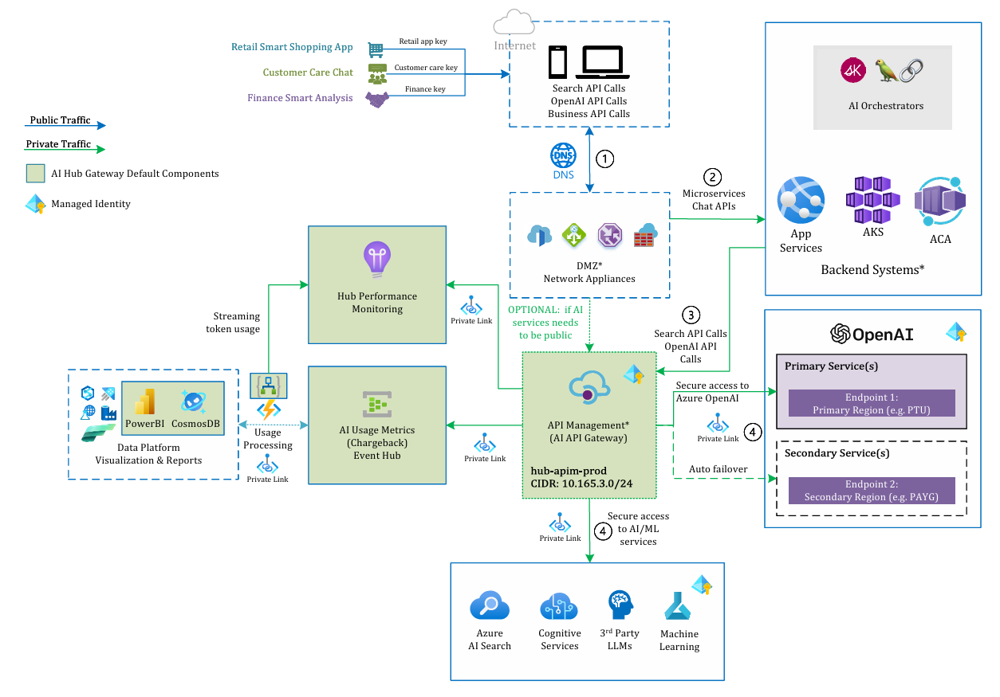

# AI Hub Gateway Landing Zone accelerator
The AI Hub Gateway Landing Zone is a solution accelerator that provides a set of guidelines and best practices for implementing a central AI API gateway to empower various line-of-business units in an organization to leverage Azure AI services.

##  User Story
The AI Hub Gateway Landing Zone architecture designed to be a central hub for AI services, providing a single point of entry for AI services, and enabling the organization to manage and govern AI services in a consistent manner. 



>NOTE: The V2 version is still work in progress and more features and capabilities will be added to the solution accelerator.

### Key features


#### Recent release updates:
>**About**: here you can see the recent updates to the gateway implementation

Now this solution accelerator is updated to be **enterprise ready** with the following features:

- **Improved OpenAI Usage Ingestion** with the ability to ingest usage data from Azure OpenAI API for both streaming and non-streaming requests. [Check the guide here](./guides/openai-usage-ingestion.md)
- **Bring your own VNet** is now supported with the ability to deploy the AI Hub Gateway Landing Zone in your own VNet. [Check the guide here](./guides/bring-you-own-network.md)
- **Throttling events monitoring** is now supported with the ability to capture and raise ```429``` too many requests status code as a custom metric in Application Insights. [Check the guide here](./guides/throttling-events-handling.md)
- **New gpt-4o Global Deployment** is now part of the OpenAI resource provisioning
- **Azure OpenAI API spec version** was updated to ```2024-05-01-preview``` to bring APIs for audio and batch among other advancements (note it is backward compatible with previous versions)
- **AI usage reports enhancements** with Cosmos Db now include a container for ```model-pricing``` which include the $ pricing for AI models tokens ([sample data can be found here](./src/usage-reports/model-pricing.json)), along with updated PowerBI dashboard design.
- **Private connectivity** now can be enabled by setting APIM deployment to External or Internal (require SKU to be either Developer or Premium) and it will provision all included Azure resources like (Azure OpenAI, Cosmos, Event Hub,...) with private endpoints.
- **Usage ingestion** is now implemented with Azure Function to support ingesting usage data from Event Hub to Cosmos Db with full private connectivity support.

The AI Hub Gateway Landing Zone provides the following features:

- **Centralized AI API Gateway**: A central hub for AI services, providing a single point of entry for AI services that can be shared among multiple use-cases in a secure and governed approach.
- **Seamless integration with Azure AI services**: Ability to just update endpoints and keys in existing apps to switch to use AI Hub Gateway.
- **AI routing and orchestration**: The AI Hub Gateway Landing Zone provides a mechanism to route and orchestrate AI services, based on priority and target model enabling the organization to manage and govern AI services in a consistent manner.
- **Granular access control**: The AI Hub Gateway Landing Zone does not use master keys to access AI services, instead, it uses managed identities to access AI services while consumers can use gateway keys.
- **Private connectivity**: The AI Hub Gateway Landing Zone is designed to be deployed in a private network, and it uses private endpoints to access AI services.
- **Capacity management**: The AI Hub Gateway Landing Zone provides a mechanism to manage capacity based on requests and tokens.
- **Usage & charge-back**: The AI Hub Gateway Landing Zone provides a mechanism to track usage and charge-back to the respective business units with flexible integration with existing charge-back & data platforms.
- **Resilient and scalable**: The AI Hub Gateway Landing Zone is designed to be resilient and scalable, and it uses Azure API Management with its zonal redundancy and regional gateways which provides a scalable and resilient solution.
- **Full observability**: The AI Hub Gateway Landing Zone provides full observability with Azure Monitor, Application Insights, and Log Analytics with detailed insights into performance, usage, and errors.
- **Hybrid support**: The AI Hub Gateway Landing Zone approach the deployment of backends and gateway on Azure, on-premises or other clouds.

##  One-click deploy

This solution accelerator provides a one-click deploy option to deploy the AI Hub Gateway Landing Zone in your Azure subscription through Azure Developer CLI (azd) or Bicep (IaC).

### What is being deployed?


The one-click deploy option will deploy the following components in your Azure subscription:
1. **Azure API Management**: Azure API Management is a fully managed service that powers most of the GenAI gateway capabilities.
2. **Application Insights**: Application Insights is an extensible Application Performance Management (APM) service that will provides critical insights on the gateway operational performance. It will also include a dashboard for the key metrics.
3. **Event Hub**: Event Hub is a fully managed, real-time data ingestion service that’s simple, trusted, and scalable and it is used to stream usage and charge-back data to target data and charge back platforms.
4. **Azure OpenAI**: 3 instances of Azure OpenAI across 3 regions. Azure OpenAI is a cloud deployment of cutting edge generative models from OpenAI (like ChatGPT, DALL.E and more).
5. **Cosmos DB**: Azure Cosmos DB is a fully managed NoSQL database for storing usage and charge-back data.
6. **Azure Function App**: to support real-time event processing service that will be used to process the usage and charge-back data from Event Hub and push it to Cosmos DB.
7. **User Managed Identity**: A user managed identity to be used by the Azure API Management to access the Azure OpenAI services/Event Hub and another for Azure Stream Analytics to access Event Hub and Cosmos DB.
8. **Virtual Network**: A virtual network to host the Azure API Management and the other Azure resources.
9. **Private Endpoints & Private DNS Zones**: Private endpoints for Azure OpenAI, Cosmos DB, Azure Function, Azure Monitor and Event Hub to enable private connectivity.

### Prerequisites

In order to deploy and run this solution accelerator, you'll need

- **Azure Account** - If you're new to Azure, get an [Azure account for free](https://aka.ms/free) and you'll get some free Azure credits to get started.
- **Azure subscription with access enabled for the Azure OpenAI service** - [You can request access](https://aka.ms/oaiapply). You can also visit [the Cognitive Search docs](https://azure.microsoft.com/free/cognitive-search/) to get some free Azure credits to get you started.
- **Azure account permissions** - Your Azure Account must have `Microsoft.Authorization/roleAssignments/write` permissions, such as [User Access Administrator](https://learn.microsoft.com/azure/role-based-access-control/built-in-roles#user-access-administrator) or [Owner](https://learn.microsoft.com/azure/role-based-access-control/built-in-roles#owner).

For local development, you'll need:

- **Azure CLI** - The Azure CLI is a command-line tool that provides a great experience for managing Azure resources. You can install the Azure CLI on your local machine by following the instructions [here](https://docs.microsoft.com/cli/azure/install-azure-cli).
- **Azure Developer CLI (azd)** - The Azure Developer CLI is a command-line tool that provides a great experience for deploying Azure resources. You can install the Azure Developer CLI on your local machine by following the instructions [here](https://learn.microsoft.com/en-us/azure/developer/azure-developer-cli/install-azd)
- VS Code - Visual Studio Code is a lightweight but powerful source code editor which runs on your desktop and is available for Windows, macOS, and Linux. You can install Visual Studio Code on your local machine by following the instructions [here](https://code.visualstudio.com/Download)

### How to deploy?

It is recommended to check first the [main.bicep](./infra/main.bicep) file that includes the deployment configuration and parameters.

Make sure you have enough OpenAI capacity for gpt-35-turbo and embedding in the selected regions.

Currently these are the default values:

```bicep
// You can add more OpenAI instances by adding more objects to the openAiInstances object
// Then update the apim policy xml to include the new instances
@description('Object containing OpenAI instances. You can add more instances by adding more objects to this parameter.')
param openAiInstances object = {
  openAi1: {
    name: 'openai1'
    location: 'eastus'
    deployments: [
      {
        name: chatGptDeploymentName
        model: {
          format: 'OpenAI'
          name: chatGptModelName
          version: chatGptModelVersion
        }
        scaleSettings: {
          scaleType: 'Standard'
        }
      }
      {
        name: embeddingGptDeploymentName
        model: {
          format: 'OpenAI'
          name: embeddingGptModelName
          version: embeddingGptModelVersion
        }
        sku: {
          name: 'Standard'
          capacity: deploymentCapacity
        }
      }
      {
        name: 'gpt-4o'
        model: {
          format: 'OpenAI'
          name: 'gpt-4o'
          version: '2024-05-13'
        }
        sku: {
          name: 'GlobalStandard'
          capacity: deploymentCapacity
        }
      }
      {
        name: 'dall-e-3'
        location: 'eastus'
        model: {
          format: 'OpenAI'
          name: 'dall-e-3'
          version: '3.0'
        }
        sku: {
          name: 'Standard'
          capacity: 1
        }
      }
    ]
  }
  openAi2: {
    name: 'openai2'
    location: 'northcentralus'
    deployments: [
      {
        name: chatGptDeploymentName
        model: {
          format: 'OpenAI'
          name: chatGptModelName
          version: chatGptModelVersion
        }
        scaleSettings: {
          scaleType: 'Standard'
        }
      }
      {
        name: embeddingGptDeploymentName
        model: {
          format: 'OpenAI'
          name: embeddingGptModelName
          version: embeddingGptModelVersion
        }
        sku: {
          name: 'Standard'
          capacity: deploymentCapacity
        }
      }
    ]
  }
  openAi3: {
    name: 'openai3'
    location: 'eastus2'
    deployments: [
      {
        name: chatGptDeploymentName
        model: {
          format: 'OpenAI'
          name: chatGptModelName
          version: chatGptModelVersion
        }
        scaleSettings: {
          scaleType: 'Standard'
        }
      }
      {
        name: embeddingGptDeploymentName
        model: {
          format: 'OpenAI'
          name: embeddingGptModelName
          version: embeddingGptModelVersion
        }
        sku: {
          name: 'Standard'
          capacity: deploymentCapacity
        }
      }
    ]
  }
}
```

When you are happy with the configuration, you can deploy the solution using the following command:

```bash
# Use --tenant-id if you have multiple tenants with login
azd auth login

# Setup new environment
azd env new ai-hub-gateway-dev

# Deploy the solution accelerator
azd up

# You can also use to provision only the infrastructure
# azd provision

# You can also use this to deploy the Azure Function code (given that infrastructure is already deployed)
# azd deploy

```

>**NOTE**: If you faced any deployment errors, try to rerun the ```azd up``` command as you might be facing a [transient error](./guides/deployment-troubleshooting.md).

After that, you can start using the AI Hub Gateway Landing Zone through the Azure API Management on Azure Portal:


>**NOTE**: You can use Azure Cloud Shell to run the above command, just clone this repository and run the command from the repo root folder.

##  Supporting documents

To dive deeper into the AI Hub Gateway technical mechanics, you can check out the following guides:

- [Architecture deep dive](./guides/architecture.md)
- [Deployment components](./guides/deployment.md)
- [API Management configuration](./guides/apim-configuration.md)
- [OpenAI Onboarding](./guides/openai-onboarding.md)
- [OpenAI Usage Ingestion](./guides/openai-usage-ingestion.md)
- [AI Search integration](./guides/ai-search-integration.md)
- [Power BI Dashboard](./guides/power-bi-dashboard.md)
- [Bring your own vnet](./guides/bring-you-own-network.md)
- [End-to-end scenario (Chat with data)](./guides/end-to-end-scenario.md)
- [Hybrid deployment of AI Hub Gateway](./guides/ai-hub-gateway-hybrid-deployment.md)
- [Deployment troubleshooting](./guides/deployment-troubleshooting.md)