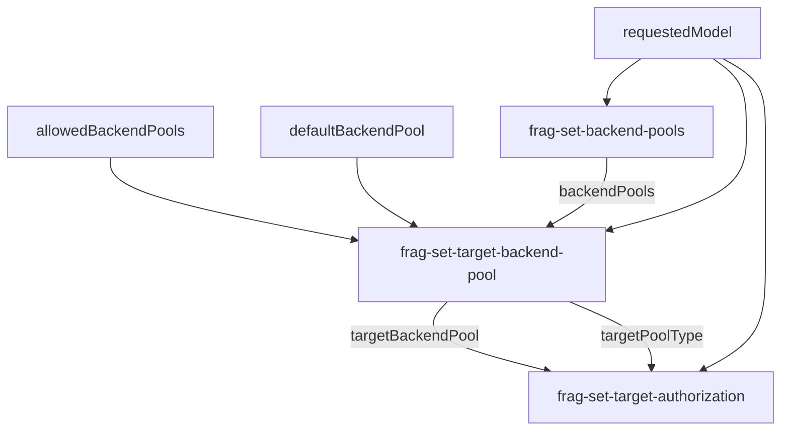

# APIM Policy Fragments

This directory contains reusable policy fragments for the Universal LLM API gateway implementation.

## Overview

The policy has been refactored to separate concerns into modular fragments, making it easier to maintain and update individual components without affecting the entire policy.

## Fragment Files

### frag-set-backend-pools.xml

**Purpose**: Defines backend pool configurations with their supported models and routing settings.

**Input Variables**:
- `requestedModel`: The model name extracted from the request payload
- `defaultBackendPool`: Default backend pool to use when model is not mapped (empty string = error for unmapped models)
- `allowedBackendPools`: Comma-separated list of allowed backend pool IDs (empty string = all pools allowed)

**Output Variables**:
- `backendPools`: JArray containing all backend pool configurations

**Configuration**: 
- Modify the backend pool definitions within this fragment to add/remove pools
- Each pool specifies: poolName, poolType, and supportedModels array
- Supports region-specific configurations via `context.Deployment.Region`

---

### frag-set-target-backend-pool.xml

**Purpose**: Determines which backend pool to route the request to based on the requested model and access permissions.

**Input Variables**:
- `requestedModel`: The model name extracted from the request payload
- `defaultBackendPool`: Default backend pool to use when model is not mapped
- `allowedBackendPools`: Comma-separated list of allowed backend pool IDs
- `backendPools`: JArray containing all backend pool configurations

**Output Variables**:
- `targetBackendPool`: The selected backend pool name or error code
- `targetPoolType`: The type of the selected backend pool (e.g., "azure-openai", "ai-foundry")

**Error Codes**:
- `ERROR_NO_MODEL`: No backend pool found for the requested model
- `ERROR_NO_ALLOWED_POOLS`: User doesn't have access to any pool supporting the model

**Logic Flow**:
1. Finds all backend pools supporting the requested model
2. Filters by allowed backend pools (RBAC)
3. Returns first matching pool or appropriate error
4. Validates and returns error responses for invalid selections
5. Sets the pool type for authentication configuration

---

### frag-set-target-authorization.xml

**Purpose**: Configures authentication headers and URL rewriting based on backend pool type.

**Input Variables**:
- `targetPoolType`: The type of the target backend pool
- `targetBackendPool`: The selected backend pool name
- `requestedModel`: The model name extracted from the request payload

**Expected Named Values**:
- `uami-client-id`: User-assigned managed identity client ID for authentication

**Side Effects**:
- Sets Authorization header with managed identity token
- Rewrites request URL for Azure OpenAI to include `/deployments/{model}/` path
- Sets backend service to the target backend pool

**Backend Types**:
- **azure-openai**: Uses Azure OpenAI API format with deployment path rewriting
- **ai-foundry**: Uses standard OpenAI-compatible API paths (no rewriting needed)

---

## Main Policy Flow

The main policy (`universal-llm-api-policy-v2.xml`) now follows this simplified flow:

1. **Entra ID Authentication** (optional, via aad-auth fragment)
2. **Model Extraction**: Parse model parameter from request body
3. **Model Validation**: Return 400 if model is missing
4. **RBAC Configuration**: Set allowed backend pools and default behavior
5. **Backend Pool Loading**: Call `frag-set-backend-pools`
6. **Target Selection**: Call `frag-set-target-backend-pool`
7. **Authorization**: Call `frag-set-target-authorization`

## Benefits of This Refactoring

1. **No Cache Dependency**: Removed cache lookup/store operations for simpler execution
2. **Separation of Concerns**: Each fragment has a single, well-defined responsibility
3. **Easier Maintenance**: Update backend pools or routing logic independently
4. **Better Documentation**: Each fragment includes detailed comments about inputs/outputs
5. **Compliance**: Uses proper XML entity encoding (`&lt;`, `&amp;`) for APIM policy expressions
6. **Reusability**: Fragments can be referenced from multiple policies

## Variable Dependencies



## Customization Guide

### Adding a New Backend Pool

1. Edit `frag-set-backend-pools.xml`
2. Add a new pool definition:
```csharp
var newPool = new JObject()
{
    { "poolName", "new-pool-name" },
    { "poolType", "pool-type" },
    { "supportedModels", new JArray("model1", "model2") }
};
backendPools.Add(newPool);
```

### Implementing RBAC

In the main policy, set the `allowedBackendPools` variable:
```xml
<!-- Allow only specific pools -->
<set-variable name="allowedBackendPools" value="azure-openai-backend-pool,ai-foundry-phi-pool" />

<!-- Allow all pools (default) -->
<set-variable name="allowedBackendPools" value="" />
```

### Setting Default Backend

In the main policy, configure the default backend:
```xml
<!-- Use a specific pool as fallback -->
<set-variable name="defaultBackendPool" value="azure-openai-backend-pool" />

<!-- Return error for unmapped models (default) -->
<set-variable name="defaultBackendPool" value="" />
```

## Testing

When deploying these fragments:

1. Ensure all three fragments are created in APIM with the correct fragment IDs
2. Test with a valid model to verify routing works
3. Test with an invalid model to verify error handling
4. Test RBAC by setting `allowedBackendPools` to restricted values
5. Monitor Azure Monitor for throttling metrics (via throttling-events fragment)

## Troubleshooting

**Issue**: `404 Not Found` when calling the API
- **Cause**: Fragment IDs don't match the `include-fragment` references
- **Solution**: Verify fragment IDs in APIM match: `frag-set-backend-pools`, `frag-set-target-backend-pool`, `frag-set-target-authorization`

**Issue**: `400 Bad Request - Model could not be detected`
- **Cause**: Request body doesn't contain a `model` parameter
- **Solution**: Ensure request payload includes `"model": "model-name"`

**Issue**: `403 Forbidden - Access forbidden`
- **Cause**: `allowedBackendPools` doesn't include pools supporting the requested model
- **Solution**: Update `allowedBackendPools` or add model to an allowed pool
