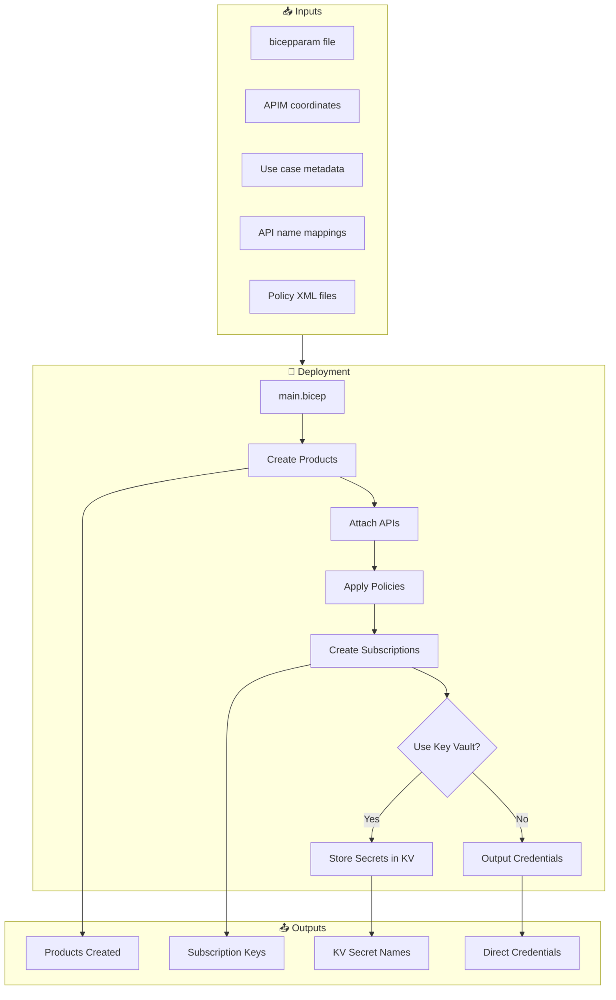
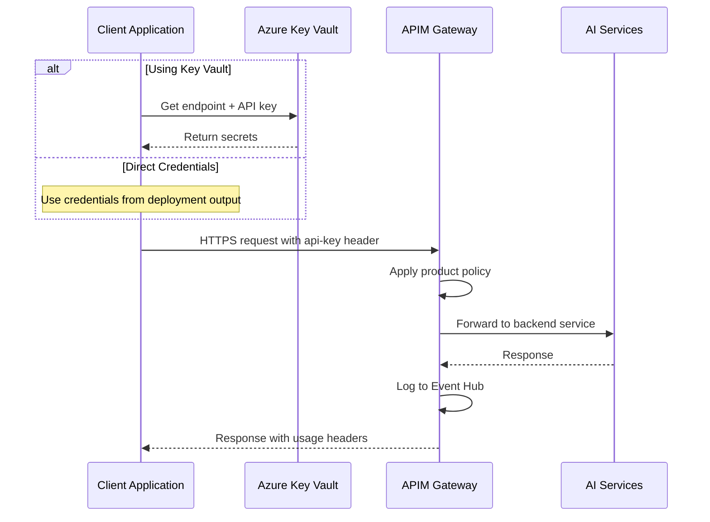

# 🚀 Use Case Onboarding for AI Citadel Governance Hub

## Overview

Automate the onboarding of AI use cases to your APIM-based AI Gateway with a streamlined, infrastructure-as-code approach using **Bicep parameter files** (`.bicepparam`).

This package eliminates manual APIM configuration by providing:
- 📦 **Automated Product Creation**: Per-service APIM products with naming `<serviceCode>-<BU>-<UseCase>-<ENV>`
- 🔌 **API Integration**: Automatic API attachment with custom or default policies
- 🔑 **Subscription Management**: Auto-generated subscriptions with secure API keys
- 🔐 **Flexible Secret Storage**: Optional Azure Key Vault integration or direct credential output
- 📝 **Declarative Configuration**: Simple `.bicepparam` files for version control

## What Gets Created

| Resource | Naming Pattern | Description |
|----------|----------------|-------------|
| **APIM Product** | `{code}-{BU}-{UseCase}-{ENV}` | Product per service (e.g., `OAI-Healthcare-PatientAssistant-DEV`) |
| **APIM Subscription** | `{product}-SUB-01` | Subscription with API key |
| **Key Vault Secrets** | `{secretName}` | Endpoint URL and API key (optional) |

## Key Features

✨ **Simplified Parameters**: No need for full resource IDs - just API names  
🔄 **Optional Key Vault**: Choose between Key Vault storage or direct output  
📋 **Policy Templates**: Pre-built policies for common use cases  
🎯 **Multi-Service Support**: Onboard multiple AI services in one deployment  
🔒 **Secure by Default**: Credentials stored in Key Vault or marked as secrets  
📊 **Production Ready**: Includes 3 complete real-world examples
---

## 🗺️ Architecture Overview

### Deployment Flow



### Runtime Request Flow



---

## 📁 Repository Structure

```
usecase-onboarding/
├── main.bicep                          # Main orchestration template
├── modules/
│   ├── apimOnboardService.bicep        # Product + subscription creation
│   ├── apimProduct.bicep               # APIM product module
│   ├── apimSubscription.bicep          # Subscription module
│   └── kvSecrets.bicep                 # Key Vault secret storage
├── policies/
│   └── default-ai-product-policy.xml   # Default product policy
└── samples/
    ├── healthcare-chatbot/             # Use case 1: Healthcare AI
    │   ├── README.md                   # Complete documentation
    │   ├── usecase.bicepparam          # Deployment parameters
    │   └── policy.xml                  # Custom APIM policy
    ├── customer-support-agent/         # Use case 2: Support AI
    │   ├── README.md
    │   ├── usecase.bicepparam
    │   └── policy.xml
    └── document-analysis-pipeline/     # Use case 3: Document AI
        ├── README.md
        ├── usecase.bicepparam
        ├── doc-policy.xml              # Document Intelligence policy
        └── oai-policy.xml              # OpenAI policy
```

---

## 🔧 Parameter Reference

### Main Parameters (main.bicep)

| Parameter | Type | Required | Description | Example |
|-----------|------|----------|-------------|---------|
| `apim` | object | ✅ | APIM instance coordinates | `{ subscriptionId, resourceGroupName, name }` |
| `keyVault` | object | ✅* | Key Vault for secrets (*required even if not used) | `{ subscriptionId, resourceGroupName, name }` |
| `useTargetAzureKeyVault` | bool | ❌ | Store secrets in Key Vault (default: `true`) | `true` or `false` |
| `useCase` | object | ✅ | Use case naming context | `{ businessUnit, useCaseName, environment }` |
| `apiNameMapping` | object | ✅ | Map service codes to API names | `{ OAI: ["azure-openai-service-api"], ... }` |
| `services` | array | ✅ | Services to onboard | See [Services Schema](#services-schema) below |
| `productTerms` | string | ❌ | Product terms of service | "By using this product..." |

### Services Schema

Each service in the `services` array:

```bicep
{
  code: string              // Service code (e.g., "OAI", "DOC", "SRCH")
  endpointSecretName: string // Name for endpoint secret in Key Vault
  apiKeySecretName: string   // Name for API key secret in Key Vault
  policyXml: string          // Optional: Custom policy XML (empty = use default)
}
```

### API Name Mapping Schema

Map service codes to their API names in APIM:

```bicep
{
  OAI: ["azure-openai-service-api"]
  DOC: ["document-intelligence-api", "document-intelligence-api-legacy"]
  SRCH: ["azure-ai-search-index-api"]
  // ... add more services
}
```

**Note**: API names must already exist in your APIM instance. The deployment will fail if an API name is not found.

---

## 🧱 What gets created

| Component | Scope | Naming | Notes |
|-----------|-------|--------|-------|
| APIM Product | APIM | `<serviceCode>-<BU>-<UseCase>-<ENV>` | One per service code you include |
| APIM Subscription | APIM | `<product>-SUB-01` | Primary key is captured into Key Vault |
| Key Vault Secrets | KV | `endpointSecretName`, `apiKeySecretName` | One endpoint + one key per service |

Naming examples
- Product: `OAI-Retail-FinancialAssistant-DEV`
- Subscription: `OAI-Retail-FinancialAssistant-DEV-SUB-01`

---

## ✅ Prerequisites

### Azure Resources

| Resource | Requirement | How to Verify |
|----------|-------------|---------------|
| **APIM Instance** | Published APIs matching your `apiNameMapping` | `az apim api list -g <rg> -n <apim-name>` |
| **Azure Key Vault** | Accessible with secret set permissions (if using KV) | `az keyvault show -n <kv-name>` |
| **APIs in APIM** | APIs already exist with correct names | Check APIM portal → APIs |

### Permissions Required

The deployment identity needs:

| Scope | Role | Purpose |
|-------|------|---------|
| APIM Resource Group | `API Management Service Contributor` | Create products and subscriptions |
| Key Vault (if used) | `Key Vault Secrets Officer` | Write secrets |
| Subscription | `Reader` | Reference existing resources |

### Verify Permissions

```powershell
# Check APIM permissions
az role assignment list `
  --scope /subscriptions/<sub-id>/resourceGroups/<apim-rg> `
  --query "[?principalName=='<your-identity>'].roleDefinitionName"

# Check Key Vault permissions (if using)
az role assignment list `
  --scope /subscriptions/<sub-id>/resourceGroups/<kv-rg>/providers/Microsoft.KeyVault/vaults/<kv-name> `
  --query "[?principalName=='<your-identity>'].roleDefinitionName"
```

---

## ⚡ Quick Start Guide

### Step 1: Choose a Use Case Template

Pick from our ready-to-use examples:

1. **[Healthcare Chatbot](samples/healthcare-chatbot/)** - HIPAA-compliant patient assistant
2. **[Customer Support Agent](samples/customer-support-agent/)** - Multi-tier support with RAG
3. **[Document Analysis Pipeline](samples/document-analysis-pipeline/)** - OCR + summarization

Each example includes:
- Complete `README.md` with usage examples
- Pre-configured `.bicepparam` file
- Custom APIM policy for the use case
- Python code samples

### Step 2: Configure Your Parameters

```powershell
# Copy the template
cd bicep/infra/usecase-onboarding/samples/healthcare-chatbot
cp usecase.bicepparam my-usecase.bicepparam

# Edit my-usecase.bicepparam
code my-usecase.bicepparam
```

Update these values:

```bicep
using '../../main.bicep'

param apim = {
  subscriptionId: 'YOUR-SUBSCRIPTION-ID'        // ← Update
  resourceGroupName: 'YOUR-APIM-RESOURCE-GROUP'  // ← Update
  name: 'YOUR-APIM-NAME'                        // ← Update
}

param keyVault = {
  subscriptionId: 'YOUR-SUBSCRIPTION-ID'        // ← Update
  resourceGroupName: 'YOUR-KV-RESOURCE-GROUP'   // ← Update
  name: 'YOUR-KV-NAME'                          // ← Update
}

param useTargetAzureKeyVault = true  // false to output credentials directly

param useCase = {
  businessUnit: 'YourDepartment'     // ← Update
  useCaseName: 'YourUseCaseName'     // ← Update
  environment: 'DEV'                 // DEV, TEST, PROD
}

// Verify these API names exist in your APIM
param apiNameMapping = {
  OAI: ['azure-openai-service-api']
  DOC: ['document-intelligence-api']
}

param services = [
  {
    code: 'OAI'
    endpointSecretName: 'OPENAI-ENDPOINT'
    apiKeySecretName: 'OPENAI-API-KEY'
    policyXml: loadTextContent('policy.xml')  // or '' for default
  }
  // Add more services as needed
]
```

### Step 3: Validate Configuration

```powershell
# Check that APIs exist in APIM
az apim api show `
  --resource-group YOUR-APIM-RG `
  --service-name YOUR-APIM-NAME `
  --api-id azure-openai-service-api

# Preview what will be created
az deployment sub what-if `
  --location eastus `
  --template-file ../../main.bicep `
  --parameters my-usecase.bicepparam
```

### Step 4: Deploy

```powershell
# Deploy at subscription scope
az deployment sub create `
  --name healthcare-chatbot-onboarding `
  --location eastus `
  --template-file ../../main.bicep `
  --parameters my-usecase.bicepparam
```

### Step 5: Verify Deployment

```powershell
# Check products created
az apim product list `
  --resource-group YOUR-APIM-RG `
  --service-name YOUR-APIM-NAME `
  --query "[?contains(name, 'Healthcare-PatientAssistant')].{Name:name, State:state}"

# Check subscriptions
az apim subscription list `
  --resource-group YOUR-APIM-RG `
  --service-name YOUR-APIM-NAME `
  --query "[?contains(displayName, 'Healthcare-PatientAssistant')]"

# If using Key Vault, check secrets
az keyvault secret list `
  --vault-name YOUR-KV-NAME `
  --query "[?contains(name, 'openai')].name"
```

### Step 6: Use the Service

```python
from azure.identity import DefaultAzureCredential
from azure.keyvault.secrets import SecretClient

# Get credentials from Key Vault
credential = DefaultAzureCredential()
kv_client = SecretClient(
    vault_url="https://YOUR-KV-NAME.vault.azure.net/",
    credential=credential
)

endpoint = kv_client.get_secret("openai-endpoint").value
api_key = kv_client.get_secret("openai-api-key").value

# Use with your application
print(f"Endpoint: {endpoint}")
# api_key is ready to use as Ocp-Apim-Subscription-Key header
```

---

## 🎯 Complete Use Case Examples

### 1. Healthcare Patient Assistant 🏥

**Scenario**: HIPAA-compliant chatbot for healthcare professionals

**Services**: Azure OpenAI + Document Intelligence

**Key Features**:
- Model restrictions (GPT-4o, GPT-4, GPT-3.5-Turbo only)
- Content safety and compliance logging
- Medical document processing
- Token limits: 50K/min per subscription

**[View Full Documentation →](samples/healthcare-chatbot/README.md)**

```powershell
# Quick deploy
cd samples/healthcare-chatbot
# Edit usecase.bicepparam first
az deployment sub create --location eastus --template-file ../../main.bicep --parameters usecase.bicepparam
```

---

### 2. Customer Support Agent 🎧

**Scenario**: Multi-tier AI support with knowledge base integration

**Services**: Azure OpenAI + Azure AI Search

**Key Features**:
- Premium vs Standard tier rate limiting (300 vs 150 req/min)
- RAG with Azure AI Search
- Response caching (5 min TTL)
- Token cost tracking per request
- Support for GPT-4o-mini for cost optimization

**[View Full Documentation →](samples/customer-support-agent/README.md)**

```powershell
# Quick deploy
cd samples/customer-support-agent
# Edit usecase.bicepparam first
az deployment sub create --location eastus --template-file ../../main.bicep --parameters usecase.bicepparam
```

---

### 3. Document Analysis Pipeline 📄

**Scenario**: High-volume document processing with OCR and summarization

**Services**: Document Intelligence + Azure OpenAI

**Key Features**:
- Batch processing (500 docs/min)
- Async long-running operations (120s timeout)
- Automatic retry logic (3 attempts)
- Per-request cost estimation
- Multi-model routing (GPT-4o, GPT-4o-mini, GPT-4-turbo)
- Separate policies for each service

**[View Full Documentation →](samples/document-analysis-pipeline/README.md)**

```powershell
# Quick deploy
cd samples/document-analysis-pipeline
# Edit usecase.bicepparam first
az deployment sub create --location eastus --template-file ../../main.bicep --parameters usecase.bicepparam
```

---

## 🔑 Key Vault Integration Options

### Option 1: Use Key Vault (Recommended)

**When to use**: Production deployments, applications with managed identities

```bicep
param useTargetAzureKeyVault = true

param keyVault = {
  subscriptionId: 'YOUR-SUB-ID'
  resourceGroupName: 'YOUR-KV-RG'
  name: 'YOUR-KV-NAME'
}
```

**Benefits**:
- ✅ Centralized secret management
- ✅ Automatic rotation support
- ✅ Access auditing
- ✅ Integration with managed identities

**Retrieval**:
```python
from azure.keyvault.secrets import SecretClient
kv_client = SecretClient(vault_url="https://<kv-name>.vault.azure.net/", credential=credential)
endpoint = kv_client.get_secret("openai-endpoint").value
```

### Option 2: Direct Output (CI/CD)

**When to use**: CI/CD pipelines, serverless functions, non-Azure environments

```bicep
param useTargetAzureKeyVault = false

// keyVault still required but can use placeholders
param keyVault = {
  subscriptionId: '00000000-0000-0000-0000-000000000000'
  resourceGroupName: 'placeholder'
  name: 'placeholder'
}
```

**Benefits**:
- ✅ No Key Vault dependency
- ✅ Direct credential access
- ✅ Works in any environment

**Retrieval from Deployment Output**:
```powershell
$output = az deployment sub show `
  --name my-deployment `
  --query properties.outputs.endpoints.value -o json | ConvertFrom-Json

$oaiEndpoint = ($output | Where-Object { $_.code -eq 'OAI' }).endpoint
$oaiKey = ($output | Where-Object { $_.code -eq 'OAI' }).apiKey

# Store in CI/CD variables
Write-Host "##vso[task.setvariable variable=OAI_ENDPOINT;issecret=true]$oaiEndpoint"
Write-Host "##vso[task.setvariable variable=OAI_KEY;issecret=true]$oaiKey"
```

⚠️ **Security Note**: When using direct output, handle credentials as secrets in your CI/CD system.

---

## 📝 Creating Custom Policies

### Using Default Policy

The simplest approach - omit `policyXml` or set it to empty string:

```bicep
param services = [
  {
    code: 'OAI'
    endpointSecretName: 'OAI-ENDPOINT'
    apiKeySecretName: 'OAI-KEY'
    policyXml: ''  // Uses policies/default-ai-product-policy.xml
  }
]
```

**Default policy includes**:
- Basic rate limiting (100 req/min)
- Model validation
- Token limits
- Content safety checks

### Creating Custom Policy

**Step 1**: Create policy XML file in your use case folder

```xml
<!-- my-custom-policy.xml -->
<policies>
    <inbound>
        <base />
        <!-- Your custom logic -->
        <rate-limit-by-key calls="500" renewal-period="60" counter-key="@(context.Subscription.Id)" />
        <set-header name="X-Custom-Header" exists-action="override">
            <value>my-value</value>
        </set-header>
    </inbound>
    <backend>
        <base />
    </backend>
    <outbound>
        <base />
    </outbound>
    <on-error>
        <base />
    </on-error>
</policies>
```

**Step 2**: Reference in bicepparam

```bicep
param services = [
  {
    code: 'OAI'
    endpointSecretName: 'OAI-ENDPOINT'
    apiKeySecretName: 'OAI-KEY'
    policyXml: loadTextContent('my-custom-policy.xml')
  }
]
```

### Policy Best Practices

✅ **Always include `<base />`** in each section to inherit gateway policies  
✅ **Use variables** for dynamic values: `@(context.Subscription.Id)`  
✅ **Add error handling** in `<on-error>` section  
✅ **Log important headers** for troubleshooting  
✅ **Test policies** in APIM portal before deployment  

### Common Policy Patterns

<details>
<summary><b>Model Allowlist</b></summary>

```xml
<set-variable name="requestedModel" value="@{
    var body = context.Request.Body?.As&lt;JObject&gt;(preserveContent: true);
    return body?[&quot;model&quot;]?.ToString() ?? string.Empty;
}" />

<choose>
    <when condition="@(!new [] { &quot;gpt-4o&quot;, &quot;gpt-4&quot; }.Contains(context.Variables.GetValueOrDefault&lt;string&gt;(&quot;requestedModel&quot;, &quot;&quot;)))">
        <return-response>
            <set-status code="403" reason="Forbidden" />
            <set-body>Model not allowed</set-body>
        </return-response>
    </when>
</choose>
```
</details>

<details>
<summary><b>Tier-Based Rate Limiting</b></summary>

```xml
<set-variable name="tier" value="@(context.Request.Headers.GetValueOrDefault(&quot;X-Tier&quot;, &quot;standard&quot;))" />

<choose>
    <when condition="@(context.Variables.GetValueOrDefault&lt;string&gt;(&quot;tier&quot;) == &quot;premium&quot;)">
        <rate-limit-by-key calls="300" renewal-period="60" counter-key="@(context.Subscription.Id)" />
    </when>
    <otherwise>
        <rate-limit-by-key calls="100" renewal-period="60" counter-key="@(context.Subscription.Id)" />
    </otherwise>
</choose>
```
</details>

<details>
<summary><b>Token Usage Tracking</b></summary>

```xml
<!-- In outbound section -->
<set-variable name="usage" value="@{
    var response = context.Response.Body.As&lt;JObject&gt;(preserveContent: true);
    return response?[&quot;usage&quot;];
}" />

<set-header name="X-Tokens-Used" exists-action="override">
    <value>@{
        var usage = context.Variables.GetValueOrDefault&lt;JToken&gt;(&quot;usage&quot;);
        return usage?[&quot;total_tokens&quot;]?.ToString() ?? &quot;0&quot;;
    }</value>
</set-header>
```
</details>

---

## 🔄 Advanced Scenarios

### Multiple Services in One Use Case

Onboard multiple AI services simultaneously:

```bicep
param apiNameMapping = {
  OAI: ['azure-openai-service-api']
  DOC: ['document-intelligence-api']
  SRCH: ['azure-ai-search-index-api']
  OAIRT: ['openai-realtime-ws-api']
}

param services = [
  {
    code: 'OAI'
    endpointSecretName: 'MULTI-OAI-ENDPOINT'
    apiKeySecretName: 'MULTI-OAI-KEY'
    policyXml: loadTextContent('oai-policy.xml')
  }
  {
    code: 'DOC'
    endpointSecretName: 'MULTI-DOC-ENDPOINT'
    apiKeySecretName: 'MULTI-DOC-KEY'
    policyXml: loadTextContent('doc-policy.xml')
  }
  {
    code: 'SRCH'
    endpointSecretName: 'MULTI-SEARCH-ENDPOINT'
    apiKeySecretName: 'MULTI-SEARCH-KEY'
    policyXml: ''  // Use default
  }
]
```

**Result**: Creates 3 APIM products, 3 subscriptions, 6 Key Vault secrets

### API with Multiple Versions

Include multiple API versions for backward compatibility:

```bicep
param apiNameMapping = {
  DOC: [
    'document-intelligence-api',       // Latest version
    'document-intelligence-api-legacy' // Legacy support
  ]
}
```

Both APIs will be added to the same product.

### Environment-Specific Configurations

Create environment-specific parameter files:

```
samples/my-usecase/
├── README.md
├── policy.xml
├── usecase.dev.bicepparam
├── usecase.test.bicepparam
└── usecase.prod.bicepparam
```

**usecase.dev.bicepparam**:
```bicep
param useCase = {
  businessUnit: 'Engineering'
  useCaseName: 'MyApp'
  environment: 'DEV'
}
// Lower rate limits for dev
```

**usecase.prod.bicepparam**:
```bicep
param useCase = {
  businessUnit: 'Engineering'
  useCaseName: 'MyApp'
  environment: 'PROD'
}
// Higher rate limits for production
```

Deploy:
```powershell
# Dev
az deployment sub create --template-file ../../main.bicep --parameters usecase.dev.bicepparam

# Prod
az deployment sub create --template-file ../../main.bicep --parameters usecase.prod.bicepparam
```

---

## 📤 Deployment Outputs

After deployment, the following outputs are available:

### When Using Key Vault (`useTargetAzureKeyVault = true`)

| Output | Type | Description | Example |
|--------|------|-------------|---------|
| `apimGatewayUrl` | string | APIM gateway base URL | `https://apim-gateway.azure-api.net` |
| `useKeyVault` | bool | Always `true` | `true` |
| `products[]` | array | Created products | `[{ productId: "OAI-Healthcare-...", displayName: "..." }]` |
| `subscriptions[]` | array | KV secret names | `[{ name: "OAI-...-SUB-01", keyVaultApiKeySecretName: "openai-api-key", ... }]` |

**Access secrets from Key Vault**:
```powershell
$secretNames = (az deployment sub show --name my-deployment --query properties.outputs.subscriptions.value -o json | ConvertFrom-Json)
$endpoint = az keyvault secret show --vault-name <kv-name> --name ($secretNames[0].keyVaultEndpointSecretName) --query value -o tsv
```

### When NOT Using Key Vault (`useTargetAzureKeyVault = false`)

| Output | Type | Description | Contains Secrets |
|--------|------|-------------|------------------|
| `apimGatewayUrl` | string | APIM gateway base URL | No |
| `useKeyVault` | bool | Always `false` | No |
| `products[]` | array | Created products | No |
| `endpoints[]` | array | **Direct credentials** | ⚠️ **YES** |

**Endpoints output structure**:
```json
[
  {
    "code": "OAI",
    "productId": "OAI-Healthcare-PatientAssistant-DEV",
    "subscriptionName": "OAI-Healthcare-PatientAssistant-DEV-SUB-01",
    "endpoint": "https://apim-gateway.azure-api.net/openai",
    "apiKey": "abc123...xyz"  // ⚠️ Sensitive
  }
]
```

**Extract credentials**:
```powershell
$output = az deployment sub show --name my-deployment --query properties.outputs.endpoints.value -o json | ConvertFrom-Json
$oaiCreds = $output | Where-Object { $_.code -eq 'OAI' }

# Store securely in CI/CD
Write-Host "##vso[task.setvariable variable=OAI_ENDPOINT;issecret=true]$($oaiCreds.endpoint)"
Write-Host "##vso[task.setvariable variable=OAI_KEY;issecret=true]$($oaiCreds.apiKey)"
```

⚠️ **Security Warning**: The `endpoints` output contains sensitive API keys when not using Key Vault. Always:
- Mark as secrets in CI/CD systems
- Never log or display in plaintext
- Store in secure secret management systems
- Rotate keys regularly

---

## 🛠️ Troubleshooting

### Common Issues

| Issue | Cause | Solution |
|-------|-------|----------|
| **API not found** | API name doesn't exist in APIM | Verify with `az apim api list -g <rg> -n <apim>` |
| **Authorization failed** | Missing permissions | Grant `API Management Service Contributor` |
| **Secret not created** | Key Vault permissions | Grant `Key Vault Secrets Officer` |
| **Product not visible** | Product not published | Check product state in APIM portal |
| **401 on API calls** | Wrong subscription key | Verify key from Key Vault or deployment output |
| **403 - Model Not Allowed** | Model blocked by policy | Check allowed models in policy XML |
| **429 - Rate Limit** | Exceeded rate limit | Reduce request frequency or adjust policy |

### Debugging Steps

1. **Verify API exists**:
```powershell
az apim api show `
  --resource-group YOUR-APIM-RG `
  --service-name YOUR-APIM-NAME `
  --api-id azure-openai-service-api
```

2. **Check product creation**:
```powershell
az apim product show `
  --resource-group YOUR-APIM-RG `
  --service-name YOUR-APIM-NAME `
  --product-id OAI-Healthcare-PatientAssistant-DEV
```

3. **Verify subscription**:
```powershell
az apim subscription show `
  --resource-group YOUR-APIM-RG `
  --service-name YOUR-APIM-NAME `
  --subscription-id OAI-Healthcare-PatientAssistant-DEV-SUB-01
```

4. **Test API call**:
```powershell
$key = az keyvault secret show --vault-name <kv-name> --name openai-api-key --query value -o tsv
$endpoint = az keyvault secret show --vault-name <kv-name> --name openai-endpoint --query value -o tsv

curl -X POST "$endpoint/chat/completions?api-version=2024-02-01" `
  -H "api-key: $key" `
  -H "Content-Type: application/json" `
  -d '{"model":"gpt-4o","messages":[{"role":"user","content":"test"}]}'
```

5. **View APIM logs**:
```powershell
az monitor log-analytics query `
  --workspace YOUR-WORKSPACE-ID `
  --analytics-query "ApiManagementGatewayLogs | where OperationId contains 'openai' | take 10"
```

### Getting Help

- Check API errors in APIM Test Console
- Review deployment operation logs
- Enable APIM diagnostics for detailed request traces
- Verify network connectivity from app to APIM

---

## 💼 Production Deployment Checklist

Before deploying to production:

- [ ] **Security Review**
  - [ ] Policies enforce approved models only
  - [ ] Rate limits configured appropriately
  - [ ] Content safety enabled (if applicable)
  - [ ] Secrets stored in Key Vault
  - [ ] Managed identities used for authentication

- [ ] **Testing**
  - [ ] Test successful API calls
  - [ ] Verify rate limits trigger correctly
  - [ ] Test error handling (401, 403, 429, 500)
  - [ ] Validate policy behavior

- [ ] **Monitoring**
  - [ ] Event Hub logging configured
  - [ ] Application Insights connected
  - [ ] Alerts set up for quota thresholds
  - [ ] Power BI dashboard created

- [ ] **Documentation**
  - [ ] Team onboarding guide created
  - [ ] API usage examples provided
  - [ ] Support contact information shared
  - [ ] Key rotation procedures documented

- [ ] **Compliance**
  - [ ] Data residency requirements met
  - [ ] Audit logging enabled
  - [ ] Terms of service reviewed
  - [ ] Privacy policies applied

---

## 📚 Additional Resources

### Related Guides

- [APIM Configuration Guide](../../guides/apim-configuration.md)
- [Azure OpenAI Onboarding](../../guides/LLM-Backend-Onboarding.md)
- [Power BI Dashboard Setup](../../guides/power-bi-dashboard.md)
- [PII Masking Policies](../../guides/pii-masking-apim.md)
- [Full Deployment Guide](../../guides/full-deployment-guide.md)

### Example Use Cases

1. **[Healthcare Patient Assistant](samples/healthcare-chatbot/)** - HIPAA-compliant conversational AI
2. **[Customer Support Agent](samples/customer-support-agent/)** - Multi-tier support with RAG
3. **[Document Analysis Pipeline](samples/document-analysis-pipeline/)** - High-volume OCR + summarization

### External Documentation

- [Azure API Management Policies](https://learn.microsoft.com/azure/api-management/api-management-policies)
- [Azure OpenAI Service](https://learn.microsoft.com/azure/ai-services/openai/)
- [Azure Document Intelligence](https://learn.microsoft.com/azure/ai-services/document-intelligence/)
- [Azure Key Vault](https://learn.microsoft.com/azure/key-vault/)
- [Bicep Language](https://learn.microsoft.com/azure/azure-resource-manager/bicep/)

---

## 🤝 Contributing

Have a new use case to share? We welcome contributions!

1. Fork the repository
2. Create a new folder under `samples/`
3. Include:
   - `README.md` with complete documentation
   - `usecase.bicepparam` with example parameters
   - Custom policy XML file(s)
   - Code samples (Python, C#, etc.)
4. Submit a pull request

---

## 💡 FAQ

<details>
<summary><b>Can I use the same Key Vault for multiple use cases?</b></summary>

Yes! Multiple deployments can target the same Key Vault. Just ensure secret names don't conflict by using descriptive prefixes (e.g., `healthcare-oai-endpoint`, `support-oai-endpoint`).
</details>

<details>
<summary><b>How do I update a policy after deployment?</b></summary>

1. Update the policy XML file
2. Redeploy with the same parameters
3. Or manually update in APIM portal: Products → [Your Product] → Policies
</details>

<details>
<summary><b>Can I onboard the same service multiple times?</b></summary>

No, each service code can only appear once per use case. If you need multiple configurations, create separate use case deployments with different `useCaseName` values.
</details>

<details>
<summary><b>What happens if I redeploy with the same parameters?</b></summary>

Bicep is idempotent - it will update existing resources instead of creating new ones. Products, subscriptions, and secrets will be updated to match the new configuration.
</details>

<details>
<summary><b>How do I delete an onboarded use case?</b></summary>

Delete the APIM products and subscriptions:
```powershell
az apim product delete --resource-group <rg> --service-name <apim> --product-id <product-id>
az apim subscription delete --resource-group <rg> --service-name <apim> --subscription-id <sub-id>
```
Manually delete Key Vault secrets if needed.
</details>

<details>
<summary><b>Can I use this with other AI services like Azure AI Search?</b></summary>

Yes! Add the API name to `apiNameMapping` and configure the service in the `services` array. See the [Customer Support Agent example](samples/customer-support-agent/) for Azure AI Search integration.
</details>

---

## 📞 Support

For issues or questions:
- **GitHub Issues**: [Report bugs or request features](https://github.com/Azure-Samples/ai-hub-gateway-solution-accelerator/issues)
- **Documentation**: Review the guides in `/guides`
- **Examples**: Check the sample use cases in `/samples`

---

**Last Updated**: November 2025  
**Version**: 2.0 (Bicepparam-based)
