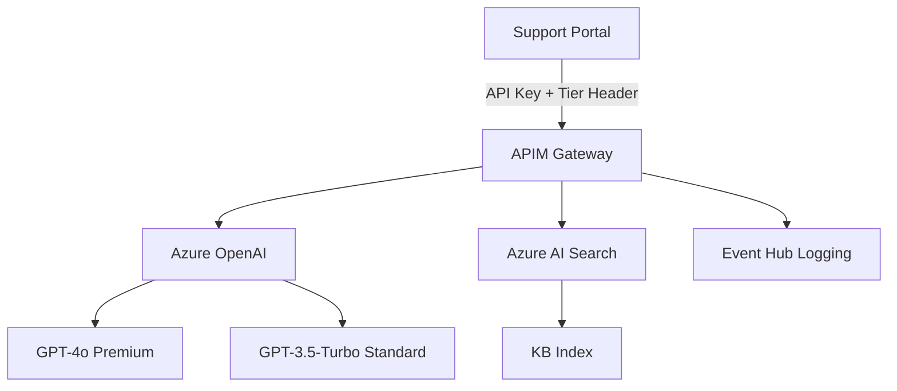

# Customer Support Agent

## Overview
This use case demonstrates onboarding a **Customer Support AI Agent** to the AI Gateway. The agent provides intelligent, context-aware customer support with knowledge base integration and multi-tier service levels.

## Architecture



## Services Used

| Service | Purpose | API Name in APIM |
|---------|---------|------------------|
| **Azure OpenAI** | Conversational AI, answer generation | `azure-openai-service-api` |
| **Azure AI Search** | Knowledge base retrieval (RAG) | `azure-ai-search-index-api` |

## Features

- ✅ **Multi-Tier Support**: Premium (300 req/min) vs Standard (150 req/min)
- ✅ **Smart Model Routing**: Auto-select based on support tier
- ✅ **Response Caching**: 5-minute cache for repeated queries
- ✅ **Token Tracking**: Real-time cost monitoring per request
- ✅ **RAG Integration**: Knowledge base search with Azure AI Search
- ✅ **Cost Optimization**: Support for GPT-4o-mini for simple queries

## Prerequisites

Before deploying, ensure:

1. **APIM Instance** with published APIs:
   - `azure-openai-service-api`
   - `azure-ai-search-index-api`

2. **Azure Key Vault** for the support agent application

3. **Azure AI Search** with indexed knowledge base

4. **Deployment Permissions**:
   - `API Management Service Contributor`
   - `Key Vault Secrets Officer`

## Deployment

### Step 1: Configure Parameters

Edit `usecase.bicepparam`:

```bicep
param apim = {
  subscriptionId: 'YOUR-SUBSCRIPTION-ID'
  resourceGroupName: 'YOUR-APIM-RG'
  name: 'YOUR-APIM-NAME'
}

param keyVault = {
  subscriptionId: 'YOUR-SUBSCRIPTION-ID'
  resourceGroupName: 'YOUR-KV-RG'
  name: 'YOUR-KV-NAME'
}

// Optional: Deploy without Key Vault
param useTargetAzureKeyVault = false  // Outputs credentials directly
```

### Step 2: Deploy

```powershell
az deployment sub create `
  --name customer-support-onboarding `
  --location eastus `
  --template-file ../../main.bicep `
  --parameters usecase.bicepparam
```

### Step 3: Verify

```powershell
# Check products
az apim product show `
  --resource-group YOUR-APIM-RG `
  --service-name YOUR-APIM-NAME `
  --product-id OAI-CustomerService-SupportAgent-PROD

# Check subscriptions
az apim subscription list `
  --resource-group YOUR-APIM-RG `
  --service-name YOUR-APIM-NAME `
  --query "[?contains(name, 'CustomerService-SupportAgent')]"
```

## Usage Examples

### Setup Client

```python
from azure.identity import DefaultAzureCredential
from azure.keyvault.secrets import SecretClient
import openai

# Retrieve credentials from Key Vault
credential = DefaultAzureCredential()
kv_client = SecretClient(
    vault_url="https://YOUR-KV-NAME.vault.azure.net/",
    credential=credential
)

openai_endpoint = kv_client.get_secret("support-openai-endpoint").value
openai_key = kv_client.get_secret("support-openai-key").value
search_endpoint = kv_client.get_secret("support-search-endpoint").value
search_key = kv_client.get_secret("support-search-key").value
```

### Standard Support Query

```python
import requests

headers = {
    "api-key": openai_key,
    "Content-Type": "application/json",
    "X-Support-Tier": "standard"  # Standard tier = GPT-3.5, 150 req/min
}

payload = {
    "model": "gpt-35-turbo",
    "messages": [
        {"role": "system", "content": "You are a helpful customer support agent."},
        {"role": "user", "content": "How do I reset my password?"}
    ],
    "temperature": 0.7
}

response = requests.post(
    f"{openai_endpoint}/chat/completions?api-version=2024-02-01",
    headers=headers,
    json=payload
)

print(response.json()["choices"][0]["message"]["content"])
```

### Premium Support with RAG

```python
from azure.search.documents import SearchClient
from azure.core.credentials import AzureKeyCredential

# Search knowledge base
search_client = SearchClient(
    endpoint=search_endpoint,
    index_name="support-kb",
    credential=AzureKeyCredential(search_key)
)

results = search_client.search(
    search_text="password reset procedure",
    top=3
)

context = "\n".join([doc["content"] for doc in results])

# Premium tier call with context
headers["X-Support-Tier"] = "premium"  # Premium = GPT-4o, 300 req/min

payload = {
    "model": "gpt-4o",
    "messages": [
        {"role": "system", "content": f"Context from KB:\n{context}"},
        {"role": "user", "content": "Provide detailed password reset steps"}
    ],
    "temperature": 0.3
}

response = requests.post(
    f"{openai_endpoint}/chat/completions?api-version=2024-02-01",
    headers=headers,
    json=payload
)

print(response.json()["choices"][0]["message"]["content"])
print(f"Tokens used: {response.headers.get('X-Tokens-Used')}")
```

### Cost-Optimized Query

```python
# Use GPT-4o-mini for simple queries
payload = {
    "model": "gpt-4o-mini",
    "messages": [
        {"role": "user", "content": "What are your business hours?"}
    ]
}

response = requests.post(
    f"{openai_endpoint}/chat/completions?api-version=2024-02-01",
    headers=headers,
    json=payload
)
```

## Policy Features

### Multi-Tier Rate Limiting

| Tier | Requests/Min | Daily Quota | Models |
|------|--------------|-------------|--------|
| **Premium** | 300 | 100,000 | All (GPT-4o recommended) |
| **Standard** | 150 | 50,000 | All (GPT-3.5-Turbo recommended) |

Set tier via header: `X-Support-Tier: premium` or `X-Support-Tier: standard`

### Response Caching

Responses are cached for 5 minutes to reduce costs:
- Varies by support tier
- Varies by query parameter `q`

### Token Usage Tracking

Every response includes `X-Tokens-Used` header for cost monitoring:

```python
tokens = response.headers.get('X-Tokens-Used')
print(f"This request cost approximately ${int(tokens) * 0.000002:.6f}")
```

## Monitoring

### View Metrics

```powershell
# Get usage statistics
az monitor metrics list `
  --resource /subscriptions/YOUR-SUB/resourceGroups/YOUR-APIM-RG/providers/Microsoft.ApiManagement/service/YOUR-APIM `
  --metric Requests `
  --start-time 2024-01-01T00:00:00Z
```

### Cost Analysis

Track token usage via custom headers logged to Event Hub:
- `X-Tokens-Used`: Tokens per request
- `X-Support-Tier`: Service tier
- `X-Request-Id`: Correlation ID

## Troubleshooting

| Issue | Solution |
|-------|----------|
| **403 - Model Not Allowed** | Use: gpt-4o, gpt-4, gpt-35-turbo, or gpt-4o-mini |
| **429 - Rate Limit Exceeded** | Check tier limits or upgrade to premium |
| **Cache Hit Rate Low** | Review query patterns; ensure consistent parameters |
| **High Token Costs** | Use gpt-4o-mini for simple queries, enable caching |

## Performance Optimization

1. **Cache Strategy**: Identical queries return cached responses (5 min TTL)
2. **Model Selection**:
   - Simple queries → `gpt-4o-mini` (cheapest)
   - Standard support → `gpt-35-turbo`
   - Complex/premium → `gpt-4o`
3. **RAG Integration**: Retrieve KB context with Azure AI Search before calling OpenAI

## Next Steps

- Configure Power BI for support analytics
- Set up alerting for quota thresholds
- Implement A/B testing for response quality
- Add sentiment analysis tracking

## Related Documentation

- [Azure AI Search Integration](../../../guides/ai-search-integration.md)
- [APIM Caching Policies](../../../guides/apim-configuration.md)
- [Cost Optimization Guide](../../../guides/cost-optimization.md)
