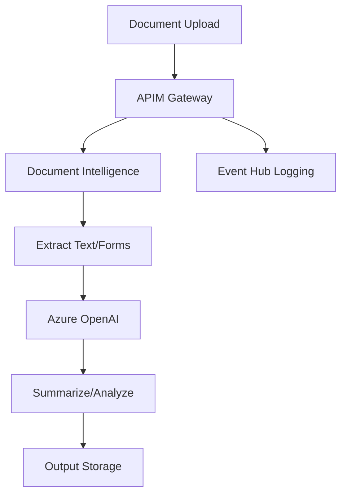

# Document Analysis Pipeline

## Overview
This use case demonstrates onboarding an **Intelligent Document Analysis Pipeline** to the AI Gateway. The pipeline combines Azure Document Intelligence for OCR/extraction with Azure OpenAI for summarization and entity extraction.

## Architecture



## Services Used

| Service | Purpose | API Name in APIM | Policy |
|---------|---------|------------------|--------|
| **Document Intelligence** | OCR, form extraction, layout analysis | `document-intelligence-api` | `doc-policy.xml` |
| **Azure OpenAI** | Document summarization, entity extraction | `azure-openai-service-api` | `oai-policy.xml` |

## Features

- ✅ **Multi-Format Support**: PDF, images, Office documents
- ✅ **Batch Processing**: Up to 500 docs/min via Document Intelligence
- ✅ **Intelligent Summarization**: GPT-4o/mini for document summaries
- ✅ **Cost Optimization**: Automatic model routing based on task complexity
- ✅ **Async Operations**: Long-running document processing support
- ✅ **Detailed Cost Tracking**: Per-request cost estimation

## Prerequisites

1. **APIM Instance** with:
   - `document-intelligence-api` published
   - `azure-openai-service-api` published

2. **Azure Key Vault** (optional - can output credentials directly)

3. **Azure Document Intelligence** resource

4. **Azure OpenAI** with deployed models:
   - `gpt-4o` (complex analysis)
   - `gpt-4o-mini` (simple summaries)
   - `gpt-4-turbo` (batch processing)

5. **Deployment Permissions**:
   - `API Management Service Contributor`
   - `Key Vault Secrets Officer` (if using Key Vault)

## Deployment

### Option 1: Deploy with Key Vault

```powershell
# Edit usecase.bicepparam first, then:
az deployment sub create `
  --name doc-pipeline-onboarding `
  --location eastus `
  --template-file ../../main.bicep `
  --parameters usecase.bicepparam
```

### Option 2: Deploy without Key Vault (CI/CD)

```bicep
// In usecase.bicepparam, set:
param useTargetAzureKeyVault = false
```

```powershell
# Deploy and capture outputs
$deployment = az deployment sub create `
  --name doc-pipeline-onboarding `
  --location eastus `
  --template-file ../../main.bicep `
  --parameters usecase.bicepparam `
  --query properties.outputs.endpoints.value -o json | ConvertFrom-Json

# Extract credentials
$docEndpoint = ($deployment | Where-Object { $_.code -eq 'DOC' }).endpoint
$docKey = ($deployment | Where-Object { $_.code -eq 'DOC' }).apiKey
$oaiEndpoint = ($deployment | Where-Object { $_.code -eq 'OAI' }).endpoint
$oaiKey = ($deployment | Where-Object { $_.code -eq 'OAI' }).apiKey

# Store in environment variables or CI/CD secrets
$env:DOC_ENDPOINT = $docEndpoint
$env:DOC_KEY = $docKey
$env:OAI_ENDPOINT = $oaiEndpoint
$env:OAI_KEY = $oaiKey
```

### Verify Deployment

```powershell
# Check products
az apim product list `
  --resource-group YOUR-APIM-RG `
  --service-name YOUR-APIM-NAME `
  --query "[?contains(name, 'DocAnalysisPipeline')]"

# Check subscriptions
az apim subscription list `
  --resource-group YOUR-APIM-RG `
  --service-name YOUR-APIM-NAME `
  --query "[?contains(displayName, 'DocAnalysisPipeline')]"
```

## Usage Examples

### Setup

```python
import os
from azure.identity import DefaultAzureCredential
from azure.keyvault.secrets import SecretClient
from azure.ai.documentintelligence import DocumentIntelligenceClient
from azure.core.credentials import AzureKeyCredential
import openai

# Option 1: From Key Vault
credential = DefaultAzureCredential()
kv_client = SecretClient(
    vault_url="https://YOUR-KV-NAME.vault.azure.net/",
    credential=credential
)

doc_endpoint = kv_client.get_secret("doc-pipeline-endpoint").value
doc_key = kv_client.get_secret("doc-pipeline-key").value
oai_endpoint = kv_client.get_secret("oai-pipeline-endpoint").value
oai_key = kv_client.get_secret("oai-pipeline-key").value

# Option 2: From environment variables (CI/CD)
doc_endpoint = os.getenv("DOC_ENDPOINT")
doc_key = os.getenv("DOC_KEY")
oai_endpoint = os.getenv("OAI_ENDPOINT")
oai_key = os.getenv("OAI_KEY")
```

### Process Invoice with Document Intelligence

```python
doc_client = DocumentIntelligenceClient(
    endpoint=doc_endpoint,
    credential=AzureKeyCredential(doc_key)
)

# Specify document type for optimized processing
headers = {"X-Document-Type": "invoice"}

with open("invoice.pdf", "rb") as f:
    poller = doc_client.begin_analyze_document(
        model_id="prebuilt-invoice",
        analyze_request=f,
        content_type="application/pdf"
    )
    
    result = poller.result()

# Extract invoice data
for document in result.documents:
    invoice_id = document.fields.get("InvoiceId")
    total = document.fields.get("InvoiceTotal")
    vendor = document.fields.get("VendorName")
    
    print(f"Invoice: {invoice_id.value if invoice_id else 'N/A'}")
    print(f"Total: {total.value if total else 'N/A'}")
    print(f"Vendor: {vendor.value if vendor else 'N/A'}")
```

### Supported Document Types

Set via `X-Document-Type` header:
- `invoice` - Invoices and bills
- `receipt` - Receipts
- `contract` - Legal contracts
- `identity` - ID cards, passports
- `general` - General documents
- `layout` - Layout analysis only

### Summarize Extracted Text with OpenAI

```python
import requests

# Use extracted text from Document Intelligence
extracted_text = "\n".join([line.content for page in result.pages for line in page.lines])

headers = {
    "api-key": oai_key,
    "Content-Type": "application/json",
    "X-Task-Type": "summarize"  # Options: summarize, extract, batch
}

payload = {
    "model": "gpt-4o-mini",  # Cost-optimized for simple summaries
    "messages": [
        {
            "role": "system",
            "content": "You are a document analysis assistant. Provide concise summaries."
        },
        {
            "role": "user",
            "content": f"Summarize this invoice:\n\n{extracted_text}"
        }
    ],
    "max_tokens": 500,
    "temperature": 0.3
}

response = requests.post(
    f"{oai_endpoint}/chat/completions?api-version=2024-02-01",
    headers=headers,
    json=payload
)

result = response.json()
summary = result["choices"][0]["message"]["content"]

# Check cost
tokens_used = int(response.headers.get("X-Tokens-Total", 0))
estimated_cost = float(response.headers.get("X-Estimated-Cost-USD", 0))

print(f"Summary: {summary}")
print(f"Cost: ${estimated_cost:.6f} ({tokens_used} tokens)")
```

### Batch Processing (Large Volume)

```python
import concurrent.futures

def process_document(file_path):
    """Process a single document through the pipeline"""
    headers = {
        "api-key": doc_key,
        "X-Document-Type": "general",
        "X-Task-Type": "batch"
    }
    
    with open(file_path, "rb") as f:
        # Step 1: Extract text with Document Intelligence
        poller = doc_client.begin_analyze_document(
            model_id="prebuilt-layout",
            analyze_request=f
        )
        doc_result = poller.result()
    
    # Step 2: Summarize with OpenAI (batch task type = lower rate limit)
    text = "\n".join([line.content for page in doc_result.pages for line in page.lines])
    
    oai_headers = {
        "api-key": oai_key,
        "X-Task-Type": "batch"
    }
    
    oai_payload = {
        "model": "gpt-4-turbo",  # Optimized for batch
        "messages": [{"role": "user", "content": f"Summarize: {text[:4000]}"}],
        "max_tokens": 200
    }
    
    oai_response = requests.post(
        f"{oai_endpoint}/chat/completions?api-version=2024-02-01",
        headers=oai_headers,
        json=oai_payload
    )
    
    return {
        "file": file_path,
        "summary": oai_response.json()["choices"][0]["message"]["content"],
        "cost": float(oai_response.headers.get("X-Estimated-Cost-USD", 0))
    }

# Process 100 documents in parallel
document_files = [f"docs/doc_{i}.pdf" for i in range(100)]

with concurrent.futures.ThreadPoolExecutor(max_workers=10) as executor:
    results = list(executor.map(process_document, document_files))

total_cost = sum(r["cost"] for r in results)
print(f"Processed {len(results)} documents")
print(f"Total cost: ${total_cost:.4f}")
```

## Policy Features

### Document Intelligence Policy

| Feature | Value | Description |
|---------|-------|-------------|
| **Rate Limit** | 500 req/min | High throughput for batch processing |
| **Daily Quota** | 50,000 docs | Daily document limit |
| **Timeout** | 120 seconds | For large documents |
| **Retry Logic** | 3 attempts | Automatic retry on 429/5xx errors |

### OpenAI Policy

| Task Type | Rate Limit | Daily Quota | Recommended Model |
|-----------|------------|-------------|-------------------|
| **Summarize** | 200/min | 50,000 | gpt-4o-mini |
| **Extract** | 200/min | 50,000 | gpt-4o |
| **Batch** | 100/min | 100,000 | gpt-4-turbo |

Set via `X-Task-Type` header.

### Cost Estimation

Every OpenAI response includes:
- `X-Tokens-Prompt`: Input tokens
- `X-Tokens-Completion`: Output tokens
- `X-Tokens-Total`: Total tokens
- `X-Estimated-Cost-USD`: Approximate cost

## Performance Optimization

### Model Selection Strategy

```python
def select_model(text_length):
    """Choose optimal model based on document complexity"""
    if text_length < 1000:
        return "gpt-4o-mini"  # Simple summary: ~$0.00015/1K tokens
    elif text_length < 5000:
        return "gpt-4o"       # Complex analysis: ~$0.0025/1K tokens
    else:
        return "gpt-4-turbo"  # Long document: ~$0.01/1K tokens
```

### Cost Comparison

| Model | Input Cost (per 1K tokens) | Output Cost (per 1K tokens) | Best For |
|-------|---------------------------|----------------------------|----------|
| **gpt-4o-mini** | $0.00015 | $0.00060 | Simple summaries, receipts |
| **gpt-4o** | $0.0025 | $0.01 | Complex contracts, analysis |
| **gpt-4-turbo** | $0.01 | $0.03 | Long documents, batch |

### Async Processing for Large Documents

```python
# Check if Document Intelligence operation is still running
if response.status_code == 202:
    operation_location = response.headers.get("Operation-Location")
    print(f"Long-running operation: {operation_location}")
    
    # Poll for completion
    while True:
        status_response = requests.get(
            operation_location,
            headers={"api-key": doc_key}
        )
        
        status = status_response.json()["status"]
        if status == "succeeded":
            result = status_response.json()
            break
        elif status == "failed":
            raise Exception("Document processing failed")
        
        time.sleep(5)
```

## Monitoring & Analytics

### Track Processing Metrics

```python
# Headers available in responses
processing_time = response.headers.get("X-Processing-Time-Ms")
document_type = response.headers.get("X-Document-Type")
tokens_used = response.headers.get("X-Tokens-Total")
cost = response.headers.get("X-Estimated-Cost-USD")

# Log to your analytics system
analytics.log({
    "use_case": "DocAnalysisPipeline",
    "document_type": document_type,
    "processing_time_ms": processing_time,
    "tokens": tokens_used,
    "cost_usd": cost,
    "timestamp": datetime.utcnow()
})
```

### Query APIM Logs

```powershell
# View usage by document type
az monitor log-analytics query `
  --workspace YOUR-WORKSPACE-ID `
  --analytics-query "ApiManagementGatewayLogs | where OperationId contains 'DocAnalysisPipeline' | summarize count() by DocumentType"
```

## Troubleshooting

| Issue | Solution |
|-------|----------|
| **400 - Invalid Document Type** | Use: invoice, receipt, contract, identity, general, layout |
| **400 - Max Tokens Exceeded** | Reduce `max_tokens` parameter (limit: 16,000) |
| **429 - Rate Limit** | Reduce concurrency or use `X-Task-Type: batch` |
| **500 - Timeout** | Document too large; split into smaller chunks |
| **High Costs** | Switch to gpt-4o-mini for simple tasks |

## CI/CD Integration Example

```yaml
# Azure DevOps Pipeline
- task: AzureCLI@2
  displayName: 'Deploy Document Pipeline'
  inputs:
    azureSubscription: 'YOUR-SERVICE-CONNECTION'
    scriptType: 'pscore'
    scriptLocation: 'inlineScript'
    inlineScript: |
      $output = az deployment sub create `
        --name doc-pipeline-$(Build.BuildId) `
        --location eastus `
        --template-file bicep/infra/usecase-onboarding/main.bicep `
        --parameters bicep/infra/usecase-onboarding/samples/document-analysis-pipeline/usecase.bicepparam `
        --parameters useTargetAzureKeyVault=false `
        --query properties.outputs.endpoints.value -o json | ConvertFrom-Json
      
      # Store in pipeline variables
      $docCreds = $output | Where-Object { $_.code -eq 'DOC' }
      $oaiCreds = $output | Where-Object { $_.code -eq 'OAI' }
      
      Write-Host "##vso[task.setvariable variable=DOC_ENDPOINT;issecret=true]$($docCreds.endpoint)"
      Write-Host "##vso[task.setvariable variable=DOC_KEY;issecret=true]$($docCreds.apiKey)"
      Write-Host "##vso[task.setvariable variable=OAI_ENDPOINT;issecret=true]$($oaiCreds.endpoint)"
      Write-Host "##vso[task.setvariable variable=OAI_KEY;issecret=true]$($oaiCreds.apiKey)"
```

## Next Steps

- Integrate with Azure Functions for automated pipeline
- Set up Power BI dashboard for cost analytics
- Add custom models for domain-specific extraction
- Implement webhook notifications for async operations

## Related Documentation

- [Document Intelligence API Reference](https://learn.microsoft.com/azure/ai-services/document-intelligence/)
- [Azure OpenAI Best Practices](../../../guides/openai-onboarding.md)
- [APIM Policy Reference](../../../guides/apim-configuration.md)
- [Cost Optimization Guide](../../../guides/cost-optimization.md)
