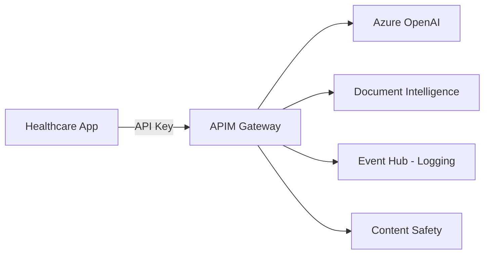

# Healthcare Patient Assistant Chatbot

## Overview
This use case demonstrates onboarding a **Healthcare Patient Assistant** chatbot to the AI Gateway. The chatbot provides HIPAA-compliant conversational AI support for healthcare professionals and patients.

## Architecture



## Services Used

| Service | Purpose | API Name in APIM |
|---------|---------|------------------|
| **Azure OpenAI** | Conversational AI, medical documentation assistance | `azure-openai-service-api` |
| **Document Intelligence** | Medical record processing, insurance form extraction | `document-intelligence-api` |

## Features

- ✅ **HIPAA Compliance**: All interactions logged for audit trails
- ✅ **Model Restrictions**: Only approved models (GPT-4, GPT-4o, GPT-3.5-Turbo)
- ✅ **Rate Limiting**: 50K tokens/min, 100 requests/min per subscription
- ✅ **Content Safety**: Built-in content filtering for medical use cases
- ✅ **Secure Storage**: API keys stored in Azure Key Vault

## Prerequisites

Before deploying this use case, ensure:

1. **APIM Instance** configured with:
   - `azure-openai-service-api` API published
   - `document-intelligence-api` API published
   
2. **Azure Key Vault** created for the healthcare chatbot application

3. **Permissions**: Deployment identity has:
   - `API Management Service Contributor` on APIM resource group
   - `Key Vault Secrets Officer` on target Key Vault

## Deployment

### Step 1: Update Parameters

Edit `usecase.bicepparam` and replace placeholder values:

```bicep
param apim = {
  subscriptionId: 'YOUR-SUBSCRIPTION-ID'
  resourceGroupName: 'YOUR-APIM-RESOURCE-GROUP'
  name: 'YOUR-APIM-NAME'
}

param keyVault = {
  subscriptionId: 'YOUR-SUBSCRIPTION-ID'
  resourceGroupName: 'YOUR-KEYVAULT-RESOURCE-GROUP'
  name: 'YOUR-KEYVAULT-NAME'
}
```

### Step 2: Deploy

```powershell
# Deploy at subscription scope
az deployment sub create `
  --name healthcare-chatbot-onboarding `
  --location eastus `
  --template-file ../../main.bicep `
  --parameters usecase.bicepparam
```

### Step 3: Verify Deployment

```powershell
# Check APIM products
az apim product list `
  --resource-group YOUR-APIM-RESOURCE-GROUP `
  --service-name YOUR-APIM-NAME `
  --query "[?contains(name, 'Healthcare-PatientAssistant')].{Name:name, State:state}"

# Check Key Vault secrets
az keyvault secret list `
  --vault-name YOUR-KEYVAULT-NAME `
  --query "[?contains(name, 'openai') || contains(name, 'docintell')].name"
```

## Using the Onboarded Service

### Retrieve Credentials from Key Vault

```python
from azure.identity import DefaultAzureCredential
from azure.keyvault.secrets import SecretClient

credential = DefaultAzureCredential()
kv_client = SecretClient(vault_url="https://YOUR-KEYVAULT-NAME.vault.azure.net/", credential=credential)

# Get OpenAI endpoint and key
openai_endpoint = kv_client.get_secret("openai-endpoint").value
openai_key = kv_client.get_secret("openai-api-key").value

# Get Document Intelligence endpoint and key
doc_endpoint = kv_client.get_secret("docintell-endpoint").value
doc_key = kv_client.get_secret("docintell-api-key").value
```

### Call Azure OpenAI via APIM

```python
import openai

openai.api_base = openai_endpoint
openai.api_key = openai_key
openai.api_type = "azure"
openai.api_version = "2024-02-01"

response = openai.ChatCompletion.create(
    deployment_name="gpt-4o",  # Must be one of the allowed models
    messages=[
        {"role": "system", "content": "You are a helpful healthcare assistant."},
        {"role": "user", "content": "What are the symptoms of diabetes?"}
    ],
    temperature=0.7
)

print(response.choices[0].message.content)
```

### Process Medical Documents

```python
from azure.ai.documentintelligence import DocumentIntelligenceClient
from azure.core.credentials import AzureKeyCredential

doc_client = DocumentIntelligenceClient(
    endpoint=doc_endpoint,
    credential=AzureKeyCredential(doc_key)
)

# Analyze a medical form
with open("insurance-form.pdf", "rb") as f:
    poller = doc_client.begin_analyze_document(
        "prebuilt-invoice", f
    )
    result = poller.result()
    
print(f"Extracted fields: {result.documents[0].fields}")
```

## Policy Configuration

The `policy.xml` file enforces:

- **Model Allowlist**: Only `gpt-4o`, `gpt-4`, `gpt-35-turbo`
- **Rate Limits**: 100 requests/min, 50K tokens/min
- **Compliance Tracking**: Request timestamps and response times logged

To customize the policy:
1. Edit `policy.xml`
2. Redeploy using the same deployment command

## Monitoring & Compliance

### View Usage Metrics

```powershell
# View APIM analytics
az apim api operation list `
  --resource-group YOUR-APIM-RESOURCE-GROUP `
  --service-name YOUR-APIM-NAME `
  --api-id azure-openai-service-api
```

### Audit Logs

All requests are logged to Event Hub for compliance auditing. Access logs through:
- Azure Monitor
- Log Analytics workspace
- Event Hub consumer applications

## Troubleshooting

| Issue | Solution |
|-------|----------|
| **403 - Model Not Allowed** | Verify you're using an approved model (gpt-4o, gpt-4, gpt-35-turbo) |
| **429 - Rate Limit** | Reduce request frequency or request quota increase |
| **401 - Unauthorized** | Verify API key from Key Vault is correct |
| **Secrets not in Key Vault** | Ensure `useTargetAzureKeyVault = true` in parameters |

## Next Steps

- Set up Power BI dashboard for usage analytics
- Configure alerts for rate limit violations
- Implement PII masking policies
- Add Azure AI Search for RAG capabilities

## Related Documentation

- [APIM Configuration Guide](../../../guides/apim-configuration.md)
- [Content Safety Integration](../../../guides/pii-masking-apim.md)
- [Power BI Dashboard Setup](../../../guides/power-bi-dashboard.md)
