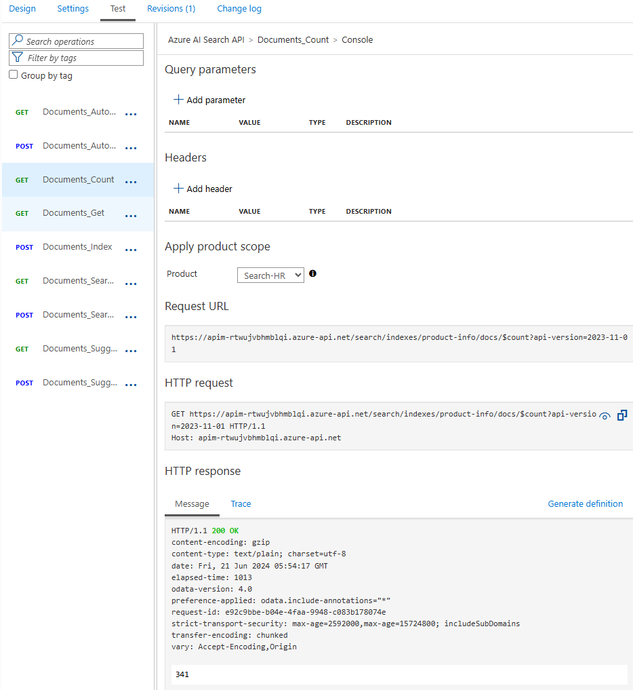
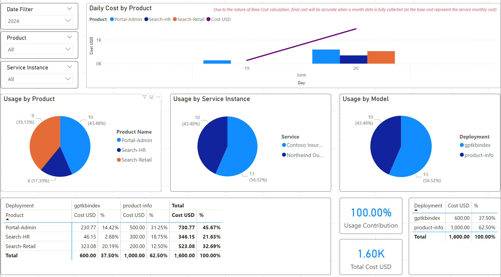

# Azure AI Search integration

Azure AI Search is a powerful search and indexing service that can be used to index and search data in your applications. It provides a simple REST API that can be used to interact with the service. 

In GenAI apps, Azure AI Search adds vector, keyword and hybrid search capabilities to your RAG (Retrieval-Augmented Generation) models. 

It also support combining hybrid search with semantic ranker to improve the top search results being sent to the LLM.

In this guide, we will show you how to integrate Azure AI Search with APIM.

## Overview

Out of the box, AI Hub Gateway will provide the following:
- Adding new API for Azure Search based on the latest specs ([Azure Search API Spec](../infra/modules/apim/ai-search-api/ai-search-api-spec.yaml)) as of writing this guide.
- Creating 2 Azure AI Search backends
- Creating 1 Azure AI Search product and subscription to be used to access the services and track the usage.
- Configuring Azure AI Search API to leverage routing logic to determine which search service to use with requested index.

## Prerequisites

### Service instance
You need to have 1 or more Azure AI Service instance configured with at least 1 index.

Service can be in the same subscription/region as APIM or in a different subscription/region, only you need to make sure they belong to the same Entra ID tenant.

### Permissions
Also as APIM uses Managed Identity to access various AI services, you need to make sure that APIM User Managed Identity is granted at least ```Search Index Data Reader``` role on the Azure AI Search service(s).

Pump the permission to ```Search Index Data Contributor``` if you want to use the indexing capabilities of the service as well.

### Network Access
Finally, if you are using AI Search with restricted network access, you need to make sure that APIM is able to resolve and reach the AI Search private endpoint.

## Backends configuration

You can find the configuration for the Azure AI Search backends in the [main.bicep](../infra/main.bicep):
    
```bicep
@description('Object containing AI Search existing instances. You can add more instances by adding more objects to this parameter.')
param aiSearchInstances array = [
  {
    name: 'ai-search-1'
    url: 'https://REPLACE1.search.windows.net/'
    description: 'AI Search Instnace 1'
  }
  {
    name: 'ai-search-2'
    url: 'https://REPLACE2.windows.net/'
    description: 'AI Search Instnace 2'
  }
]
```

If you have an existing APIM, you can just head to APIM backends, and add the new AI Search backends noting the names you are using so it can be added to the API routing logic.

## Routing Configuration

The routing configuration is done in the [ai-search-api-policy.xml](../infra/modules/apim/policies/ai-search-api-policy.xml) file. You can find the routing configuration in the following section:

```xml
<set-variable name="oaClusters" value="@{
    // route is an Azure AI Search endpoint
    JArray routes = new JArray();
    // cluster is a group of routes that are capable of serving a specific index name
    JArray clusters = new JArray();
    // Update the below if condition when using multiple APIM gateway regions/SHGW to get different configurations for each region
    if(context.Deployment.Region == "West Europe" || true)
    {
        // Adding all Azure AI Search endpoints routes (which are set as APIM Backend)
        routes.Add(new JObject()
        {
            { "name", "Contoso Insurance KB" },
            { "location", "Switzerland North" },
            { "backend-id", "ai-search-swn" },
            { "priority", 1},
            { "isThrottling", false }, 
            { "retryAfter", DateTime.MinValue } 
        });

        routes.Add(new JObject()
        {
            { "name", "Northwind Outdoor KB" },
            { "location", "Sweden Central" },
            { "backend-id", "ai-search-sec" },
            { "priority", 1},
            { "isThrottling", false }, 
            { "retryAfter", DateTime.MinValue } 
        });

        // For each index, create a cluster with the routes that can serve it
        clusters.Add(new JObject()
        {
            { "deploymentName", "gptkbindex" },
            { "routes", new JArray(routes[0]) }
        });

        clusters.Add(new JObject()
        {
            { "deploymentName", "product-info" },
            { "routes", new JArray(routes[1]) }
        });
    }
    else
    {
        //No clusters found for selected region, either return error (default behavior) or set default cluster in the else section
    }
    
    return clusters;   
}" />
```

>Note: this is similar to how Azure OpenAI API routing logic work. In fact, both APIs are sharing shared policy fragments.

## Testing

The simplest API to validate it is working to called ```Documents_Count``` which will return the count of documents in the index.

Using APIM portal, you can test the API to see if it is working as expected or enable tracing to investigate any issues:



## Usage tracking

To activate the usage tracking for configured AI Search services, you need to update the Cosmos Db container ```model-pricing``` with the new AI Search service name and the pricing tier.

Below are example entries for 2 AI search services integrated with AI Hub Gateway:

```json
{
    "id": "6",
    "model": "ai-search",
    "deploymentName": "ai-search-1",
    "isActive": true,
    "CostPerInputUnit": 0,
    "CostPerOutputUnit": 1,
    "CostUnit": 1,
    "BaseCost": 600,
    "Currency": "USD",
    "CalculationMethod": "percentage",
    "region": "ALL"
}

---

{
    "id": "7",
    "model": "ai-search",
    "deploymentName": "ai-search-2",
    "isActive": true,
    "CostPerInputUnit": 0,
    "CostPerOutputUnit": 1,
    "CostUnit": 1,
    "BaseCost": 1000,
    "Currency": "USD",
    "CalculationMethod": "percentage",
    "region": "ALL"
}
```

Calculating the cost for AI Search:
- Every API call to Azure AI Search is considered as 1 prompt token, 0 completion and total 1 token.
- There is a field called ```BaseCost``` which is the base cost for the service per month in USD.
- Make sure that ```deploymentName``` equal to the Route Name you selected in the AI Search routing configuration (it must match the usage record ```deploymentName```).
- The field ```CalculationMethod``` is set to ```percentage``` which means the cost will be calculated based on the percentage of the base cost.
    - In [Usage PowerBI dashboard](../src/usage-reports/AI-Hub-Gateway-Usage-Report-v1-4.pbix), there is a tab named ```Percentage Usage``` which shows the usage of the AI services based on the percentage of the base cost.
    - Example: you have 1 AI Search service that cost $1,000 per month and used by 3 different teams (aka products):
            - Team 1 used 50% of the total requests sent to the service, thus the cost for this team will be $500.
            - Team 2 used 30% of the total requests sent to the service, thus the cost for this team will be $300.
            - Team 3 used 20% of the total requests sent to the service, thus the cost for this team will be $200.



## Integration with apps

Now with AI Hub Gateway setup is complete, you can start integrating your apps with Azure AI Search through AI Hub Gateway endpoint.

The information you need to share with development teams are the following:

- The API endpoint to be used to access the AI Search service (which you can see it in the APIM portal test screen of the search API).
    - Example: ```https://apim-rtwujvbhmblqi.azure-api.net/search```
- The API key to be used to access the AI Search service:
    - Create a new APIM product, grant it access to the search API. Be mindful in selecting the product name as it will be used in the reports (example: AIType-BusinessUnit-Team-Environment so something like Search-HR-Internal-Prod).
    - Create a new subscription under that product to generate the API Keys that will be used by the apps to access the service.

>Note: You can also rely on automation or leverage the APIM developer portal to allow self-service for getting the subscriptions and API keys.