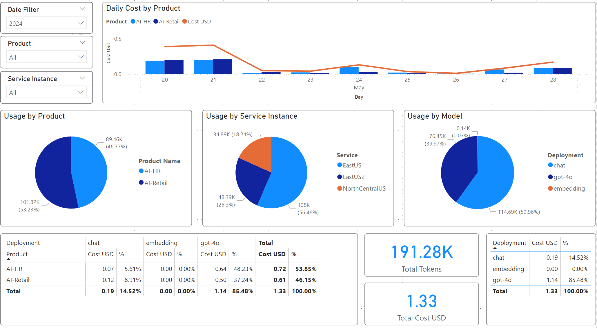

### Gateway routing strategies (APIM)

When it comes to GenAI APIs, a need for advanced routing strategies arises to manage the capacity and resiliency for smooth AI-infused experiences across multiple clients.

Setting these policies in APIM will allow for advanced routing based on the region and model in addition to the priority and throttling status.

Dimensions of the routing strategies include:
- **Global vs. regional**: Ability to route to traffic to different regional gateway might be a requirement to ensure low latency, high availability and data residency.
    - For example, if you have a global deployment of AI Hub Gateway, you might want to route traffic to the nearest gateway to the client, or route that traffic to a specific gateway based on regulatory requirements.
- **Model-based routing**: Ability to route to traffic based on requested model is critical as not all OpenAI regional deployments support all capabilities and versions.
    - For example, if you can have gpt-4-vision model that is only available in 2 regions, you might want to load balance traffic to these 2 regions only.
- **Priority based routing**: Ability to route traffic based on priority is critical to ensure that the traffic is routed to preferred region first and fall back to other deployments when primary deployment is not available.
    - For example, if you have a Provisioned Throughput Unit (PTU) deployment in certain region, you might want to route all traffic to that deployment to maximize its utilization and only fall back to a secondary deployment in another region when the PTU is throttling (this also should revert back to primary when it is available again).
- **Throttling fallback support**: Ability to take a specific route out of the routing pool if it is throttling and fall back to the next available route.
    - For example, if you have a OpenAI deployment that is throttling, AI Hub Gateway should be able to take it out of the routing pool and fall back to the next available deployment and register the time needed before it is available again you might want so it can be brought back into the pool.
- **Configuration update**: Ability to update the routing configuration without affecting the existing traffic is critical to allow for rolling updates of the routing configuration.
    - For example, if you have a new OpenAI deployment that is available, you might want to update the routing configuration to include it and allow for new traffic to be routed to it without affecting the existing traffic (and in also support rolling back certain update when needed).

This routing strategy based the great work of [APIM Smart Load Balancing](https://github.com/andredewes/apim-aoai-smart-loadbalancing/tree/main), it is worth checking out.

This routing strategy is designed to address all the needs outlined above for a robust and reliable AI routing engine.

Implementation details are as follows:
- **Clusters (model based routing)**: it is a simple concept to group multiple OpenAI endpoints that support specific OpenAI deployment name. 
    - This to support model-based routing
    - For example, if the model is gpt-4 and it exists only in 2 regions, I will create a cluster with these 2 endpoints only. On the other hand, gpt-35-turbo exists in 5 regions, I will create a cluster with these 5 endpoints.
    - In order for this routing to work, OpenAI deployment names across regions must use the same name as I rely on the URL path to extract the direct deployment name which then results in specific routes to be used.
- **Routes**: It is json array that include all OpenAI endpoints with metadata.
    - Each cluster will reference supported route from this json array
    - Each route will have a friendly name, location, priority, and throttling status.
- **Clusters and routes caching**: using APIM cache to store clusters and routes to allow it to be shared across multiple API calls contexts.
    - **Configurations update**: Using API revision part of the caching key to allow for rolling updates of the clusters and routes through:
        - Creating new API revision with updated clusters and routes
        - Updating the API revision to be current (which will result in immediate creation of new cache entry with the updated clusters and routes)
        - API revision number is part of the cache key for both clusters and routes.
        - If configuration roll back is critical, you might want to add the routing policies directly in OpenAI API - All Operations policy scope (as policy fragments don't support revisions).
    - **Multi-region support**: Each clusters array will be stored with region name as part of the cache key to allow for multi-region support.

Based on this implementation, APIM should be able to do advanced routing based on the region and model in addition to the priority and throttling status.

Having revision number as part of the cache key will allow for rolling updates of the clusters and routes.

Also at any given time, you will have different cached routes that represent different models/region, and based on the incoming request, you can route to the correct OpenAI endpoint.

## Working with the Policy

This guide provides insights into customizing API Management policies to enable smart load balancing for Azure OpenAI endpoints. While Azure API Management does not natively support this scenario, custom policies offer a flexible solution. Below, we explore the key components of these policies, their configuration, and their role in efficient load management.

### Understanding `oaClusters`

**Clusters (model based routing)**: it is a simple concept to group multiple OpenAI endpoints that support specific OpenAI deployment name (specific model and version). 
    - For example, if the model is gpt-4 and it exists only in 2 OpenAI instances, I will create a cluster with these 2 endpoints only. On the other hand, gpt-35-turbo exists in 5 OpenAI instances, I will create a cluster with these 5 endpoints.
    - In order for this routing to work, OpenAI deployment names across regions must use the same name as I rely on the URL path to extract the direct deployment name which then results in specific routes to be used.

### Understanding `routes` Variable Configuration

The `routes` variable is crucial as it defines the OpenAI endpoints and their priorities. This example demonstrates setting up various endpoints with priorities and throttling status. 

    - Each cluster will reference supported route from this json array
    - Each route will have a friendly name, location, priority, and throttling status.

This sample deployment, creates 3 OpenAI instances in 3 different regions (EastUS, NorthCentralUS, EastUS2) and assigns them to the same priority level (which mean they will all be available for routing).

You can also see that this sample configuration is using a single region deployment of APIM gateway indicated by the always true condition ```if(context.Deployment.Region == "West Europe" || true)```. 

This is to show how you can configure different routing configuration based on the region of the APIM gateway.

>**NOTE**: Before making any changes to the policy, please ensure creating **new API revision** first to test the new configuration and avoid any impact on the existing traffic.

Primary APIM policy for [OpenAI can be found here](../infra/modules/apim/policies/openai_api_policy.xml).

```xml
<set-variable name="oaClusters" value="@{
    // route is an Azure OpenAI API endpoints
    JArray routes = new JArray();
    // cluster is a group of routes that are capable of serving a specific deployment name (model and version)
    JArray clusters = new JArray();
    // Update the below if condition when using multiple APIM gateway regions/SHGW to get different configuartions for each region
    if(context.Deployment.Region == "West Europe" || true)
    {
        // Adding all Azure OpenAI endpoints routes (which are set as APIM Backend)
        routes.Add(new JObject()
        {
            { "name", "EastUS" },
            { "location", "eastus" },
            { "backend-id", "openai-backend-0" },
            { "priority", 1},
            { "isThrottling", false }, 
            { "retryAfter", DateTime.MinValue } 
        });

        routes.Add(new JObject()
        {
            { "name", "NorthCentralUS" },
            { "location", "northcentralus" },
            { "backend-id", "openai-backend-1" },
            { "priority", 1},
            { "isThrottling", false },
            { "retryAfter", DateTime.MinValue }
        });

        routes.Add(new JObject()
        {
            { "name", "EastUS2" },
            { "location", "eastus2" },
            { "backend-id", "openai-backend-2" },
            { "priority", 1},
            { "isThrottling", false },
            { "retryAfter", DateTime.MinValue }
        });

        // For each deployment name, create a cluster with the routes that can serve it
        // It is important in you OpenAI deployments to use the same name across instances
        clusters.Add(new JObject()
        {
            { "deploymentName", "chat" },
            { "routes", new JArray(routes[0], routes[1], routes[2]) }
        });

        clusters.Add(new JObject()
        {
            { "deploymentName", "embedding" },
            { "routes", new JArray(routes[0], routes[1], routes[2]) }
        });

        //If you want to add additional speical models like DALL-E or GPT-4, you can add them here
        //In this cluster, DALL-E is served by one OpenAI endpoint route and GPT-4 is served by two OpenAI endpoint routes
        //clusters.Add(new JObject()
        //{
        //    { "deploymentName", "dall-e-3" },
        //    { "routes", new JArray(routes[0]) }
        //});

        //clusters.Add(new JObject()
        //{
        //    { "deploymentName", "gpt-4" },
        //    { "routes", new JArray(routes[0], routes[1]) }
        //});
        
    }
    else
    {
        //No clusters found for selected region, either return error (defult behavior) or set default cluster in the else section
    }
    
    return clusters;   
}" />
```

### Not found routes

This policy is designed to through ```400 Bad Request``` when the requested deployment name is not found in the clusters configuration.

```xml
<!-- If no routes found for deployment, return bad request with content of routes variable -->
<choose>
    <when condition="@(((JArray)context.Variables["routes"]).ToString().Contains("No routes"))">
        <return-response>
            <set-status code="400" reason="No routes" />
            <set-body>@(((JArray)context.Variables["routes"]).ToString())</set-body>
        </return-response>
    </when>
</choose>
```

Check the details of [validating routes](../infra/modules/apim/policies/frag-validate-routes.xml) for more information.

### Safe configuration changes

**Caching**: caching the clusters and routes allow it to be shared across multiple API calls.

```xml
<cache-store-value key="@("oaClusters" + context.Deployment.Region + context.Api.Revision)" value="@((JArray)context.Variables["oaClusters"])" duration="60" />
...
<cache-store-value key="@(context.Request.MatchedParameters["deployment-id"] + "Routes" + context.Deployment.Region + context.Api.Revision)" value="@((JArray)context.Variables["routes"])" duration="60" />
```

You can see that cache key is taking into consideration region, model deployment name and API revision to ensure that the cache is unique for each configuration.

If you need to update the configuration, I would recommend creating first a new API revision, update the configuration and test it. 

Once you are happy with the new configuration, you can update the API to use the new revision as the current revision.

If something went wrong, you can always rollback to the previous revision.

### Authentication Managed Identity

This section of the policy injects the Azure Managed Identity from your API Management instance as an HTTP header for OpenAI. This method is recommended for ease of API key management across different backends. 
```xml
<authentication-managed-identity resource="https://cognitiveservices.azure.com" output-token-variable-name="msi-access-token" ignore-error="false" />
<set-header name="Authorization" exists-action="override">
    <value>@("Bearer " + (string)context.Variables["msi-access-token"])</value>
</set-header>
```

### Backend Routing

Full implementation of backend routing can be found in this policy fragment [backend-routing](../infra/modules/apim/policies/frag-backend-routing.xml).

#### Handling backend health
Before every call to OpenAI, the policy checks if any backends can be marked as healthy after the specified "Retry-After" period.

```xml
<set-variable name="listBackends" value="@{
    JArray backends = (JArray)context.Variables["listBackends"];

    for (int i = 0; i < backends.Count; i++)
    {
        JObject backend = (JObject)backends[i];

        if (backend.Value<bool>("isThrottling") && DateTime.Now >= backend.Value<DateTime>("retryAfter"))
        {
            backend["isThrottling"] = false;
            backend["retryAfter"] = DateTime.MinValue;
        }
    }

    return backends; 
}" />
```

#### Handling 429 and 5xx Errors

This code segment is triggered when a 429 or 5xx error occurs, updating the backend status accordingly based on the "Retry-After" header. 
```xml
<when condition="@(context.Response != null && (context.Response.StatusCode == 429 || context.Response.StatusCode.ToString().StartsWith("5")) )">
    <cache-lookup-value key="listBackends" variable-name="listBackends" />
    <set-variable name="listBackends" value="@{
        JArray backends = (JArray)context.Variables["listBackends"];
        int currentBackendIndex = context.Variables.GetValueOrDefault<int>("backendIndex");
        int retryAfter = Convert.ToInt32(context.Response.Headers.GetValueOrDefault("Retry-After", "10"));

        JObject backend = (JObject)backends[currentBackendIndex];
        backend["isThrottling"] = true;
        backend["retryAfter"] = DateTime.Now.AddSeconds(retryAfter);

        return backends;      
    }" />
```

There are other parts of the policy in the sources but these are the most relevant. The original [source XML](../infra/modules/apim/policies/openai_api_policy.xml) you can find in this repo contains comments explaining what each section does.

### Usage & Charge-back tracking

This outbound policy fragment [contains the main usage tracking logic](../infra/modules/apim/policies/frag-openai-usage.xml).

It sends the usage data to the configured Event Hub logger to allow for usage tracking and charge-back.

To use this policy, the bicep script provision an Event Hub logger that is used by APIM to push the usage data.

#### Non-streaming requests
APIM will leverage the usage section in the response to send the tokens used in the request.

#### Streaming requests
Streaming is supported for usage tracking, but currently it uses estimates to calculate the tokens used in prompt and response.

This is how it works:
- APIM will calculate the total consumed tokens in the streaming request based on a API-level policy ```azure-openai-token-limit``` which set a variable ```TotalConsumedTokens```.
```xml
<!-- This is from the inbound section of OpenAI API policies -->
 ....
<!-- Setting gobal TPM limit to collect usage for streaming requests -->
<azure-openai-token-limit counter-key="APIMOpenAI" 
                        tokens-per-minute="5000000" 
                        estimate-prompt-tokens="true" 
                        tokens-consumed-variable-name="TotalConsumedTokens" 
                        remaining-tokens-variable-name="TotalRemainingTokens" />
...
```
- In the [usage tracking policy](../infra/modules/apim/policies/frag-openai-usage.xml), the policy will use the ```TotalConsumedTokens``` variable to calculate the total tokens used in the request, and allocate 60% of the tokens to the prompt and 40% to the response (as cost calculation uses different rates for prompt and response tokens).

To manually create this logger, you can use the below PowerShell script to create the logger in the APIM service (you can leverage Azure Cloud Shell to run this script):

```ps1
# API Management service-specific details
$apimServiceName = "apim-ai-gateway"
$resourceGroupName = "rg-ai-gateway"

# Event Hub connection string
$eventHubConnectionString = "Endpoint=sb://<EventHubsNamespace>.servicebus.windows.net/;SharedAccessKeyName=<KeyName>;SharedAccessKey=<key>"

# Create logger
$context = New-AzApiManagementContext -ResourceGroupName $resourceGroupName -ServiceName $apimServiceName
New-AzApiManagementLogger -Context $context -LoggerId "usage-eventhub-logger" -Name "usage-eventhub-logger" -ConnectionString $eventHubConnectionString -Description "Event Hub logger for OpenAI usage metrics"
```

Using this policy, you will have records like the following (I used CosmosDb to store these metrics from Event Hub through Stream Analytics job):

```json
{
    "id": "chatcmpl-9LkbdMtFW3u9rN9TazmoAzBShJlJF",
    "timestamp": "5/6/2024 4:51:09 AM",
    "appId": "42e0ee4f-4059-498f-8146-bb05294493e5",
    "subscriptionId": "master",
    "productName": "AI-HR",
    "targetService": "chat.completion",
    "model": "gpt-35-turbo",
    "gatewayName": "APIM-NAME.azure-api.net",
    "gatewayRegion": "Sweden Central",
    "aiGatewayId": "managed",
    "RequestIp": "1.1.1.1",
    "operationName": "Creates a completion for the chat message",
    "sessionId": "NA",
    "endUserId": "NA",
    "backendId": "openai-backend-1",
    "routeLocation": "northcentralus",
    "routeName": "NorthCentralUS",
    "deploymentName": "chat",
    "promptTokens": "25",
    "responseTokens": "43",
    "totalTokens": "68",
    "EventProcessedUtcTime": "2024-05-06T04:51:26.6917416Z",
    "PartitionId": 0,
    "EventEnqueuedUtcTime": "2024-05-06T04:51:26.4090000Z",
    "_rid": "xzlBAOBAzO0BAAAAAAAAAA==",
    "_self": "dbs/xzlBAA==/colls/xzlBAOBAzO0=/docs/xzlBAOBAzO0BAAAAAAAAAA==/",
    "_etag": "\"00007a03-0000-4700-0000-663861d20000\"",
    "_attachments": "attachments/",
    "_ts": 1714971090
}
```

Based on these records, I've created the following PowerBI dashboard to track the usage and charge-back:



If a session and/or user tracking is required, make sure to assign values to the following variables (you can use any part of the request like headers for example to inject the values into the variables).

---csharp
<log-to-eventhub logger-id="usage-eventhub-logger">@{
...
new JProperty("sessionId", (string)context.Variables.GetValueOrDefault<string>("sessionId", "NA")),
new JProperty("endUserId", (string)context.Variables.GetValueOrDefault<string>("endUserId", "NA")),
...
}</log-to-eventhub>
---

Setting these variables will allow you to track the usage and charge-back based on the session and user.

### Capacity management
In OpenAI calls, tokens are used to manage capacity and rate limits.

Currently APIM natively support rate limiting on the number of requests per time window, but we can leverage that to repurpose it to manage capacity based on tokens.

APIM policy [rate-limit-by-key](https://docs.microsoft.com/en-us/azure/api-management/policies/rate-limit-by-key) can be used to manage capacity based on tokens.

```xml

<inbound>
    <base />
    <!-- TPM rate limit for specific product (only with non-streaming requests -->
    <choose>
        <when condition="@(!(context.Request.Body.As<JObject>(true)[" stream"] != null && context.Request.Body.As<JObject>(true)[" stream"].Type != JTokenType.Null))">
            <rate-limit-by-key calls="100" renewal-period="60" counter-key="@(String.Concat(context.Subscription.Id,"tpm"))" increment-condition="@(context.Response.StatusCode >= 200 && context.Response.StatusCode < 400)" increment-count="@(((JObject)context.Variables["responseBody"]).SelectToken("usage.total_tokens")?.ToObject<int>() ?? 0)" remaining-calls-header-name="remainingTPM" total-calls-header-name="totalTPM" />
        </when>
    </choose>
    <!-- Restrict access for this product to specific models -->
    <choose>
        <when condition="@(!new [] { "gpt-4", "embedding" }.Contains(context.Request.MatchedParameters["deployment-id"] ?? String.Empty))">
            <return-response>
                <set-status code="401" reason="Unauthorized" />
            </return-response>
        </when>
    </choose>
</inbound>

```

Above policy will limit the number of tokens to 5000 per minute based on the total tokens used in the response (that is why it is an outbound policy).

This policy will also add 2 headers to the response to indicate the remaining tokens and the total tokens used.

This will allow the client calling the api to know how many tokens are remaining and how many tokens are used.

You can also combine token rate limiting with request rate limiting to provide a more robust capacity management.

```xml

<!-- Rate limit on RPM -->
<rate-limit-by-key calls="5" renewal-period="60" counter-key="@(String.Concat(context.Subscription.Id,"rpm"))" increment-condition="@(context.Response.StatusCode >= 200 && context.Response.StatusCode < 400)" remaining-calls-header-name="remainingRPM" total-calls-header-name="totalRPM" />

```

One more capacity control to use is the [quota-by-key](https://docs.microsoft.com/en-us/azure/api-management/policies/quota-by-key) policy.

```xml
<!-- Quota limit on requests per 5 mins -->
<quota-by-key calls="100" renewal-period="300" counter-key="@(context.Subscription.Id)" increment-condition="@(context.Response.StatusCode >= 200 && context.Response.StatusCode < 400)" />

```

Above quota policy will limit the number of requests to 100 per 5 minutes.

My recommendation is to use only the minimum required capacity management policies to avoid over-complicating the solution (for example, token limit only can be sufficient in some cases).

>NOTE: I believe native policy support is coming to APIM soon, but for now, you can use the custom rate limiter to manage capacity based on tokens.

### Handling streaming requests

Although this policy will continue to work for streaming requests, there are some limitations to consider.

Currently streaming has 2 challenges when it comes to charge back and usage tracking:

- Current approach to usage metrics logging do not support streaming requests due to conflict with response buffering (which result in 500 error), so you can't use ```log-to-eventhub``` policy.
- OpenAI streaming requests do not provide usage metrics in the response as it stands today (maybe it will change in the future).
- This means that capacity management also through ```rate-limit-by-key``` policy will not work as it is based on the usage metrics in the response.

To all transparent handling of streaming requests, both ```log-to-eventhub``` and ```rate-limit-by-key``` policies are under a conditional execution ```choose``` block so they will work only with non-streaming requests. 

```xml
<!-- Usage logs for non-streaming requests only (usage for streaming is not supported yet) -->
<choose>
    <when condition="@(context.Variables.GetValueOrDefault<string>("isStream","false").Equals("false", StringComparison.OrdinalIgnoreCase))">
    ...
    </when>
</choose>

```

APIM is perfectly fine to proxy streamed requests to backends, but usage metrics will not be captured (you still get).

One solution to this is to use an app as backend to log the usage metrics and charge-back and proxy the streaming requests.

This app will rely on a token counting SDK to manually calculate the tokens and ship them to Event Hub when steam is done.

Check out one implementation for this on [enterprise-azure-ai](https://github.com/Azure/enterprise-azureai) with an AI Proxy app that can do that.

There are few ways to handle this, one of them is to use an app as backend to log the usage metrics and charge-back and proxy the streaming requests.

### Model-based RBAC

In some cases, you might want to restrict access to specific models based on the the business unit or team using OpenAI endpoint.

The following policy can be implemented at a product level to restrict access to specific models.

```xml

<inbound>
    <base />
    <!-- Restrict access for this product to specific models -->
    <choose>
        <when condition="@(!new [] { "gpt-4", "embedding" }.Contains(context.Request.MatchedParameters["deployment-id"] ?? String.Empty))">
            <return-response>
                <set-status code="401" reason="Unauthorized" />
            </return-response>
        </when>
    </choose>
</inbound>

```

The above policy will restrict access to only 2 deployments (gpt-4 and embedding), any other model deployment will get ```401 Unauthorized```.