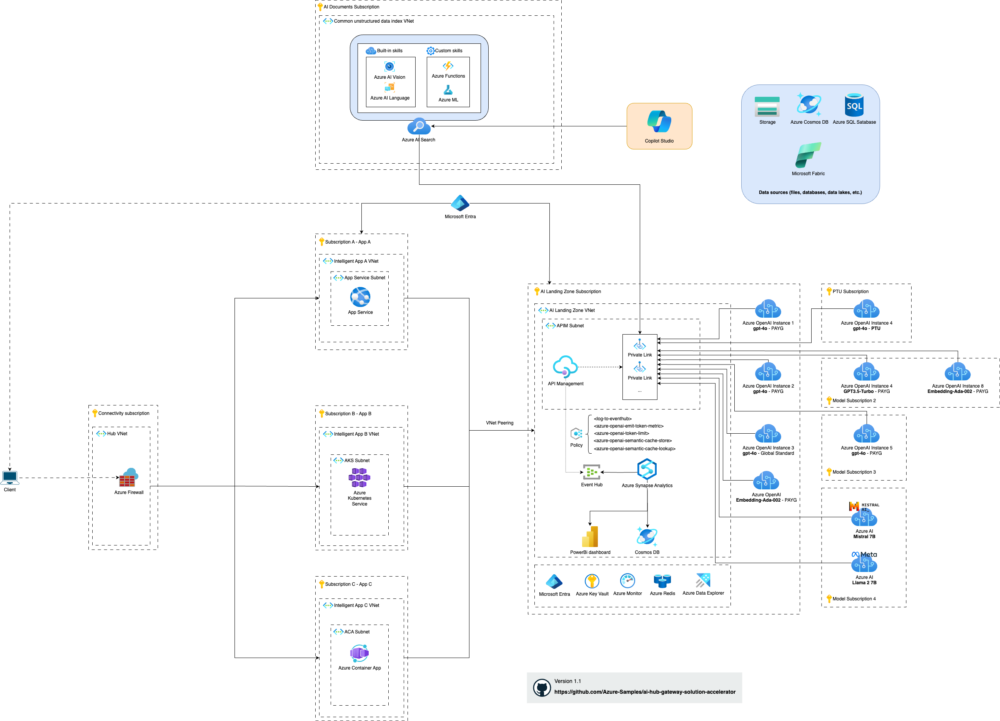

## AI Hub Gateway Landing Zone Architecture
The AI Hub Gateway Landing Zone architecture designed to be a central hub for AI services, providing a single point of entry for AI services, and enabling the organization to manage and govern AI services in a consistent manner. 

### Azure architecture diagram
This example diagram shows how these different Azure services would interact in a classic [hub-spoke topology](https://learn.microsoft.com/en-us/azure/architecture/networking/architecture/hub-spoke?tabs=cli). 

### Networking

The AI Landing Zone Virtual Network could be connected to the spokes via [virtual network peering](https://learn.microsoft.com/en-us/azure/virtual-network/virtual-network-peering-overview). The different applications (applications A, B and C) laying in the spoke networks would be able to resolve the API Management endpoint for their AI service consumption.

The different Azure OpenAi services would not be accessible to other external services, only being accessible through the API Management instance, being able to communicate to those instances via [Private Links](https://learn.microsoft.com/en-us/azure/private-link/private-link-overview).

For more details, see the [networking components section](#networking-components).

### AI Services and Indexes
The API Management instance would be able to communicate with one-to-many Azure OpenAI and/or AI service, as illustrated in the diagram. This can be a mix of 1 or more services, in 1 or more subscriptions, and also be of different model types, such as [Azure OpenAI Services](https://learn.microsoft.com/en-us/azure/ai-services/openai/overview) or other models in [Azure Machine Learning Studio, for example Mistral](https://learn.microsoft.com/en-us/azure/machine-learning/how-to-deploy-models-mistral?view=azureml-api-2).

It is also posible to make [Azure AI Search](https://learn.microsoft.com/en-us/azure/search/search-what-is-azure-search) indexes available through the API Management instance. This is particularly useful when wanting to consume a same index of data in several applications, while ensuring finer-grain control on the index.

For more details, see the [additional components section](#additional-components-deployment).

### Other data sources
Other data sources, such as Cosmos DB or SQL databases, could also be used as data sources to create the AI Search index.

### Cross-charging and token consumption count
When sharing AI consumption with different applications, sometimes it would be beneficial to know the token consumption for each application, in order to calculate charge-backs. This is possible using a combination of different services, such as Event Hub, Synapse Analytics, Cosmos DB and PowerBI.
For more details, see the [data and charge-back platforms section](#data-and-charge-back-platforms).

## Architecture components
The AI Hub Gateway Landing Zone consists of the following components:

### Main gateway components
These are the critical components of the AI Hub Gateway Landing Zone that provides the capabilities outlined above.

- **Azure API Management**: Azure API Management is a fully managed service that enables customers to publish, secure, transform, maintain, and monitor APIs.
- **Application Insights**: Application Insights is an extensible Application Performance Management (APM) service that provides critical insights on the gateway operational performance.
- **Event Hub**: Event Hub is a fully managed, real-time data ingestion service that’s simple, trusted, and scalable and it is used to stream usage and charge-back data to target data and charge back platforms.

### AI services
This is the Azure AI services that will be exposed through the AI Hub Gateway Landing Zone.

Examples of these service could include:

- **Azure OpenAI**: Azure OpenAI is a cloud deployment of cutting edge generative models from OpenAI (like ChatGPT, DALL.E and more).
- **Azure AI Search**: Azure AI Search is a cloud search service with built-in AI capabilities that enrich all types of information to help users identify and explore relevant content at scale (critical component of RAG-based generative AI applications).
- **Azure Cognitive Services**: Azure Cognitive Services is a set of cloud-based services with REST APIs and client library SDKs available to help you build cognitive intelligence into your applications.

### Backend services
These are the backend services that will include your AI business logic and experiences.

You can host backend services on Azure, on-premises, or other clouds.

Examples of these services could include:
- **Azure Kubernetes Service**: Azure Kubernetes Service (AKS) is a managed container orchestration service, based on the open-source Kubernetes system, which is available on the Microsoft Azure public cloud.
- **Azure Container Apps**: Azure Container Apps is a fully managed serverless container service that enables you to run containers on Azure without having to manage the infrastructure.
- **Azure App Service**: Azure App Service is a fully managed platform for building, deploying, and scaling web apps.

Also in these backends, it is common to use **AI Orchestrator** framework like [Semantic Kernel](https://github.com/microsoft/semantic-kernel) and [Langchain](https://www.langchain.com/) to orchestrate sophisticated AI workflows and scenarios.

### <a name="data-and-charge-back-platforms">Data and charge-back platforms</a>

As part of the AI Hub Gateway Landing Zone, you will need to integrate with existing data and charge-back platforms to track usage and charge-back to the respective business units.

Examples of these platforms could include:
- **Cosmos DB**: Azure Cosmos DB is a fully managed NoSQL database for storing usage and charge-back data.
- **Azure Synapse Analytics**: Azure Synapse Analytics is an analytics service that brings together enterprise data warehousing and big data analytics.
- **Microsoft Fabric**: Microsoft Fabric is a cloud-based platform that provides a scalable, reliable, and secure infrastructure for building and managing data and analytics solutions.
- **PowerBI**: Power BI is a business analytics service by Microsoft. It aims to provide interactive visualizations and business intelligence capabilities with an interface simple enough for end users to create their own reports and dashboards.