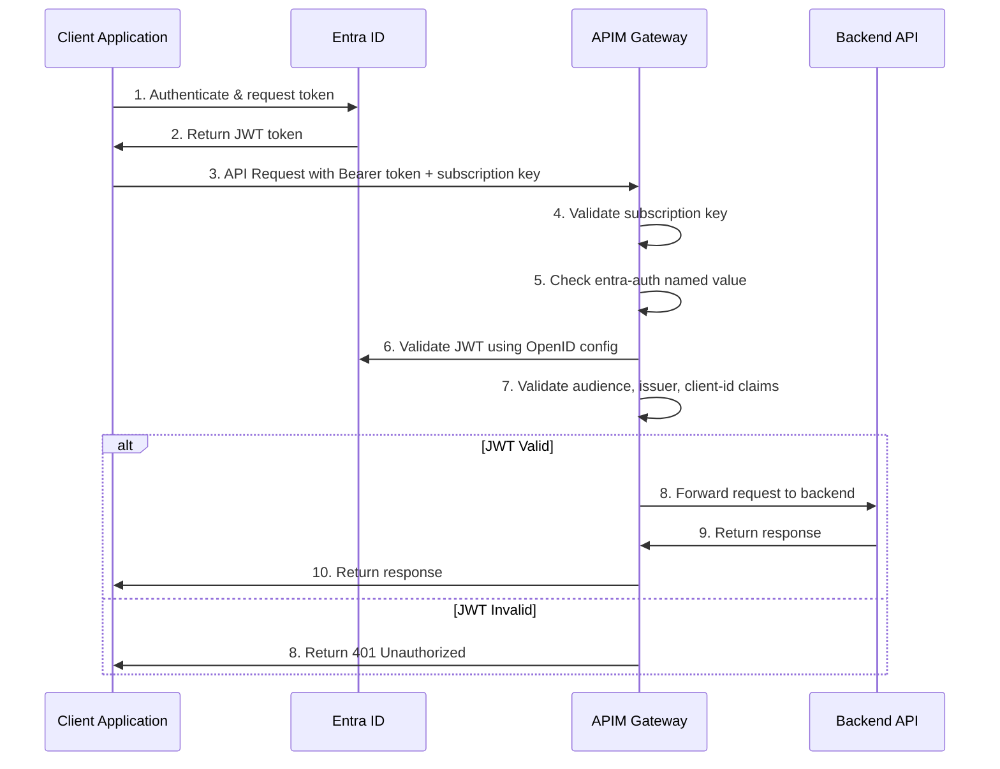
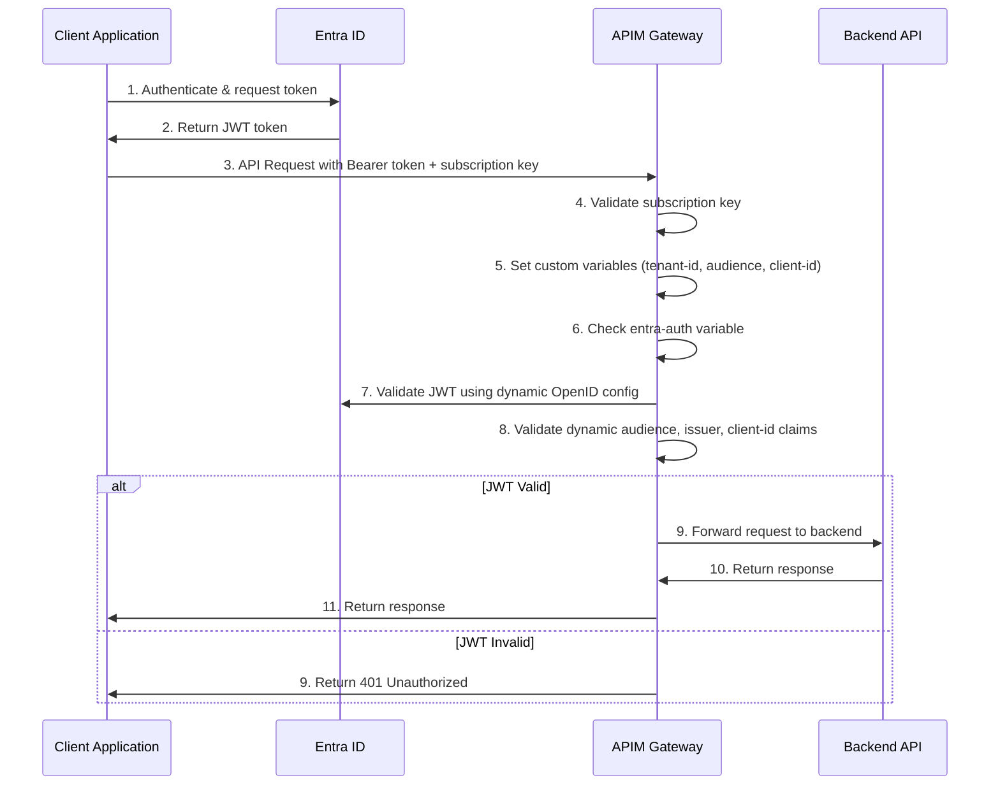

# Understanding JWT Token Authentication with Microsoft Entra ID

For use cases requiring additional security beyond subscription keys, JWT token validation with Microsoft Entra ID (formerly Azure AD) provides a robust solution. The AI Hub Gateway offers two distinct approaches for implementing JWT validation:

1. **Standard Entra ID Authentication**: Uses APIM named values for configuration
2. **Custom Entra ID Authentication**: Uses policy variables for flexible, use-case-specific configuration

Both approaches allow you to:
- **Restrict access to specific client applications**: Only registered applications with the correct client ID can access the API
- **Ensure tokens are properly issued**: Validates that tokens come from your trusted Entra ID tenant
- **Verify appropriate permissions**: Checks that necessary scopes/roles are included in the token
- **Implement Zero Trust principles**: Requires authentication at each access point, regardless of network location

## Approach 1: Standard Entra ID Authentication

This approach uses APIM named values and is suitable for scenarios where all APIs in a product use the same authentication configuration.

### User Flow Chart - Standard Approach



### Step-by-Step Configuration - Standard Approach

#### Step 1: Register Application in Microsoft Entra ID

1. Navigate to the Azure portal and select **Microsoft Entra ID**
2. Go to **App registrations** → **New registration**
3. Configure the application:
   - **Name**: Your client application name (e.g., "AI Hub Client App")
   - **Supported account types**: Choose appropriate option for your use case
   - **Redirect URI**: Configure if using authorization code flow
4. After registration, note the **Application (client) ID**
5. Configure **API permissions** if needed for your use case
6. For client credentials flow, create a **client secret** under **Certificates & secrets**

#### Step 2: Configure APIM Named Values

1. Navigate to your APIM instance in Azure portal
2. Go to **Named values** and create the following:

| Named Value | Value | Description |
|-------------|-------|-------------|
| `entra-auth` | `true` | Enables JWT validation |
| `tenant-id` | `{your-tenant-id}` | Your Entra ID tenant ID |
| `audience` | `{your-audience}` | Resource identifier (often the client ID or custom audience) |
| `client-id` | `{your-client-id}` | Application ID from Step 1 |

#### Step 3: Apply Policy Fragment to Product

1. Navigate to **Products** in your APIM instance
2. Select the product you want to secure
3. Go to **Policies** and edit the inbound policy
4. Add the fragment reference:
```xml
<policies>
    <inbound>
        <base />
        <include-fragment fragment-id="aad-auth" />
        <!-- other policies -->
    </inbound>
</policies>
```

#### Step 4: Client Implementation

Configure your client application to:

1. **Acquire JWT token** from Entra ID:
```http
POST https://login.microsoftonline.com/{tenant-id}/oauth2/v2.0/token
Content-Type: application/x-www-form-urlencoded

grant_type=client_credentials
&client_id={client-id}
&client_secret={client-secret}
&scope={audience}/.default
```

2. **Make API requests** with both tokens:
```http
GET https://your-apim-gateway.azure-api.net/api/endpoint
Authorization: Bearer {jwt-token}
Ocp-Apim-Subscription-Key: {subscription-key}
```

## Approach 2: Custom Entra ID Authentication

This approach uses policy variables and provides flexibility for different use cases with varying authentication requirements within the same product.

### User Flow Chart - Custom Approach



### Step-by-Step Configuration - Custom Approach

#### Step 1: Register Application in Microsoft Entra ID

Follow the same steps as in the Standard Approach.

#### Step 2: Configure API-Specific Policy

Instead of using named values, set variables directly in your API or operation policy:

```xml
<policies>
    <inbound>
        <base />
        
        <!-- Set authentication variables for this specific use case -->
        <set-variable name="entra-auth" value="true" />
        <set-variable name="tenant-id" value="{your-tenant-id}" />
        <set-variable name="audience" value="{your-specific-audience}" />
        <set-variable name="client-id" value="{your-client-id}" />
        
        <!-- Include the custom authentication fragment -->
        <include-fragment fragment-id="aad-auth-custom" />
        
        <!-- other policies -->
    </inbound>
</policies>
```

#### Step 3: Use Case-Specific Configurations

For different APIs or operations within the same product, you can configure different authentication parameters:

**Example: Different client applications per API**
```xml
<!-- API 1: Internal applications -->
<set-variable name="client-id" value="{internal-app-client-id}" />
<set-variable name="audience" value="api://internal-hub" />

<!-- API 2: Partner applications -->
<set-variable name="client-id" value="{partner-app-client-id}" />
<set-variable name="audience" value="api://partner-hub" />
```

**Example: Conditional authentication based on request**
```xml
<choose>
    <when condition="@(context.Request.Url.Path.Contains("/premium/"))">
        <set-variable name="entra-auth" value="true" />
        <set-variable name="client-id" value="{premium-client-id}" />
    </when>
    <otherwise>
        <set-variable name="entra-auth" value="false" />
    </otherwise>
</choose>
```

#### Step 4: Advanced Custom Scenarios

**Multi-tenant support:**
```xml
<set-variable name="tenant-id" value="@{
    string clientId = context.Request.Headers.GetValueOrDefault("X-Tenant-Id", "");
    return clientId == "tenant1" ? "{tenant1-id}" : "{tenant2-id}";
}" />
```

**Dynamic audience based on request:**
```xml
<set-variable name="audience" value="@{
    string apiVersion = context.Request.Headers.GetValueOrDefault("Api-Version", "v1");
    return $"api://ai-hub-{apiVersion}";
}" />
```

## Comparison: Standard vs Custom Approach

| Aspect | Standard Approach | Custom Approach |
|--------|------------------|------------------|
| **Configuration** | APIM Named Values | Policy Variables |
| **Flexibility** | Product-level | API/Operation-level |
| **Use Case** | Uniform authentication across product | Varying authentication requirements |
| **Maintenance** | Centralized configuration | Distributed configuration |
| **Performance** | Slightly faster (pre-resolved values) | Dynamic evaluation |
| **Complexity** | Simple | More complex but flexible |

## Security Considerations

- **Token Lifetime**: JWT tokens should be short-lived (1 hour or less)
- **Claim Validation**: Consider requiring additional claims for more granular control
- **Secret Management**: Keep client secrets properly secured using Azure Key Vault
- **CORS Policies**: Implement appropriate CORS policies if browser clients will access the API
- **Rate Limiting**: Apply rate limiting policies to prevent abuse
- **Logging**: Enable comprehensive logging for security monitoring
- **Token Refresh**: Implement proper token refresh mechanisms in client applications

## Troubleshooting Common Issues

1. **401 Unauthorized Errors**:
   - Verify tenant-id, client-id, and audience values
   - Check token expiration
   - Ensure proper Bearer token format

2. **Token Validation Failures**:
   - Verify OpenID configuration endpoint accessibility
   - Check issuer claim matches expected format
   - Validate audience claim in token

3. **Variable Resolution Issues** (Custom Approach):
   - Ensure variables are set before including the fragment
   - Check variable names match exactly
   - Verify conditional logic for dynamic scenarios

## Best Practices

1. **Use Standard Approach** when all APIs in a product have the same authentication requirements
2. **Use Custom Approach** when you need flexibility for different use cases within the same product
3. **Implement proper error handling** to provide meaningful error messages
4. **Monitor authentication metrics** to identify potential security issues
5. **Regularly rotate client secrets** and update configurations accordingly
6. **Test both approaches thoroughly** in non-production environments before deployment