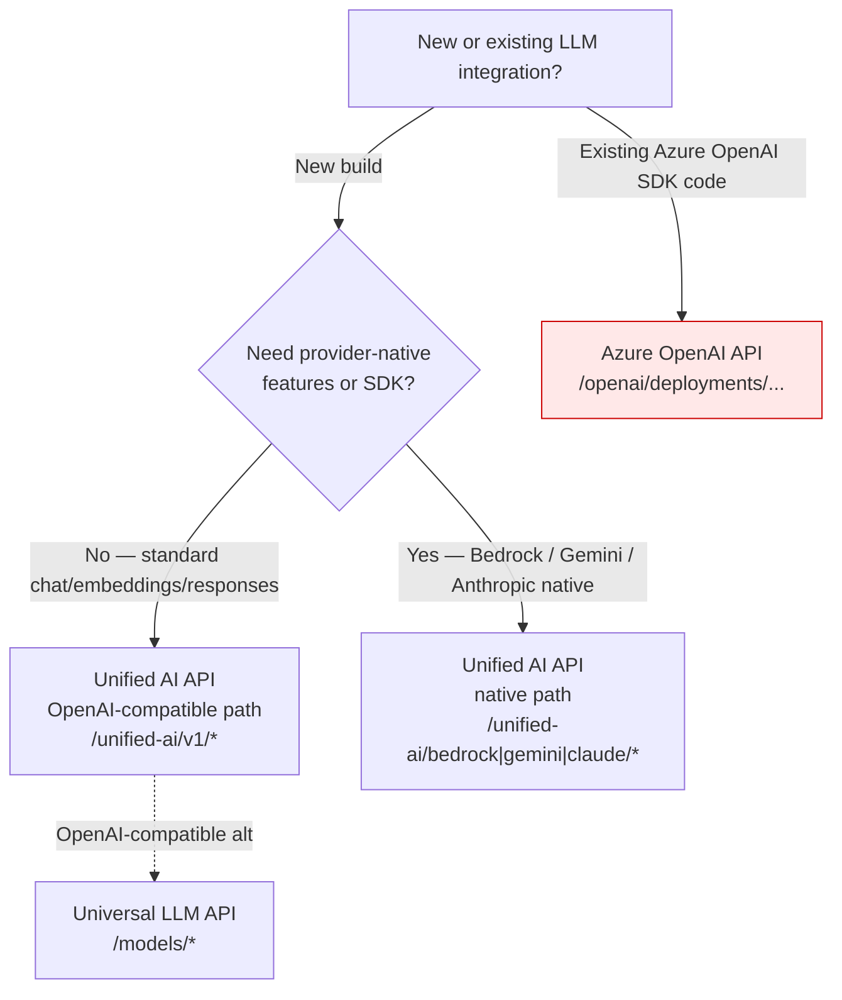

# LLM Access Guide

> **Unified reference for accessing LLMs through the Citadel Governance Hub.** This guide consolidates the three LLM API surfaces and the two access patterns into a single decision and implementation reference. 

It opens with an executive summary for architects and platform owners, then dives into the deep technical routing internals for engineers.

---

## Executive Summary

The Citadel Governance Hub exposes every LLM — Azure OpenAI (legacy), Microsoft Foundry Models, AWS Bedrock, Google Gemini, Anthropic Claude, and other providers — through **Azure API Management (APIM)** acting as a single, governed front door. 

Instead of distributing master keys and letting each team call provider endpoints directly, all traffic flows through one control plane that enforces security, RBAC, cost attribution, load balancing, failover, and observability on every call.

### Three LLM APIs

Citadel Governance Hub offers **three distinct API surfaces** to accommodate different client needs and integration scenarios. Each API supports one or both of the two access patterns (OpenAI-Compatible and Provider-Native) described in the next section.

| API | Path | Access pattern(s) | Primary use case | Validation notebook |
|---|---|---|---|---|
| **Azure OpenAI API** | `/openai/deployments/{deployment-id}/*` | OpenAI-Compatible (Azure OpenAI SDK shape) | **Legacy integration only** — existing code built on the Azure OpenAI SDK that pins the `/openai/deployments/...` URL shape. | [citadel-access-contracts-tests.ipynb](../validation/citadel-access-contracts-tests.ipynb) |
| **Universal LLM API** | `/models/*` | OpenAI-Compatible (OpenAI v1 spec) | OpenAI-compatible access across many models/providers via a single stable path. | [citadel-universal-llm-api-all-models-tests.ipynb](../validation/citadel-universal-llm-api-all-models-tests.ipynb) |
| **Unified AI API** ⭐ | `/unified-ai/*` | OpenAI-Compatible **and** Provider-Native | **Recommended** single wildcard endpoint that serves OpenAI-compatible *and* every provider-native pattern with dynamic routing. | [citadel-unified-ai-api-tests.ipynb](../validation/citadel-unified-ai-api-tests.ipynb) |

### Two access patterns

Every way a client can call a model collapses into one of two patterns:

| Access pattern | What it is | Surfaces that support it | Recommended for |
|---|---|---|---|
| **OpenAI-Compatible access** | Standard OpenAI request/response shapes (`/chat/completions`, `/embeddings`, `/responses`, `/v1/*`). Clients use stock OpenAI SDKs and the gateway routes transparently to whichever backend hosts the model. | **All three APIs** (Azure OpenAI API, Universal LLM API, Unified AI API) | The default for **new** integrations and any code that already speaks OpenAI. |
| **LLM Provider-Native access** | The provider's own wire format — Bedrock Converse (`/model/{id}/converse`), Gemini (`/models/{id}:generateContent`), Anthropic Messages (`/v1/messages`). Clients use the provider's native SDK and get provider-specific features. | **Unified AI API only** | Workloads that need provider-exclusive capabilities or must run an existing provider-native SDK unchanged. |

### Quick recommendations



- **Starting fresh and speaking OpenAI?** Use the **Unified AI API** OpenAI-compatible path (`/unified-ai/v1/*`). It gives you the broadest backend reach plus a clean upgrade path to native features later. The **Universal LLM API** (`/models/*`) is an equally valid OpenAI-compatible alternative when you want a dedicated, OpenAI-v1-only surface.
- **Need a provider's exclusive feature or native SDK?** Use the **Unified AI API** native paths (`/unified-ai/bedrock/...`, `/unified-ai/gemini/...`, `/unified-ai/claude/...`).
- **Migrating existing Azure OpenAI SDK code?** Point it at the **Azure OpenAI API** (`/openai/deployments/...`) — it preserves the exact URL shape. Treat this as **legacy compatibility**, not the target state for new work.

> Regardless of which API or pattern you pick, the **same governance, RBAC, cost attribution, model aliases, and observability** apply — that is the entire point of routing through the gateway.

---

## Why Route LLM Access Through the Gateway?

Direct, key-per-team access to provider endpoints creates unpredictable cost, no central policy, no failover, and no audit trail. The gateway turns every LLM call into a governed, observable, and resilient operation. These benefits apply uniformly to **all three APIs and both access patterns**.

| Benefit | What the gateway provides | Where it shows up technically |
|---|---|---|
| **Managed credentials** | Scoped, revocable APIM subscription keys (and optional JWT) replace master provider keys. Backends authenticate via managed identity / SigV4 / provider keys held by the gateway, never by the client. | [Security Handler](#step-4-security-handler-security-handler), [Authentication & Routing](#step-4-authentication--routing-set-backend-authorization) |
| **Model-based routing** | Clients ask for a *model*; the gateway maps it to the right backend/pool — no hard-coded endpoints. | [Target Pool Selection](#step-3-target-pool-selection-set-target-backend-pool) |
| **Load balancing & failover** | Multiple backends serving the same model form a pool with priority/weight and automatic retry on 429/5xx. | [Backend Pool Types](#backend-pool-types), [Retry Logic](#retry-logic), [Circuit Breaker](#circuit-breaker-protection) |
| **Model aliases** | One client-facing name (e.g. `adv-gpt`) resolves at runtime to one of several real models, possibly across providers — enabling upgrades, A/B tests, and cross-provider fallback transparently. | [Model Aliases](#model-aliases) |
| **Multi-cloud reach** | Azure OpenAI, Foundry, Bedrock, Gemini, and Anthropic all behind one front door, callable OpenAI-style or provider-native. | [The Two Access Patterns](#the-two-access-patterns) |
| **RBAC / access contracts** | Per-product `allowedModels` and `allowedBackendPools` decide which use case can reach which model/pool. | [RBAC Integration](#rbac-integration), [Access Contracts notebook](../validation/citadel-access-contracts-tests.ipynb) |
| **Cost attribution & usage metrics** | Token usage is emitted per product / model / backend / app for chargeback and FinOps. | [Usage Metrics Collection](#usage-metrics-collection), [Power BI Dashboard](./power-bi-dashboard.md) |
| **Content safety & PII** | Prompt shields, harmful-content detection, and PII anonymization can be enforced in policy without app changes. | [PII Masking](./pii-masking-apim.md), [PII notebook](../validation/citadel-pii-processing-tests.ipynb) |
| **Stateful-resource isolation** | Responses API `response_id` values are owned per subscription and product — cross-owner access is blocked for 30 days. | [Responses API ID Security](#step-15-responses-api-id-security-responses-id-security--responses-id-cache-store) |
| **Observability** | Central App Insights / Azure Monitor metrics plus optional `UAIG-*` debug headers expose every routing decision. | [Response Headers](#step-10-response-headers-set-response-headers), [Governance Hub Benefits](./governance-hub-benefits.md) |

---

## The Three LLM APIs

All three APIs share the same underlying routing fragments and backend pool infrastructure. They differ in the **URL shape they expose to clients** and **which access patterns they support**.

| API | Path | Use Case |
|-----|------|----------|
| **Unified AI API** | `/unified-ai/*` | **RECOMMENDED** — single wildcard endpoint supporting all API types (OpenAI, Inference, Responses, Gemini, OpenAI-Compatible, and provider-native Bedrock/Gemini/Anthropic) with dynamic routing |
| **Universal LLM API** | `/models/*` | OpenAI-compatible inference endpoints supporting many models across providers |
| **Azure OpenAI API** | `/openai/deployments/{deployment-id}/*` | Azure OpenAI SDK compatibility (legacy integration) |

### Azure OpenAI API — `/openai/deployments/{deployment-id}/*`

Preserves the exact Azure OpenAI SDK URL shape, where the model is a `{deployment-id}` path parameter. Use it **only** to keep existing Azure-OpenAI-SDK code working unchanged. New integrations should prefer the Unified AI or Universal LLM OpenAI-compatible surfaces, which decouple the client from the Azure-specific deployment path.

- **Access pattern:** OpenAI-Compatible (Azure OpenAI SDK dialect)
- **Model location:** `{deployment-id}` URL path parameter
- **Validation:** [citadel-access-contracts-tests.ipynb](../validation/citadel-access-contracts-tests.ipynb) exercises this surface as part of access-contract provisioning.

### Universal LLM API — `/models/*`

Implements the **OpenAI v1 spec** (chat completions, embeddings, and the full Responses API trio in addition to other operations outlined in OpenAI V1 spec) behind a single stable `/models` path. The model travels in the request body (or the `/deployments/{model}/` segment for AOAI passthrough), so a single client URL can reach many models across Azure OpenAI, Foundry, Bedrock-Mantle, and Gemini-OpenAI backends — as long as those backends expose an OpenAI-compatible surface.

- **Access pattern:** OpenAI-Compatible (OpenAI v1)
- **Compatible pool types:** `azure-openai`, `ai-foundry`, `aws-bedrock-mantle`, `gemini-openai` (native-only pools are excluded — see [`compatiblePoolTypes`](#step-3-target-pool-selection-set-target-backend-pool))
- **Validation:** [citadel-universal-llm-api-all-models-tests.ipynb](../validation/citadel-universal-llm-api-all-models-tests.ipynb) discovers every gateway model via `GET /models/models` and runs chat / embeddings / Responses against each.

> You can consider this layer if you want to maintain access to all OpenAI specific operations beyond the standard chat, embedding and responses patterns keeping in mind that the underlying backend must support those operations. For example, Azure OpenAI and Foundry support the full OpenAI v1 spec and are accessible through this API, but AWS Bedrock and Google Gemini only support a subset of OpenAI-compatible operations and are better accessed through the Unified AI API.

### Unified AI API — `/unified-ai/*` ⭐ Recommended

A single wildcard (`/*`) catch-all that dynamically detects the API type from the request path and reconstructs the backend URI. One endpoint serves **both** access patterns:

- **OpenAI-Compatible:** `/unified-ai/v1/*`, `/unified-ai/openai/...`, `/unified-ai/models/...`, `/unified-ai/openai/responses`
- **Provider-Native:** `/unified-ai/bedrock/...` (Converse), `/unified-ai/gemini/...` (`generateContent`), `/unified-ai/claude/...` (Messages)

This is the strategic target surface because it adds dynamic path-based routing, centralized config caching, model aliases across providers, and multi-API-type support on top of the shared routing core.

- **Access patterns:** OpenAI-Compatible **and** Provider-Native
- **Validation:** [citadel-unified-ai-api-tests.ipynb](../validation/citadel-unified-ai-api-tests.ipynb) (routing patterns) and [llm-backend-onboarding-extended-providers-runner.ipynb](../validation/llm-backend-onboarding-extended-providers-runner.ipynb) (native Bedrock/Gemini/Anthropic onboarding).

---

## The Two Access Patterns

### OpenAI-Compatible Access

Clients send standard OpenAI request/response shapes and use stock OpenAI SDKs. The gateway transparently routes each request to the correct backend (Azure AI Foundry, Azure OpenAI, AWS Bedrock Mantle, Google Gemini, etc.) based on the model in the request — the client never changes code per provider.

Supported operations on the OpenAI-compatible surfaces:

- `POST /v1/chat/completions` — Chat completions
- `POST /v1/embeddings` — Text embeddings
- `POST /v1/responses` — Responses API
- `POST /v1/images/generations` — Image generation
- `GET  /v1/models` — List available models

**Supported by all three APIs.** The `openai-compat` path (`/unified-ai/v1/*`) uses **backend-path-templates** to construct the correct backend URL based on backend type, so the same client request routes to completely different backend paths:

| Backend Type | Client Path | Backend Path |
|---|---|---|
| `ai-foundry` | `/v1/chat/completions` | `/openai/v1/chat/completions` (model in body) |
| `azure-openai` | `/v1/chat/completions` | `/openai/v1/chat/completions` (model in body) |
| `aws-bedrock-mantle` | `/v1/chat/completions` | `/v1/chat/completions` |
| `gemini-openai` | `/v1/chat/completions` | `/v1beta/openai/chat/completions` |
| `aws-bedrock` | `/v1/chat/completions` | `/model/{model}/converse` |

#### Using the OpenAI Python SDK

```python
from openai import OpenAI

client = OpenAI(
    api_key="<apim-subscription-key>",
    base_url="https://<apim-gateway>/unified-ai/v1",
)

response = client.chat.completions.create(
    model="gpt-5.1",  # Any model configured in the gateway
    messages=[{"role": "user", "content": "Hello!"}],
)
print(response.choices[0].message.content)
```

#### Using curl

```bash
curl -X POST "https://<apim-gateway>/unified-ai/v1/chat/completions" \
  -H "Content-Type: application/json" \
  -H "api-key: <subscription-key>" \
  -d '{
    "model": "gpt-5.1",
    "messages": [{"role": "user", "content": "Hello!"}]
  }'
```

> **Azure OpenAI API is OpenAI-compatible too, but legacy.** The `/openai/deployments/{id}/...` shape is also OpenAI-compatible, but it pins the Azure-specific deployment URL. Prefer `/unified-ai/v1/*` or `/models/*` for new work and reserve `/openai/deployments/...` for existing Azure OpenAI SDK code.

**Validation:** [citadel-universal-llm-api-all-models-tests.ipynb](../validation/citadel-universal-llm-api-all-models-tests.ipynb) (every model, OpenAI-compatible chat/embeddings/responses) and [citadel-agent-frameworks-tests.ipynb](../validation/citadel-agent-frameworks-tests.ipynb) (real agent SDKs consuming the OpenAI-compatible surface).

### LLM Provider-Native Access

Clients speak the provider's own wire protocol and use the provider's native SDK, gaining access to provider-exclusive features that have no OpenAI equivalent. **Supported by the Unified AI API only**, via dedicated path prefixes:

| Provider | Native path | Wire format | Model location |
|---|---|---|---|
| **AWS Bedrock** | `/unified-ai/bedrock/model/{id}/converse` | Bedrock Converse | `/model/{id}/` segment (URL-decoded; supports inference-profile ARNs) |
| **Google Gemini** | `/unified-ai/gemini/v1beta/models/{id}:generateContent` | Gemini native | `/models/{id}:` segment |
| **Anthropic Claude** | `/unified-ai/claude/v1/messages` | Anthropic Messages | request body `model` field |

Each native prefix declares a `compatible-pool-types` value (`aws-bedrock`, `gemini`, `anthropic`) so the gateway routes **only** to the matching native pool — even when the same model id also exists on an OpenAI-compatible (`aws-bedrock-mantle` / `gemini-openai`) pool. See [Pool isolation](#pool-isolation-compatible-pool-types).

#### Bedrock native example

```bash
curl -X POST "https://<apim-gateway>/unified-ai/bedrock/model/us.anthropic.claude-3-5-haiku-20241022-v1:0/converse" \
  -H "Content-Type: application/json" \
  -H "api-key: <subscription-key>" \
  -d '{
    "messages": [{"role": "user", "content": [{"text": "Hello"}]}],
    "inferenceConfig": {"maxTokens": 512, "temperature": 0.5, "topP": 0.9}
  }'
```

**Validation:** [llm-backend-onboarding-extended-providers-runner.ipynb](../validation/llm-backend-onboarding-extended-providers-runner.ipynb) onboards and validates AWS Bedrock, GCP Gemini, and Anthropic Claude through native (and OpenAI-compatible) routing; [citadel-unified-ai-api-tests.ipynb](../validation/citadel-unified-ai-api-tests.ipynb) exercises the native path patterns.

---

## When to Use What

| Your situation | Recommended API | Pattern | Why |
|---|---|---|---|
| New build, standard chat/embeddings/responses | **Unified AI API** (`/unified-ai/v1/*`) | OpenAI-Compatible | Broadest backend reach + clean upgrade path to native features; one endpoint for everything. |
| New build, want a dedicated OpenAI-v1-only surface | **Universal LLM API** (`/models/*`) | OpenAI-Compatible | Stable single path, OpenAI-compatible pools only, simpler mental model. |
| Need a provider-exclusive feature or native SDK | **Unified AI API** (`/unified-ai/bedrock|gemini|claude/*`) | Provider-Native | Only surface that speaks the provider's own protocol. |
| Existing Azure OpenAI SDK code | **Azure OpenAI API** (`/openai/deployments/...`) | OpenAI-Compatible (legacy) | Preserves the exact URL shape with zero client change. |
| Cross-provider fallback / model upgrades without client change | Any API + **model alias** | Either | Alias resolves to real models at runtime with priority/weighted strategy. |
| Multi-team governance, per-use-case model restrictions | Any API + **access contract** | Either | `allowedModels` / `allowedBackendPools` enforced per product. |
| Generate or edit images (gpt-image, FLUX, MAI) | **Unified AI API** (`/unified-ai/v1/images/*`) | OpenAI-Compatible | One OpenAI-style images endpoint; gateway builds each provider's path internally. See [Image Models](#image-models). |

> **Rule of thumb:** default to the **Unified AI API**. Drop to the **Universal LLM API** when you want an OpenAI-v1-only surface, and to the **Azure OpenAI API** only for legacy compatibility.

---

## Image Models

The Unified AI API also routes **image-generation and image-edit** models — Azure OpenAI **gpt-image**, Black Forest Labs **FLUX**, and Microsoft **MAI** — through a single OpenAI-style images surface. Because all three providers return OpenAI-shaped responses (`data[].b64_json`), the gateway needs **no response translation**: it only builds the correct provider path per backend type. Image traffic is isolated behind a dedicated `image` api-type and new pool types, so chat/embeddings/responses and the native provider surfaces are unaffected.

### Client surface

| Endpoint | Model location | Use for |
|---|---|---|
| `POST /unified-ai/v1/images/generations` | `model` in JSON body | Generation (any image model) |
| `POST /unified-ai/openai/deployments/{model}/images/generations` | `{model}` in URL | Generation (Azure OpenAI SDK style) |
| `POST /unified-ai/openai/deployments/{model}/images/edits` | `{model}` in URL | Edits (multipart) — **recommended** |
| `POST /unified-ai/v1/images/edits` | `x-ai-model` **header** | Edits (multipart) without the deployments path |

> Image **edits** are `multipart/form-data`, and the model can't be read from a multipart form field. Use the `/openai/deployments/{model}/images/edits` form (model in URL), or set the `x-ai-model` header on `POST /v1/images/edits`. A missing model returns `400 missing_model_parameter` with explicit guidance.

### Provider routing

| Provider | Backend type | Backend path the gateway builds | Model location |
|---|---|---|---|
| Azure OpenAI / Foundry gpt-image | `ai-foundry` / `azure-openai` | `/openai/v1/images/{generations\|edits}` | Body / URL |
| Black Forest Labs FLUX | `azure-flux` | `/providers/blackforestlabs/v1/{modelPath}?api-version=preview` | Body (slug from `modelPath`) |
| Microsoft MAI | `azure-mai` | `/mai/v1/images/{generations\|edits}` | Body |

FLUX requires a one-time `modelPath` slug per model (e.g. `FLUX.2-pro` -> `flux-2-pro`) because the URL slug isn't derivable from the model name. Example generation request:

```bash
curl -X POST "https://<apim-gateway>/unified-ai/v1/images/generations" \
  -H "Content-Type: application/json" \
  -H "api-key: <subscription-key>" \
  -d '{ "model": "FLUX.2-pro", "prompt": "A red fox in an autumn forest", "n": 1, "size": "1024x1024" }' \
  | jq -r '.data[0].b64_json' | base64 --decode > out.png
```

RBAC, model aliases, cost attribution, and access contracts apply to image models exactly as they do to LLMs (`allowedModels` matches the image model name). Token-usage metrics are unchanged — image responses simply emit zero token usage. Full onboarding details and example `.bicepparam` config are in [LLM Backend Onboarding — Image Models](../bicep/infra/llm-backend-onboarding/README.md#image-models).

---

# Deep Technical Reference — Routing Architecture

The remainder of this guide is the engineering deep dive: the policy fragments, request flows, and per-step internals that implement the access patterns above.

## Approach

Routing relies on **APIM Policy Fragments** to implement dynamic routing logic without modifying the main API policies. Fragments keep the logic modular and reusable across all three APIs.

**Shared fragments** (used by all three APIs):
- `set-backend-pools`: Loads backend pool configurations including supported models per backend
- `set-target-backend-pool`: Matches the requested model to a backend pool (extended with `apiTypeOverrideBackend` for Unified AI)
- `set-backend-authorization`: Configures authentication for the target backend (respects `skipBackendUrlRewrite` for Unified AI)
- `set-llm-usage`: Collects token usage metrics
- `validate-model-access`: Model access control per product
- `resolve-model-alias`: Resolves a client-facing alias (e.g. `adv-gpt`) to an actual model based on `priority` or `weighted` strategy

**Shared fragment** (Universal LLM and Azure OpenAI only):
- `set-llm-requested-model`: Extracts the requested model from the request path or body

**Unified AI-specific fragments:**
- `metadata-config`: Centralized JSON configuration for models, API types, and timeout settings
- `central-cache-manager`: Caches and parses the metadata configuration with TTL-based expiry
- `request-processor`: Analyzes request paths to detect API type and extract model (replaces `set-llm-requested-model`)
- `security-handler`: Unified authentication (API Key + optional JWT per product)
- `path-builder`: Reconstructs backend URIs based on API type
- `set-response-headers`: Injects `UAIG-*` debug headers when enabled

## Architecture Overview

### Universal LLM API / Azure OpenAI API

```
┌─────────────────────────────────────────────────────────────────────────────┐
│                           Client Request                                    │
│   POST /models/chat/completions  OR  POST /openai/deployments/gpt-4o/...    │
└────────────────────────────────────┬────────────────────────────────────────┘
                                     │
                                     ▼
┌─────────────────────────────────────────────────────────────────────────────┐
│                        APIM Gateway (Inbound)                               │
│  ┌───────────────────────────────────────────────────────────────────────┐  │
│  │ 1. Authentication (Entra ID / API Key)                                │  │
│  │ 2. Extract Model (from body or deployment-id path)                    │  │
│  │ 3. Load Backend Pools Configuration                                   │  │
│  │ 4. Match Model → Backend Pool                                         │  │
│  │ 5. Validate RBAC (allowed pools check)                                │  │
│  │ 6. Set Authorization (Managed Identity)                               │  │
│  │ 7. Route to Backend Pool                                              │  │
│  └───────────────────────────────────────────────────────────────────────┘  │
└────────────────────────────────────┬────────────────────────────────────────┘
                                     │
                                     ▼
┌────────────────────────────────────────────────────────────────────────────┐
│                         Backend Pool Selection                             │
│                                                                            │
│   ┌─────────────────┐    ┌─────────────────┐    ┌─────────────────┐        │
│   │  gpt-4o-pool    │    │ deepseek-r1-pool│    │ Direct Backend  │        │
│   │  ┌───────────┐  │    │  ┌───────────┐  │    │                 │        │
│   │  │ Backend 1 │  │    │  │ Backend 1 │  │    │  Single backend │        │
│   │  │(P:1,W:100)│  │    │  │(P:1,W:100)│  │    │  for unique     │        │
│   │  └───────────┘  │    │  └───────────┘  │    │  models         │        │
│   │  ┌───────────┐  │    │  ┌───────────┐  │    │                 │        │
│   │  │ Backend 2 │  │    │  │ Backend 2 │  │    └─────────────────┘        │
│   │  │ (P:2,W:50)│  │    │  │ (P:2,W:50)│  │                               │
│   │  └───────────┘  │    │  └───────────┘  │                               │
│   └─────────────────┘    └─────────────────┘                               │
└────────────────────────────────────┬───────────────────────────────────────┘
                                     │
                                     ▼
┌────────────────────────────────────────────────────────────────────────────┐
│                          LLM Backend Targets                               │
│                                                                            │
│   ┌─────────────┐      ┌─────────────┐      ┌─────────────┐      ┌───────────┐  │
│   │   Foundry   │      │ Azure OpenAI│      │   Amazon    │      │ External  │  │
│   │  Endpoint   │      │  Endpoint   │      │  Bedrock    │      │ Provider  │  │
│   └─────────────┘      └─────────────┘      └─────────────┘      └───────────┘  │
└────────────────────────────────────────────────────────────────────────────┘
```

### Unified AI API

The Unified AI API uses a wildcard catch-all (`/*`) to handle all request patterns through a single endpoint, with dynamic API-type detection and path reconstruction.

```
┌─────────────────────────────────────────────────────────────────────────────┐
│                           Client Request                                    │
│  POST /unified-ai/openai/deployments/gpt-4o/chat/completions                │
│  POST /unified-ai/models/chat/completions (body: model)                     │
│  POST /unified-ai/v1beta/openai/chat/completions (Gemini)                   │
│  POST /unified-ai/openai/responses (Responses API)                          │
│  GET  /unified-ai/deployments (Model Discovery)                             │
└────────────────────────────────────┬────────────────────────────────────────┘
                                     │
                                     ▼
┌─────────────────────────────────────────────────────────────────────────────┐
│                    APIM Gateway (Unified AI Inbound)                        │
│  ┌───────────────────────────────────────────────────────────────────────┐  │
│  │ 1. Load Metadata Config (models, api-types, timeouts)                 │  │
│  │ 2. Cache Manager (version-keyed cache with 300s TTL)                  │  │
│  │ 3. Request Processor (detect api-type from path, extract model)       │  │
│  │ 4. Security Handler (API Key + optional JWT per product)              │  │
│  │ 5. Validate Model Access (per product allowedModels)                  │  │
│  │ 6. Load Backend Pools Configuration                   [SHARED]        │  │
│  │ 7. Match Model → Backend Pool (with api-type override)[SHARED]        │  │
│  │ 8. Set Authorization (Managed Identity)               [SHARED]        │  │
│  │ 9. Path Builder (reconstruct backend URI per api-type)                │  │
│  │ 10. Token Usage Metrics                               [SHARED]        │  │
│  └───────────────────────────────────────────────────────────────────────┘  │
└────────────────────────────────────┬────────────────────────────────────────┘
                                     │
                              ┌──────┴──────┐
                              │ API Type    │
                              │ Detection   │
                              └──────┬──────┘
            ┌─────────┬──────────┬───┴───┬──────────┬────────────┬────────────┐
            ▼         ▼          ▼       ▼          ▼            ▼            ▼
       ┌─────────┐┌────────┐┌────────┐┌────────┐┌──────────┐┌──────────┐┌──────────┐
       │ openai  ││infer-  ││respon- ││respon- ││openai-v1 ││gemini-   ││bedrock   │
       │         ││ence    ││ses     ││ses-v1  ││          ││openai    ││          │
       │/openai/ ││/models/││/openai/││/openai/││/openai/  ││/v1beta/  ││/model/   │
       │deploy...││chat/.. ││respon..││v1/resp.││v1/deploy.││openai/.. ││converse  │
       └────┬────┘└───┬────┘└───┬────┘└───┬────┘└────┬─────┘└────┬─────┘└────┬─────┘
            └─────────┴─────────┴────┬────┴──────────┴────────────┴───────────┘
                                     ▼
┌────────────────────────────────────────────────────────────────────────────┐
│                         Backend Pool Selection                             │
│           (same pool infrastructure as other APIs)                         │
└────────────────────────────────────┬───────────────────────────────────────┘
                                     │
                                     ▼
┌────────────────────────────────────────────────────────────────────────────┐
│                          LLM Backend Targets                               │
│   ┌─────────────┐  ┌─────────────┐  ┌─────────────┐  ┌─────────────┐         │
│   │   Foundry   │  │ Azure OpenAI│  │   Amazon    │  │ External    │         │
│   │  Endpoint   │  │  Endpoint   │  │  Bedrock    │  │ Provider    │         │
│   └─────────────┘  └─────────────┘  └─────────────┘  └─────────────┘         │
└────────────────────────────────────────────────────────────────────────────┘
```

## Routing Flow Details

### Universal LLM API / Azure OpenAI API Flow

These two APIs use shared fragments for a straightforward model → backend pool → backend routing flow.

#### Step 1: Model Extraction (set-llm-requested-model)

The `set-llm-requested-model` policy fragment extracts the model from the request. It is also invoked by **Citadel access-contract product policies** (`bicep/infra/citadel-access-contracts/policies/default-ai-product-policy.xml`), so it must recognize **every provider's** model-location convention so that `validate-model-access` can enforce `allowedModels` regardless of which API surface the call lands on.

| Source | Pattern | Example | Used by |
|--------|---------|---------|---------|
| **GET/DELETE request** | Any GET or DELETE operation | Returns `"non-llm-request"` (skips model extraction) | All APIs |
| **`deployment-id` path parameter** | `/deployments/{deployment-id}/...` (named operation) | `/openai/deployments/gpt-4o/chat/completions` | Azure OpenAI API |
| **`/deployments/{model}/` segment** | Wildcard operation, model between `/deployments/` and next `/` | `/openai/deployments/gpt-4o/chat/completions` (Universal LLM AOAI passthrough) | Universal LLM, Unified AI `/openai/...` |
| **`/model/{modelId}/` segment** (singular) | AWS Bedrock Converse / Invoke; model between `/model/` and the LAST `/` (operation suffix); URL-decoded. Supports inference-profile ARNs containing `/` | `/unified-ai/bedrock/model/eu.amazon.nova-lite-v1:0/converse` | Unified AI native Bedrock |
| **`/models/{modelId}:method` segment** (plural with `:`) | Gemini native; model between `/models/` and `:` | `/unified-ai/gemini/v1beta/models/gemini-2.5-flash:generateContent` | Unified AI native Gemini |
| **Request body `model` field** | OpenAI-compat / Anthropic Messages / Inference body | `{"model": "claude-haiku-4-5", ...}` | Universal LLM, Anthropic Messages, OpenAI-compat surfaces |

**Logic (evaluated in order, first match wins):**

1. **GET/DELETE request** → returns `"non-llm-request"` (skips model validation; Responses API id-security may later hydrate `requestedModel` from cache).
2. **`deployment-id` path parameter** (Azure OpenAI named operations).
3. **`/deployments/{model}/` segment** (Azure OpenAI wildcard, Universal LLM `/openai/deployments/...` passthrough).
4. **`/model/{modelId}/` segment** (AWS Bedrock native `/model/{id}/converse|invoke`). Model id is URL-decoded — Bedrock model ids contain `:` (e.g. `eu.amazon.nova-lite-v1:0`) which clients typically percent-encode.
5. **`/models/{modelId}:method` segment** (Gemini native `/models/{id}:generateContent|streamGenerateContent|embedContent`). Model id is URL-decoded.
6. **Request body `model` field** (OpenAI-compat including `/v1/chat/completions`, Anthropic Messages, Bedrock OpenAI-compat).

If none match, returns 400 `missing_model_parameter`.

**Why all APIs need universal extraction.** The default access-contract product policy `<include-fragment fragment-id="set-llm-requested-model" />` and then `validate-model-access` against the contract's `allowedModels` CSV. When a contract is bound to a product that exposes Universal LLM, Azure OpenAI, **and** Unified AI, the same fragment must extract the model name for OpenAI-compat (body), Azure deployments (path param), Bedrock native (`/model/{id}/`), and Gemini native (`/models/{id}:`). A missing pattern would either let unauthorized models through (extraction returns empty → 400 instead of 403) or block native paths entirely.

#### Step 1.5: Responses API ID Security (`responses-id-security` / `responses-id-cache-store`)

The OpenAI **Responses API** (`POST /responses`, `GET /responses/{response_id}`, `GET /responses/{response_id}/input_items`, `DELETE /responses/{response_id}`) is stateful: a `response_id` returned by the backend can be re-used by the client to fetch or chain (`previous_response_id`) prior outputs. To prevent **cross-subscription and cross-product access** to those server-side conversations, the gateway adds a single shared pair of fragments wired into all three API surfaces:

| Fragment | Stage | Responsibility |
|---|---|---|
| `responses-id-security` | inbound | Detects `/responses*` routes, resolves the `response_id` (URL path or `previous_response_id` body), looks up its owner in APIM cache, returns **403** when either the subscription or product differs and **404** when no cache entry exists for a GET/DELETE. For GET/DELETE it also **hydrates `requestedModel`** from the cache so model-based routing keeps working for those previously model-less operations. |
| `responses-id-cache-store` | outbound | After a successful `POST /responses`, parses the response body, extracts `id`, and writes `key=response-id-{id}` → `value=<subscriptionId>\|<productId>\|<requestedModel>\|<userId>` to APIM internal cache for **30 days**. |

Cache contract:

```
key   = "response-id-" + response_id
value = "<subscriptionId>|<productId>|<requestedModel>|<userId>"
ttl   = 2592000 seconds (30 days)
```

`productId` is normalized to `NA` when APIM has no product context, such as a master subscription that can access APIs directly. Both the subscription ID and normalized product ID must match on subsequent requests. The 30-day mapping lifetime aligns with the default OpenAI Responses API retention period, so the gateway keeps ownership and routing metadata for the same default window as the stored response.

Routing impact on `set-target-backend-pool`:

- For `POST /responses`, model-based routing is unchanged (model is in body or path).
- For `GET /responses/{id}` and `DELETE /responses/{id}`, the inbound fragment hydrates `requestedModel` from the cache, so `set-target-backend-pool` resolves the **same backend pool** that served the original `POST` — guaranteeing consistent per-conversation backend affinity without any new branches in `set-target-backend-pool` itself.
- For Unified AI, an `apiTypeOverrideBackend` may also be configured for the `responses` api-type; the override still wins, but the ownership check runs first.

Diagnostic outputs:

- `x-aihub-response-id-cached` response header echoes the just-cached id after a successful POST.
- Trace source `Responses-API-Security` logs hydration, ownership mismatches, and cache misses.

**Validation:** the Responses API trio (create → get → input_items) and id-security behaviour are exercised in [citadel-universal-llm-api-all-models-tests.ipynb](../validation/citadel-universal-llm-api-all-models-tests.ipynb) and [citadel-unified-ai-api-tests.ipynb](../validation/citadel-unified-ai-api-tests.ipynb).

#### Step 2: Backend Pool Configuration (set-backend-pools)

The `set-backend-pools` fragment loads all available backend pools.

**Expected Input Variables:**
- `requestedModel`: The model name extracted from the request payload
- `defaultBackendPool`: Default backend pool to use when model is not mapped (empty string = error for unmapped models)
- `allowedBackendPools`: Comma-separated list of allowed backend pool IDs (empty string = all pools allowed)

**Output Variables:**
- `backendPools`: JArray containing all backend pool configurations

```csharp
// Example pool configuration (auto-generated from Bicep)
var pool_0 = new JObject()
{
    { "poolName", "DeepSeek-R1-backend-pool" },
    { "poolType", "ai-foundry" },
    { "supportedModels", new JArray("DeepSeek-R1") }
};
backendPools.Add(pool_0);
// Pool: aif-citadel-primary (Type: ai-foundry)
var pool_1 = new JObject()
{
    { "poolName", "aif-citadel-primary" },
    { "poolType", "ai-foundry" },
    { "supportedModels", new JArray("gpt-4o") }
};
backendPools.Add(pool_1);
```

Notes:
- Each backend supporting multiple models has multiple pool entries (one per model).
- Backends supporting the same model are grouped into a single load-balanced pool.
- This fragment can be gateway-region aware to support different routing pools per region (e.g. a self-hosted gateway routing only to on-premises LLMs).
- A default backend pool can be returned if no matching model is found.

#### Step 3: Target Pool Selection (set-target-backend-pool)

The `set-target-backend-pool` fragment matches the requested model to a backend.

**Expected Input Variables:**
- `requestedModel`: The model name (or `"non-llm-request"` for GET operations)
- `defaultBackendPool`: Default backend pool when model is not mapped
- `allowedBackendPools`: Comma-separated list of allowed backend pool IDs (empty = all)
- `compatiblePoolTypes`: Comma-separated list of `poolType` values the API surface accepts (empty = all). When set, pools whose `poolType` is not in the list are skipped during model matching. Used by the **Universal LLM API** (`azure-openai,ai-foundry,aws-bedrock-mantle,gemini-openai`) and the Unified AI `inference` api-type to enforce OpenAI-compatible routing only — preventing a `/models/chat/completions` call from landing on a native `aws-bedrock`, `gemini`, or `anthropic` pool that has no `/chat/completions` surface.
- `backendPools`: JArray of all backend pool configurations

**Output Variables:**
- `targetBackendPool`: The selected backend pool name, `"non-llm-request"`, or error code (`ERROR_NO_MODEL`, `ERROR_NO_ALLOWED_POOLS`)
- `targetPoolType`: The type of the selected backend pool

> **Why the `compatiblePoolTypes` filter matters.** When the same model id is registered against both a native pool and an OpenAI-compat pool — e.g. `eu.amazon.nova-lite-v1:0` on both an `aws-bedrock` (Converse) and an `aws-bedrock-mantle` (`/v1/chat/completions`) backend — unfiltered first-match-wins can route an OpenAI-compat request to the native pool. The native pool has no `/chat/completions` rewrite branch, so the unrewritten path reaches AWS Bedrock and produces `com.amazon.coral.service#UnknownOperationException`. Setting `compatiblePoolTypes` makes the gateway skip incompatible pools and pick the right one.

#### Step 4: Authentication & Routing (set-backend-authorization)

The `set-backend-authorization` fragment configures backend-specific authentication and URL rewriting.

**Expected Input Variables:**
- `targetPoolType`, `targetBackendPool`, `requestedModel`

**Expected Named Values:**
- `uami-client-id`: User-assigned managed identity client ID

**Side Effects:**
- Sets `Authorization` header with managed identity token
- Rewrites request URL for Azure OpenAI to include the deployment path
- Sets backend service to the target backend pool
- For `non-llm-request`: skips authentication and routing (handled by operation-specific policy)

| Backend Type | Authentication | URL Rewriting |
|--------------|----------------|---------------|
| `non-llm-request` | Skipped (operation-specific) | None |
| `ai-foundry` | APIM Managed Identity → Cognitive Services | None (or `/models/` prefix when `skipBackendUrlRewrite` is not set) |
| `azure-openai` | APIM Managed Identity → Cognitive Services | Injects `/deployments/{model}/` (skipped when `skipBackendUrlRewrite` is set) |
| `aws-bedrock-mantle` | Native backend authorization (API key on backend resource) | Rewrites Universal LLM `/models/{op}` → `/v1/{op}` |
| `gemini-openai` | Native backend authorization (API key on backend resource) | Rewrites Universal LLM `/models/{op}` → `/v1beta/openai/{op}` |
| `aws-bedrock` | AWS SigV4 (IAM access keys via named values) | Path constructed as `/model/{model}/converse` by path-builder (Unified AI only) |
| `gemini` | API key (query parameter) | Path constructed by path-builder (Unified AI only) |
| `anthropic` | API key (`x-api-key` header) | Path forwarded as-is (Unified AI `/claude/...`) |
| `external` | Backend credentials | None |

> **Note:** When the Unified AI API sets `skipBackendUrlRewrite`, `set-backend-authorization` skips URL rewriting because the `path-builder` fragment handles URI construction instead.

### Unified AI API Routing Flow

Instead of relying on APIM named path parameters, the Unified AI API uses wildcard operations (`/*`) and dynamically detects the API type from the request path, letting a single endpoint serve OpenAI, Inference, Responses, Gemini, and provider-native patterns.

#### Supported API Types

The `metadata-config` fragment defines the supported API types with their path patterns:

| API Type | Base Path | Path Segment | Default API Version | Use Case |
|----------|-----------|--------------|---------------------|----------|
| `openai` | `/openai` | `/deployments` | `2024-02-15-preview` | Azure OpenAI chat completions |
| `inference` | `/models` | `/models` | `2024-05-01-preview` | AI Foundry inference models |
| `responses` | `/openai/responses` | `/responses` | `2025-03-01-preview` | OpenAI Responses API |
| `responses-v1` | `/openai/v1/responses` | `/openai/v1/responses` | `v1` | OpenAI Responses API (v1) |
| `openai-v1` | `/openai/v1` | `/deployments` | `v1` | OpenAI v1 completions |
| `geminiopenai` | `/v1beta/openai` | `/v1beta/openai` | `v1beta` | Google Gemini OpenAI-compatible |
| `bedrock` | `/model` | `/model` | `bedrock-2024-04-15` | Amazon Bedrock Converse API |
| `image` | `/v1/images` | _(none)_ | `v1` | Image generation/edit (gpt-image, FLUX, MAI) |

Each API type can optionally define a `backend` property to override pool-based model routing and route to a specific backend directly (via `apiTypeOverrideBackend`).

#### Step 1: Metadata Configuration (metadata-config)

Loads the centralized JSON configuration containing model definitions, API type specs, cache settings, and timeout settings.

**Output Variable:** `metadata-config` — raw JSON string with the full configuration. The models section is dynamically generated from `llmBackendConfig` during Bicep deployment; API types, cache, and timeout settings are static.

#### Step 2: Cache Management (central-cache-manager)

Parses the `metadata-config` JSON and manages caching using APIM's internal cache.

**Cache Behavior:**
- Cache key: `metadata-config-v{config-version}` (e.g. `metadata-config-v1.0.0`)
- TTL: configurable via `cache-settings.ttl-seconds` (default 300s)
- Bypass: send `UAIG-Config-Cache-Bypass: true` header to force a cache miss

**Output Variables:** `config-models`, `config-api-types`, `config-timeout-settings`, `cache-operation` (`cache-hit` / `cache-miss`).

#### Step 3: Request Processing (request-processor)

Analyzes the incoming request to detect API type and extract the model. Replaces `set-llm-requested-model` for the Unified AI API.

**API Type Detection:**
1. Removes the API path prefix (`/unified-ai`) from the request URL.
2. Matches the remaining path against configured `base-path` patterns using **case-insensitive prefix matching (`StartsWith`)**, selecting the **longest matching base-path** so nested prefixes (e.g. `/openai/v1/responses` vs `/openai/v1` vs `/openai`) always resolve to the most specific api-type independent of declaration order.
3. Rejects unrecognized paths with `403 Forbidden` (`PathNotAllowed`). E.g. `/v2/openai/chat/completions` does **not** match `/openai` and is rejected.

**Model Extraction** (priority order):
1. **GET requests, and DELETE on `/responses*`**: returns `"non-llm-request"`. For `/responses/{id}` GET/DELETE the model is later **hydrated from the response-id ownership cache** by `responses-id-security`.
2. **Request body**: extracts `model` from JSON body.
3. **URL path segment**: extracts model using `api-path-segment` (e.g. `/openai/deployments/{model}/...`).

> **Note:** `request-processor` does not short-circuit GET/DELETE — `api-type`, `api-base-path`, `apiTypeOverrideBackend`, and `skipBackendUrlRewrite` are always populated so `path-builder` can construct backend paths like `{api-base-path}/{response-id}` for Responses API GET/DELETE after hydration.

**Output Variables:** `api-type`, `requestedModel`, `routing-processed-path`, `response-id`, `parsed-request-body`, `selected-api-version`, `is-streaming`, `apiTypeOverrideBackend`, `skipBackendUrlRewrite` (always `"true"`).

#### Step 4: Security Handler (security-handler)

Unified authentication across all endpoints.

- **API Key**: always required (APIM subscription validation)
- **JWT**: optionally enforced per product via the `jwtRequired` context variable
- **App Roles**: optionally enforced when `requiredRoles` is set in the product policy

**Output Variables:** `auth-type` (`api-key` / `jwt` / `api-key-jwt` / `none`), `user-id`, `jwt-roles`.

**Validation:** [citadel-jwt-authentication-tests.ipynb](../validation/citadel-jwt-authentication-tests.ipynb) validates JWT-enforced and role-based access across all API endpoints.

#### Steps 5–8: Shared Fragment Execution

Steps 5–8 use the same shared fragments as the other APIs:
- **validate-model-access**: checks `allowedModels` per product (runs against the alias name when used).
- **set-backend-pools**: loads the `backendPools` JArray (real pools + alias virtual pool entries).
- **set-target-backend-pool**: alias resolution + direct model→pool match. For Unified AI also checks `apiTypeOverrideBackend`.
- **resolve-model-alias**: post-resolution body rewrite of the `model` field. No-op when `is-alias=false`.
- **set-backend-authorization**: managed identity token / api-key header / SigV4 signing, then `set-backend-service`. Skips URL rewriting because `skipBackendUrlRewrite` is set.

#### Step 9: Path Builder (path-builder)

Reconstructs the backend URI from known components based on the detected API type.

| API Type | Backend Path Pattern |
|----------|---------------------|
| `openai` (default) | `{api-base-path}/deployments/{model}/{operation}` (operation from path; defaults to `chat/completions`) |
| `inference` | `{api-base-path}/chat/completions` |
| `geminiopenai` | `{api-base-path}/chat/completions` |
| `openai-v1` | `{api-base-path}/chat/completions` |
| `responses` / `responses-v1` | `{api-base-path}` or `{api-base-path}/{response-id}` |
| `bedrock` | `/model/{model}/converse` |
| `image` | `backend-path-templates[poolType][images/generations\|images/edits]` with `{model}`/`{modelPath}` resolved (e.g. FLUX `/providers/blackforestlabs/v1/{modelPath}`) |

Additional behavior:
- Auto-injects `api-version` query parameter for `responses` and `inference` types; for `image` it injects `v1` (ai-foundry/azure-openai), `preview` (azure-flux), or none (azure-mai).
- Adds `model` field to request body if not present (for `openai` type, **chat/completions only** — image bodies are never rewritten, preserving multipart edits).
- Non-LLM requests (GET/DELETE) skip path building entirely.

#### Step 10: Response Headers (set-response-headers)

Injects `UAIG-*` debug headers when `enableResponseHeaders` is `true` in the product policy.

| Header | Source | Description |
|--------|--------|-------------|
| `UAIG-Auth-Type` | security-handler | Authentication method used |
| `UAIG-User-Id` | security-handler | User identifier |
| `UAIG-Subscription` | security-handler | Subscription name |
| `UAIG-Model-Id` | request-processor | Requested model |
| `UAIG-API-Type` | request-processor | Detected API type |
| `UAIG-Processed-Path` | request-processor | Path after prefix removal |
| `UAIG-API-Version` | request-processor | API version sent to backend |
| `UAIG-Is-Streaming` | request-processor | Whether request is streaming |
| `UAIG-Backend` | set-target-backend-pool | Backend that served the request |
| `UAIG-Final-Path` | path-builder | Reconstructed backend path |
| `UAIG-Cache-Operation` | central-cache-manager | `cache-hit` or `cache-miss` |

### Unified AI Deployment Discovery

The Unified AI API includes named operations for model discovery that bypass wildcard routing:

- **`GET /unified-ai/deployments`** — Lists all available models the subscription can access (filtered by product policy)
- **`GET /unified-ai/deployments/{deployment-id}`** — Returns details for a specific model, or `404` if not found

These use the shared `get-available-models` fragment and operation-level policies, not the wildcard catch-all.

## Model Aliases

Model aliases expose a single client-facing name (e.g. `adv-gpt`, `multi-cloud-claude`) that the gateway resolves at runtime to one of several real underlying models — possibly across different cloud providers. Clients depend only on the alias, enabling graceful model retirements, A/B testing, and **cross-provider load balancing / fallback transparent to the client**.

### Aliases are virtual backend pools

Each entry in `modelAliases` becomes a **virtual pool entry inside the same `backendPools` JArray that real pools live in**. Runtime alias resolution and the retry-time member walk both ride on the same `set-target-backend-pool` + retry pipeline real models use.

| Capability | Direct model | Alias |
|---|---|---|
| Pool matching | `set-target-backend-pool` walks `backendPools` for a match on the model name. | Same fragment, but matches the alias's virtual pool entry first (entries with `isAlias=true`). |
| Strategy | Pool members use APIM-native priority/weight. | Alias members use **policy-level** priority/weight encoded into the alias virtual pool entry. |
| Retry / fallback | APIM-native pool-level retry on 429/5xx. | Pool-level retry **plus** alias-fallback walk across remaining members on 429/5xx — supported on all three APIs. |
| Cross-provider | Locked to that model's pool. | Members can mix Azure OpenAI, Bedrock, Gemini, Anthropic, etc. — fallback walks across providers. |
| Compatible-pool-types filter | Applied at pool selection. | Applied at member selection — an alias spanning native + OpenAI-compat surfaces only resolves to members compatible with the inbound surface. |

The same alias map is honored across **all three LLM endpoints**:
- **Azure OpenAI API** — `/openai/deployments/{alias}/chat/completions` (members must be `azure-openai` or `ai-foundry`).
- **Universal LLM API** — `/models/chat/completions` with `"model": "{alias}"` (members must be OpenAI-compat pool types).
- **Unified AI API** — `/unified-ai/v1/chat/completions` and native prefixes (each restricts members to its own pool type).

### Resolution flow

```
1. validate-model-access      → RBAC against alias name (if used)
2. set-backend-pools           → loads `backendPools` (real pools + alias virtual pools)
3. set-target-backend-pool     → ALIAS RESOLUTION + member pick + targeting variables
                                  + alias-fallback-members for retry
4. resolve-model-alias         → body rewrite (model field) when is-alias=true; no-op otherwise
5. set-backend-authorization   → header/SigV4/managed-identity per resolved poolType
6. path-builder (Unified AI)   → URL rewrite per resolved poolType + operation
backend retry                  → walks alias-fallback-members on 429/5xx (pre-stream only)
```

When the requested model is **not** an alias, step 3 falls through to its existing model→pool match and step 4 is a no-op.

### Resolution Strategies

| Strategy | Behavior | Best For |
|----------|----------|----------|
| `priority` (default) | The first compatible member in `models` is always chosen; the rest form the fallback list in order. | Production routing with a preferred primary and well-defined hot-spares. |
| `weighted` | A compatible member is picked at random proportional to `weights`; the rest form a fallback list (round-walk). | A/B testing, controlled rollout, blended traffic. |

### Cross-Model / Cross-Provider Fallback

The `<retry>` block in all three API policies is alias-aware. When `is-alias` is `true`, the retry budget is extended by the size of `alias-fallback-members`. On a transient failure (429/5xx) from the current member, the policy reads the next pre-resolved entry from `alias-fallback-members`, sets the targeting variables directly (no second pool match), and re-runs `resolve-model-alias` + `set-backend-authorization` (+ `path-builder` for Unified AI).

> **Pre-stream only.** Once the response stream has started, the body is committed and cross-model fallback is not possible.

### Compatible-pool-types filter on alias members

Each API surface advertises `compatiblePoolTypes`. Alias resolution applies this filter to the alias's `members[]` and skips incompatible members. If no member is compatible, the request returns `400 alias_no_compatible_member` with diagnostics.

### Access Control

`validate-model-access` runs **before** `set-target-backend-pool`, so the product's `allowedModels` controls access to the **alias name** (the contract-level identifier), not the underlying models. Granting `allowedModels = "multi-cloud-claude"` exposes only the alias.

**Validation:** [citadel-model-aliases-tests.ipynb](../validation/citadel-model-aliases-tests.ipynb) validates the shared `resolve-model-alias` fragment across all three LLM APIs (priority + weighted strategies, RBAC, discovery).

### Configuration

Aliases are declared in the `modelAliases` array of the LLM Backend Onboarding `.bicepparam` file. Each onboarding deployment regenerates the `set-backend-pools` virtual pool entries, `get-available-models` entries, and the `metadata-config` `model-aliases` section. See [LLM Backend Onboarding — Model Aliases](../bicep/infra/llm-backend-onboarding/README.md#model-aliases).

## Backend Pool Types

### Single Backend (Direct Routing)

When a model is only available on one backend, requests route directly:

```
Model: "Phi-4" → Backend: "aif-citadel-primary"
```

### Backend Pool (Load Balanced)

When multiple backends support the same model, a pool is created:

```
Model: "gpt-4o" → Pool: "gpt-4o-backend-pool"
                    ├── Backend 1 (Priority: 1, Weight: 100)
                    └── Backend 2 (Priority: 2, Weight: 50)
```

**Load Balancing Behavior:**
- **Priority**: lower value = higher priority (1 is highest)
- **Weight**: traffic distribution ratio among same-priority backends
- **Failover**: automatic retry to next backend on 429/503 errors

### Session affinity (sticky routing for stateful models)

Pure load balancing assumes every request is independent. **Stateful** models — where a follow-up call must reach the same backend that holds the conversation/thread state (the OpenAI **Responses API** and **Assistants API**) — break under round-robin routing. Session affinity makes a pool sticky: APIM sets a session cookie on the first response, and when the client replays it, routes the request back to the **same** pool member.

Enablement is **per-model**, so a single backend can mix stateful and stateless models:

- Flag the stateful model with `sessionAwareModel: true` in its model object. Only that model's pool becomes sticky; stateless models on the same backend stay purely load-balanced.
- `configureSessionAffinity` (default `true`) is a global kill-switch; `sessionAffinityDefaults` sets the cookie (`cookieName` default `ai-gateway-affinity`, `source` `Cookie`). A per-backend `sessionAffinity` object overrides the cookie for that backend's session-aware pools.

```
Model: "gpt-4.1" (sessionAwareModel: true) → Pool: "gpt41-...-backend-pool"
                    ├── Backend 1 (Priority: 1, Weight: 100)   ← first request lands here,
                    └── Backend 2 (Priority: 2, Weight: 50)       cookie pins the session to it
```

**Client requirement:** the client must persist and replay the affinity cookie. Reuse a **single HTTP client with a shared cookie jar (cookie container)** for all requests in one session so the `Set-Cookie` value is echoed back on every follow-up call; use separate cookie jars for separate sessions. Affinity is best-effort across gateway units and applies only to pooled (multi-backend) session-aware models — a tripped circuit breaker still fails over to another member. See [LLM Backend Onboarding — Session Affinity Configuration](../bicep/infra/llm-backend-onboarding/README.md#session-affinity-configuration).

### Pool isolation: `compatible-pool-types`

Each api-type in `frag-metadata-config.xml` can declare a `compatible-pool-types` CSV. The pool resolver in `frag-set-target-backend-pool.xml` skips any pool whose `poolType` is not in that list **before** matching on model name. This lets the same model id appear in two pools — e.g. `claude-3-5-haiku-20241022` on both an `aws-bedrock` (native Converse) pool and an `aws-bedrock-mantle` (OpenAI-compat) pool — without suffix tricks: `/bedrock/...` only routes to `aws-bedrock`, `/v1/chat/completions` only routes to OpenAI-compat pools.

## Circuit Breaker Protection

Each backend has circuit breaker configuration:

```bicep
circuitBreaker: {
  rules: [{
    failureCondition: {
      count: 3              // Failures before tripping
      interval: 'PT5M'      // Time window
      statusCodeRanges: [
        { min: 429, max: 429 },  // Throttling
        { min: 500, max: 503 }   // Server errors
      ]
    }
    tripDuration: 'PT1M'    // Circuit open duration
    acceptRetryAfter: true  // Honor Retry-After headers
  }]
}
```

## Retry Logic

All APIs implement automatic retry on transient failures:

```xml
<retry count="2" interval="0" first-fast-retry="true"
       condition="@(context.Response.StatusCode == 429 ||
                    context.Response.StatusCode >= 500)">
    <forward-request buffer-request-body="true" />
</retry>
```

The Unified AI API extends this with configurable timeouts from `metadata-config`:
- **Base timeout**: 120 seconds (or model-specific value)
- **Streaming multiplier**: 3x (configurable via `timeout-settings.streaming-multiplier`)
- Model-specific timeouts are defined in the `models` section of `metadata-config`

## RBAC Integration

Access contracts (applied at product level) can restrict which backend pools a client can use:

```xml
<set-variable name="allowedBackendPools"
              value="gpt-4o-backend-pool,aif-citadel-primary" />
```

| Scenario | Behavior |
|----------|----------|
| `requestedModel = "non-llm-request"` | Access control bypassed (GET operations) |
| `allowedBackendPools = ""` | All pools accessible |
| `allowedBackendPools = "pool1,pool2"` | Only listed pools accessible |
| Model supported but pool blocked | 403 Forbidden |

**Validation:** [citadel-access-contracts-tests.ipynb](../validation/citadel-access-contracts-tests.ipynb) provisions per-team access contracts and verifies `allowedModels` / `allowedBackendPools` enforcement.

### Non-LLM Request Handling

GET operations (e.g. listing models) are identified as `"non-llm-request"` and bypass model validation, backend pool routing, token usage metrics, and model-based access control — allowing auxiliary endpoints to function without a model parameter.

## Usage Metrics Collection

The `set-llm-usage` fragment emits token metrics for monitoring:

```xml
<llm-emit-token-metric namespace="llm-usage">
    <dimension name="productName" />      <!-- Use case identifier -->
    <dimension name="deploymentName" />   <!-- Model requested -->
    <dimension name="Backend ID" />       <!-- Backend that served request -->
    <dimension name="appId" />            <!-- Client identifier -->
</llm-emit-token-metric>
```

See [Power BI Dashboard](./power-bi-dashboard.md) for turning these metrics into cost-attribution reports.

## Policy Fragments Reference

### Shared Fragments (All APIs)

| Fragment | Purpose |
|----------|---------|
| `set-backend-pools` | Loads backend pool configurations |
| `set-target-backend-pool` | Matches model to backend pool with RBAC (extended with `apiTypeOverrideBackend` for Unified AI) |
| `set-backend-authorization` | Sets authentication and backend service (respects `skipBackendUrlRewrite` for Unified AI) |
| `set-llm-usage` | Collects token usage metrics |
| `validate-model-access` | Model access control per product |
| `resolve-model-alias` | Resolves a client-facing alias to an actual model (priority/weighted). No-op when not an alias. |
| `get-available-models` | Returns filtered list of models for deployment discovery |
| `ai-foundry-compatibility` | CORS configuration for AI Foundry |
| `raise-alert-events` | Emits critical-event alert metrics (throttling, backend, auth, content-safety, PII); opt-in per category |
| `raise-throttling-events` | *(legacy)* Sends throttling-only metrics on errors; superseded by `raise-alert-events` |

### Universal LLM / Azure OpenAI Only

| Fragment | Purpose |
|----------|---------|
| `set-llm-requested-model` | Extracts model from request body, URL path parameter, or URL path segment |

### Unified AI-Specific Fragments

| Fragment | Purpose |
|----------|---------|
| `metadata-config` | Centralized JSON config for models, API types, cache, and timeout settings |
| `central-cache-manager` | Caches and parses metadata config with version-keyed TTL |
| `request-processor` | Detects API type from path, extracts model, sets routing variables |
| `security-handler` | Unified authentication (API Key required + optional JWT per product) |
| `path-builder` | Reconstructs backend URI based on detected API type |
| `set-response-headers` | Injects `UAIG-*` debug headers when enabled |

## Example Request Flows

### Universal LLM API Request (OpenAI-Compatible)

```http
POST APIM_GATEWAY/models/chat/completions
Content-Type: application/json
api-key: <subscription-key>

{ "model": "gpt-4o", "messages": [{"role": "user", "content": "Hello"}] }
```

1. Extract model `"gpt-4o"` from body → 2. Find pool `"gpt-4o-backend-pool"` → 3. Pool type `"ai-foundry"` → 4. Authenticate (managed identity) → 5. Forward to healthy backend.

### Azure OpenAI API Request (OpenAI-Compatible, legacy)

```http
POST APIM_GATEWAY/openai/deployments/gpt-4o/chat/completions?api-version=2024-02-01
Content-Type: application/json
api-key: <subscription-key>

{ "messages": [{"role": "user", "content": "Hello"}] }
```

1. Extract model `"gpt-4o"` from URL path param → 2. Inject model into body → 3. Rewrite URL → 4. Find pool → 5. Authenticate & route.

### Unified AI API — OpenAI Pattern

```http
POST APIM_GATEWAY/unified-ai/openai/deployments/gpt-4o/chat/completions
api-key: <subscription-key>

{ "messages": [{"role": "user", "content": "Hello"}] }
```

1. Load & cache metadata → 2. api-type `"openai"` → 3. Extract model from path segment → 4. Security handler → 5. Find pool → 6. Authenticate (URL rewrite skipped) → 7. path-builder constructs `/openai/deployments/gpt-4o/chat/completions` → 8. Forward with `api-version`.

### Unified AI API — Inference Pattern (Foundry)

```http
POST APIM_GATEWAY/unified-ai/models/chat/completions
api-key: <subscription-key>

{ "model": "DeepSeek-R1", "messages": [{"role": "user", "content": "Hello"}] }
```

1. api-type `"inference"` → 2. Extract model from body → 3. Find pool `"DeepSeek-R1-backend-pool"` → 4. path-builder `/models/chat/completions` → 5. Forward with `api-version=2024-05-01-preview`.

### Unified AI API — Bedrock Native Pattern

```http
POST APIM_GATEWAY/unified-ai/bedrock/model/us.anthropic.claude-3-5-haiku-20241022-v1:0/converse
api-key: <subscription-key>

{ "messages": [{"role": "user", "content": [{"text": "Hello"}]}],
  "inferenceConfig": {"maxTokens": 512, "temperature": 0.5, "topP": 0.9} }
```

1. api-type `"bedrock-native"` (`compatible-pool-types: 'aws-bedrock'`) → 2. Extract model from `/model/{id}/` segment → 3. Pool resolver filters to `poolType == 'aws-bedrock'` → 4. Auth: AWS SigV4 (or `api-key-bearer`) → 5. path-builder strips `/bedrock` prefix → 6. Forward to Bedrock runtime.

### Unified AI API — Gemini Native Pattern

```http
POST APIM_GATEWAY/unified-ai/gemini/v1beta/models/gemini-2.5-flash:generateContent
api-key: <subscription-key>

{ "contents": [{ "role": "user", "parts": [{ "text": "Hello" }] }],
  "generationConfig": { "maxOutputTokens": 64 } }
```

1. api-type `"gemini-native"` (`compatible-pool-types: 'gemini'`) → 2. Extract model from `/models/{id}:` segment → 3. Filter to `poolType == 'gemini'` → 4. Auth sets `x-goog-api-key` → 5. path-builder strips `/gemini` prefix → 6. Forward to `generativelanguage.googleapis.com`.

### Unified AI API — Anthropic Claude Native Pattern

```http
POST APIM_GATEWAY/unified-ai/claude/v1/messages
api-key: <subscription-key>

{ "model": "claude-3-5-haiku-20241022", "max_tokens": 64,
  "messages": [{ "role": "user", "content": "Hello" }] }
```

1. api-type `"claude-native"` (`compatible-pool-types: 'anthropic'`) → 2. Extract model from body → 3. Filter to `poolType == 'anthropic'` → 4. Auth sets `x-api-key` + `anthropic-version` → 5. path-builder forces `/v1/messages` → 6. Forward to `api.anthropic.com`.

### Unified AI API — Model Discovery

```http
GET APIM_GATEWAY/unified-ai/deployments
api-key: <subscription-key>
```

1. Identified as `"non-llm-request"` (GET) → 2. Operation-level policy handles directly → 3. `get-available-models` returns filtered model list → 4. Returns JSON array of deployments.

## Troubleshooting

| Error | Cause | Solution |
|-------|-------|----------|
| `400: Model could not be detected` | No model in body or URL | Include `"model"` in request body or path |
| `400: Model 'x' is not supported` | No backend supports model | Check backend configuration |
| `400: alias_no_compatible_member` | Alias has no member compatible with the inbound surface | Add a compatible member or call via a compatible surface |
| `403: backend_pool_access_forbidden` | RBAC blocks pool access | Update product's `allowedBackendPools` |
| `403: PathNotAllowed` | Unified AI request path doesn't match any configured API type | Check `metadata-config` api-types base-paths |
| `403: response_id_forbidden` | Cross-subscription or cross-product Responses API access | Use the subscription and product pair that created the `response_id` |
| `404: response_id_not_found` | Unknown or expired `response_id` mapping (30-day retention) | Re-create the response |
| `401: product_required` | Request not associated with a product subscription | Provide a valid `api-key` header |
| `429: Too Many Requests` | All backends throttling | Wait for retry-after or add capacity |
| `503: Backend pool unavailable` | Circuit breaker open | Wait for trip duration to expire |
| `403: AWS SigV4 auth failure` | Invalid AWS credentials for Bedrock | Verify `aws-access-key`, `aws-secret-key`, `aws-region` named values |
| `500: AWSCredentialsNotConfigured` | AWS named values still placeholder defaults | Redeploy with `awsAccessKey`, `awsSecretKey`, `awsRegion` |

**Debug Headers:** When `enableResponseHeaders` is `true`, headers like `UAIG-API-Type`, `UAIG-Backend`, and `UAIG-Final-Path` help trace routing decisions.

---

## Validation Notebook Map

| Topic in this guide | Validation notebook |
|---|---|
| Universal LLM API (OpenAI-compatible, all models, Responses trio) | [citadel-universal-llm-api-all-models-tests.ipynb](../validation/citadel-universal-llm-api-all-models-tests.ipynb) |
| Unified AI API routing patterns (OpenAI-compat + native) | [citadel-unified-ai-api-tests.ipynb](../validation/citadel-unified-ai-api-tests.ipynb) |
| Provider-native onboarding (Bedrock / Gemini / Anthropic) | [llm-backend-onboarding-extended-providers-runner.ipynb](../validation/llm-backend-onboarding-extended-providers-runner.ipynb) |
| Backend pools & routing fragment deployment | [llm-backend-onboarding-runner.ipynb](../validation/llm-backend-onboarding-runner.ipynb) |
| Access contracts & RBAC (`allowedModels` / `allowedBackendPools`) | [citadel-access-contracts-tests.ipynb](../validation/citadel-access-contracts-tests.ipynb) |
| Model aliases (priority / weighted / cross-provider fallback) | [citadel-model-aliases-tests.ipynb](../validation/citadel-model-aliases-tests.ipynb) |
| JWT auth & app-role RBAC (security-handler) | [citadel-jwt-authentication-tests.ipynb](../validation/citadel-jwt-authentication-tests.ipynb) |
| PII anonymization / deanonymization / blocking | [citadel-pii-processing-tests.ipynb](../validation/citadel-pii-processing-tests.ipynb) |
| Agent SDK consumption (OpenAI-compatible) | [citadel-agent-frameworks-tests.ipynb](../validation/citadel-agent-frameworks-tests.ipynb) |

---

## Related Guides

- [OpenAI-Compatible API Guide](openai-compatible-api-guide.md) — SDK usage and aliases for the `/unified-ai/v1/*` surface
- [Onboarding New API Types](unified-ai-api-type-onboarding.md) — Add new backend types to the Unified AI API
- [LLM Backend Onboarding](../bicep/infra/llm-backend-onboarding/README.md) — Backend configuration reference
- [Citadel Governance Hub Benefits](governance-hub-benefits.md) — Why a centralized AI gateway
- [JWT Client Identity & Permissions](jwt-client-identity-permissions.md) — Client app identities and group-based access
- [PII Detection & Masking](pii-masking-apim.md) — Sensitive data protection in policy
- [Power BI Dashboard](power-bi-dashboard.md) — Usage analytics and cost allocation
