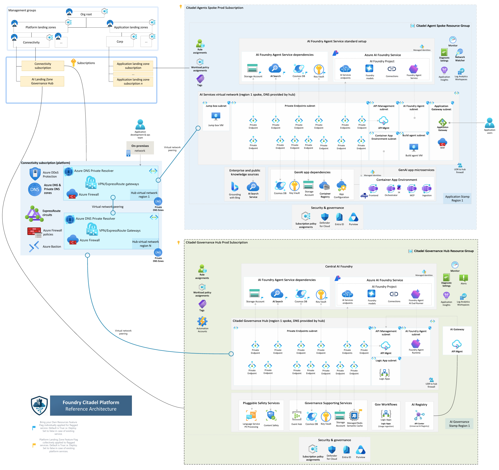
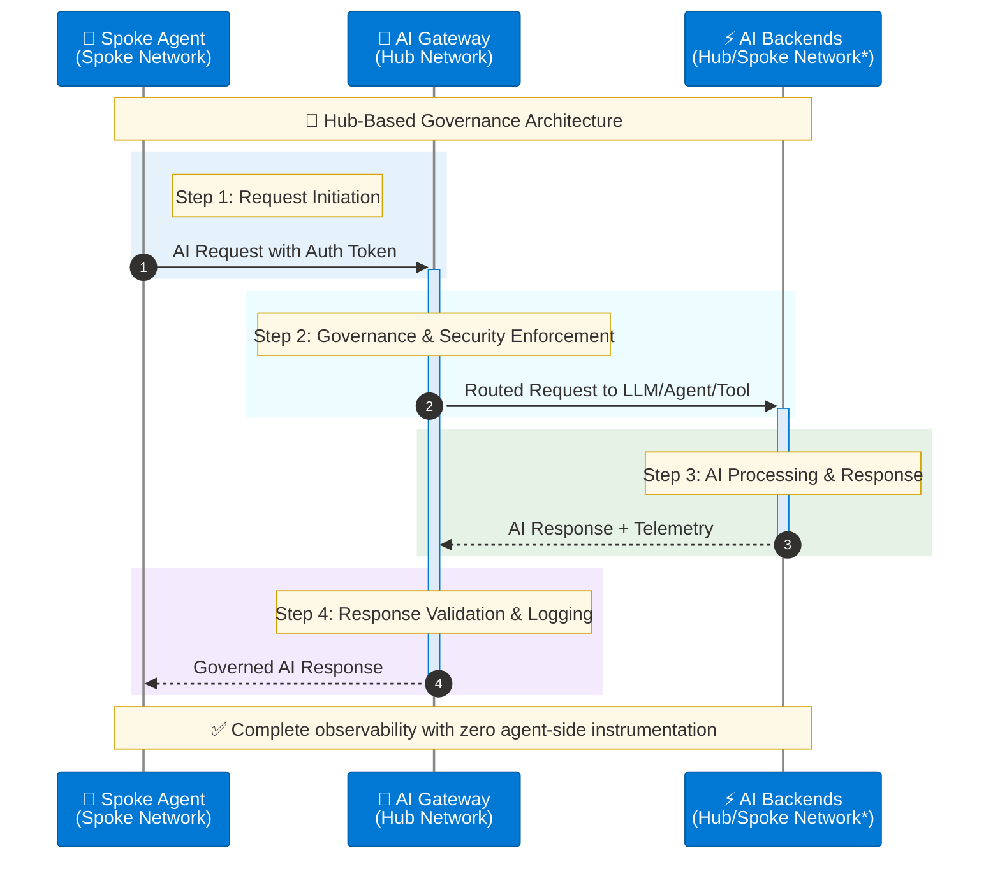
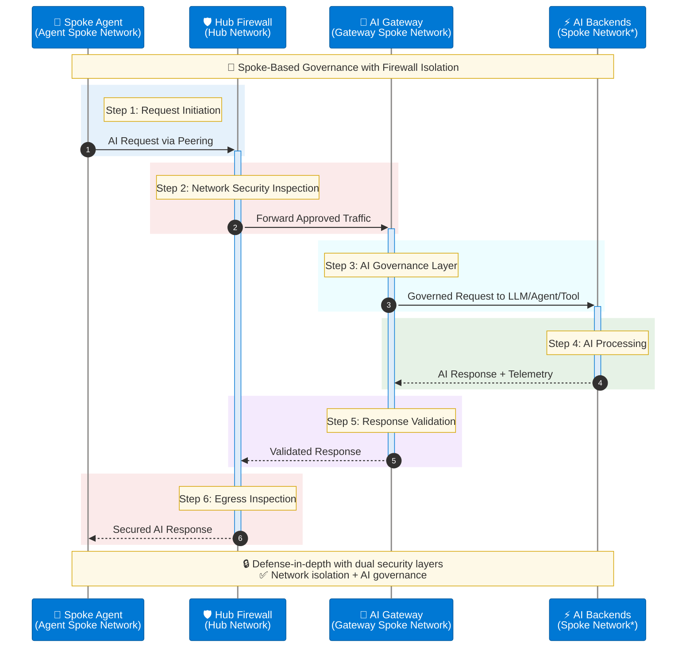

# Network Architecture

## Network Deployment Approaches

AI Citadel Governance Hub supports **two architectural patterns** for network integration.

Based on your decisions in the earlier checklist, choose one of the following approaches:



### **Approach 1: Hub-Based (Citadel as Part of Hub)**

In this approach, the Citadel Governance Hub is deployed within the existing hub virtual network (VNet) of your enterprise Azure Landing Zone.

This allows for direct communication between the unified AI gateway and connected agentic spokes, leveraging existing security and networking configurations.



>**Note:** When AI Backends reside in a different spoke networks, their traffic should be forced through the hub firewall to maintain integrity of the network traffic flow.*

#### Traffic Flow

- Routed requests originate from spoke-hosted agents.
- Traffic is directly forwarded to AI Gateway for governance, security, and observability enforcement.
- Traffic intelligently routed out to managed LLMs, tools, or downstream agents (gateway-spoke-network).

**Deployment Configuration:**
```bicep
param useExistingVnet = true
param vnetName = 'vnet-hub-eastus'
param existingVnetRG = 'rg-network-hub'
param apimSubnetName = 'snet-citadel-apim'
param privateEndpointSubnetName = 'snet-citadel-private-endpoints'
// Required when foundryNetworkInjectionEnabled = true (default).
// Subnet must be delegated to Microsoft.App/environments.
param agentSubnetName = 'snet-citadel-agents'
param dnsZoneRG = 'rg-network-hub'
param dnsSubscriptionId = '<hub-subscription-id>'
```

**When to Use:**
- ✅ Citadel manages all enterprise AI traffic
- ✅ Direct spoke-to-hub connectivity
- ✅ Simplified network topology

### **Approach 2: Hub-Spoke-Hub (Citadel as Dedicated Spoke)**

In this approach, the Citadel Governance Hub is deployed within a dedicated spoke VNet that connects to the hub VNet via VNet peering. 

Agentic workloads in other spokes are routed first to the hub network firewall through direct peering, then forwarded to the Citadel Governance Hub gateway network.

This provides an additional layer of isolation for AI workloads while still enabling secure communication with other enterprise resources in the hub.



>**Note:** * When AI Backends reside in a different spoke networks, their traffic should be forced through the hub firewall to maintain integrity of the network traffic flow.*

#### Traffic isolation flow

- Routed requests originate from spoke-hosted agents (agent-spoke-network).
- Traffic first routed to hub network firewall for inspection (hub-network).
- Hub Firewall forwards to AI Gateway for governance, security, and observability enforcement (gateway-spoke-network).
- Traffic intelligently routed out to managed LLMs, tools, or downstream agents (through the hub firewall or directly).
- AI Backend responses may still be routed through the hub firewall for final inspection before reaching spoke agents, depending on governance policy.

**Deployment Configuration:**
```bicep
param useExistingVnet = false  // Creates new spoke VNet
param vnetName = 'vnet-citadel-eastus'
param vnetAddressPrefix = '10.170.0.0/24'
param apimSubnetPrefix = '10.170.0.0/26'
param privateEndpointSubnetPrefix = '10.170.0.64/26'
param functionAppSubnetPrefix = '10.170.0.128/26'
// AI Foundry agent (network injection) subnet - delegated to Microsoft.App/environments.
// Provisioned automatically when foundryNetworkInjectionEnabled = true (default).
param agentSubnetPrefix = '10.170.0.192/26'
param foundryNetworkInjectionEnabled = true
param dnsZoneRG = 'rg-network-hub'
param dnsSubscriptionId = '<hub-subscription-id>'

// Post-deployment: Configure VNet peering to hub
```

**When to Use:**
- ✅ Defense-in-depth security (dual inspection)
- ✅ Isolated AI workloads from general traffic
- ✅ Separate cost centers/subscriptions
- ✅ Compliance requirements for network isolation

>Note: Post deployment, you must configure VNet peering, DNS servers and route tables between the Citadel spoke and your hub VNet to enable connectivity.

---

## Network Setup Options

### **Option 1: Create New Network (Greenfield)**

Accelerator will create all networking components:

```bicep
param useExistingVnet = false
param vnetAddressPrefix = '10.170.0.0/24'
param apimSubnetPrefix = '10.170.0.0/26'
param privateEndpointSubnetPrefix = '10.170.0.64/26'
param functionAppSubnetPrefix = '10.170.0.128/26'
param agentSubnetPrefix = '10.170.0.192/26'

// AI Foundry agent network injection (enabled by default).
// Set to false to skip the agent subnet and disable Foundry network injection.
param foundryNetworkInjectionEnabled = true

// Network access
param apimNetworkType = 'External'  // or 'Internal' for production
param apimV2UsePrivateEndpoint = true
```

**Includes:**
- ✅ Virtual Network with subnets (APIM, Private Endpoints, Function App, **Agent** when network injection enabled)
- ✅ Network Security Groups (one per subnet)
- ✅ Private DNS Zones
- ✅ Private endpoints according to each service's configuration; the Logic App endpoint is opt-in
- ✅ Route table (needed for APIM Developer and Premium SKUs)
- ✅ Agent subnet delegated to `Microsoft.App/environments` for AI Foundry network injection

---

### **Option 2: Bring Your Own Network (Brownfield)**

Integrate with existing enterprise network:

```bicep
param useExistingVnet = true
param vnetName = 'vnet-hub-prod-eastus'
param existingVnetRG = 'rg-network-prod'

// Subnet names (must exist)
param apimSubnetName = 'snet-citadel-apim'
param privateEndpointSubnetName = 'snet-citadel-pe'
param functionAppSubnetName = 'snet-citadel-functions'
// Required when foundryNetworkInjectionEnabled = true (default).
// The subnet must already exist and be delegated to Microsoft.App/environments.
param agentSubnetName = 'snet-citadel-agents'
param foundryNetworkInjectionEnabled = true

// DNS configuration
param existingPrivateDnsZones = {
  keyVault: '/subscriptions/{sub-id}/resourceGroups/{rg}/providers/Microsoft.Network/privateDnsZones/privatelink.vaultcore.azure.net'
  ...
}
```

**Prerequisites:**
1. VNet with sufficient address space
2. Subnets created (see [Subnet Requirements](#subnet-requirements))
    - APIM subnet /26 or larger
    - Function App subnet /26 or larger
    - Private Endpoints subnet /26 or larger
    - Agent subnet /26 or larger (only when `foundryNetworkInjectionEnabled = true`)
3. Private DNS zones created and linked (see [Required DNS Zones](#required-dns-zones))
4. NSG rules configured for APIM subnet (see [APIM Subnet](#apim-subnet))
5. Agent subnet delegated to `Microsoft.App/environments` (see [Agent Subnet (AI Foundry Network Injection)](#agent-subnet-ai-foundry-network-injection))

---

## Subnet Requirements

### APIM Subnet

Dedicated subnet with `/26` or larger address space.

#### For Developer/Premium SKU (VNet Injection)

**NSG Rules Required:**

| Direction | Priority | Name | Port | Source | Destination | Purpose |
|-----------|----------|------|------|--------|-------------|---------|
| Inbound | 3000 | AllowPublicAccess* | 443 | Internet | VirtualNetwork | Gateway access |
| Inbound | 3010 | AllowAPIMManagement | 3443 | ApiManagement | VirtualNetwork | Control plane |
| Inbound | 3020 | AllowAPIMLoadBalancer | 6390 | AzureLoadBalancer | VirtualNetwork | Health probes |
| Inbound | 3030 | AllowAzureTrafficManager* | 443 | AzureTrafficManager | VirtualNetwork | Traffic routing |
| Outbound | 3000 | AllowStorage | 443 | VirtualNetwork | Storage | Configuration |
| Outbound | 3010 | AllowSql | 1433 | VirtualNetwork | Sql | Metadata |
| Outbound | 3020 | AllowKeyVault | 443 | VirtualNetwork | AzureKeyVault | Secrets |
| Outbound | 3030 | AllowMonitor | 1886, 443 | VirtualNetwork | AzureMonitor | Diagnostics |

> *Only required for External mode

**Route Table Required (Only for APIM Developer/Premium SKUs):**

```bicep
properties: {
  routes: [
    {
      name: 'apim-management'
      properties: {
        addressPrefix: 'ApiManagement'
        nextHopType: 'Internet'
      }
    }
  ]
}
```
>Note: This is a route record that you must add to your existing route table if using existing route table and it is ensure APIM can reach the control fabric communication, which fully private.

**Service Endpoints (if forced tunneling):**
- Microsoft.Storage
- Microsoft.Sql
- Microsoft.KeyVault
- Microsoft.ServiceBus
- Microsoft.EventHub
- Microsoft.AzureActiveDirectory

#### For StandardV2/PremiumV2 SKU (Private Endpoint)

- Subnet delegated to `Microsoft.Web/serverFarms`
- No route table required
- Private endpoint provides inbound connectivity

---

### Logic App Subnet

Dedicated subnet for **outbound VNet integration**, with `/26` or larger, delegated to `Microsoft.Web/serverFarms`. The optional inbound private endpoint uses the separate [Private Endpoints Subnet](#private-endpoints-subnet), not this delegated subnet:

```bicep
{
  name: 'snet-citadel-functions'
  properties: {
    addressPrefix: '10.x.x.x/26'
    delegations: [
      {
        name: 'Microsoft.Web/serverFarms'
        properties: {
          serviceName: 'Microsoft.Web/serverFarms'
        }
      }
    ]
    privateEndpointNetworkPolicies: 'Enabled'
  }
}
```

---

### Private Endpoints Subnet

Dedicated subnet with `/26` or larger for all private endpoints:

```bicep
{
  name: 'snet-citadel-pe'
  properties: {
    addressPrefix: '10.x.x.x/26'
    privateEndpointNetworkPolicies: 'Disabled'
    privateLinkServiceNetworkPolicies: 'Enabled'
  }
}
```

> For APIM V2 SKUs and the Logic App (when `logicAppUsePrivateEndpoint = true`), private endpoints in this subnet enable private inbound connectivity.

### Logic App Private Connectivity

Logic App private connectivity is opt-in. The defaults are `logicAppUsePrivateEndpoint = false` and `logicAppPublicNetworkAccess = true`. For private-only access, set the flags to `true` and `false`, respectively. See the [parameter reference](./parameters-usage-guide.md#logic-app-private-access) for environment variables, endpoint naming, and all four flag combinations.

**Website and SCM/Kudu**

One private endpoint with the `sites` subresource serves both the website and SCM/Kudu publishing endpoint. Its private DNS zone group manages these records in `privatelink.azurewebsites.net`:

| Record | Target |
|--------|--------|
| `<app>` | Logic App private endpoint IP |
| `<app>.scm` | Same private endpoint IP |

Continue using `<app>.azurewebsites.net` and `<app>.scm.azurewebsites.net` for HTTPS, not the IP address or private-link hostnames. A second SCM endpoint, separate SCM DNS zone, and manual duplicate records are not needed when using the zone group. See [App Service private endpoint DNS](https://learn.microsoft.com/azure/app-service/overview-private-endpoint#dns).

**DNS selection and ownership**

When the Logic App endpoint is enabled, DNS selection follows this order:

1. Use the resource ID in `existingPrivateDnsZones.logicApp` when supplied.
2. Otherwise, reuse `privatelink.azurewebsites.net` in `dnsZoneRG`, using `dnsSubscriptionId` or the deployment subscription when that subscription setting is blank.
3. Otherwise, for a **new VNet**, create the zone locally and link it to the new VNet.
4. For an **existing VNet** without either DNS input, no zone is created and the endpoint's DNS zone group is skipped. The template does not reject this incomplete DNS configuration.

Reused zones are not automatically linked by this Logic App configuration, even with a new VNet. Ensure the deployment identity can associate the endpoint with the selected zone, and have the network/DNS owner configure links or forwarding for the app network, publishing runners, and administration clients. VNet peering alone does not provide DNS resolution. Reuse a centrally managed zone where applicable rather than creating a conflicting zone for the same namespace.

**Publishing and runtime connectivity**

With public access disabled, website and SCM access require a working private endpoint and private DNS. Publishing runners and administration clients must have private network reachability; see [private-only workflow publishing](./full-deployment-guide.md#private-only-logic-app-publishing). Private connectivity does not replace authentication or authorization.

These flags only control Logic App inbound access. Outbound VNet integration, routing settings, storage, Event Hub, Cosmos DB, monitoring connections, identities, and other services' access settings are unchanged. Keep those dependencies reachable for usage ingestion. This configuration applies to the main/resource-group initial-deployment templates, not the separate gateway-upgrade supporting-services templates.

---

### Agent Subnet (AI Foundry Network Injection)

When `foundryNetworkInjectionEnabled = true` (default), AI Foundry accounts are network-injected into a dedicated subnet so that Foundry agents and managed compute communicate over your VNet rather than the Microsoft-managed network. The subnet must be delegated to `Microsoft.App/environments`.

**Sizing:** `/26` or larger recommended. Greenfield default is `10.170.0.192/26`.

**Subnet definition (matches what the accelerator provisions on greenfield):**

```bicep
{
  name: 'snet-citadel-agents'
  properties: {
    addressPrefix: '10.x.x.x/26'
    privateEndpointNetworkPolicies: 'Enabled'
    privateLinkServiceNetworkPolicies: 'Enabled'
    delegations: [
      {
        name: 'Microsoft.app/environments'
        properties: {
          serviceName: 'Microsoft.App/environments'
        }
      }
    ]
  }
}
```

**Brownfield (existing VNet) requirements:**
- Subnet must already exist with the `Microsoft.App/environments` delegation above.
- No other workload may share the subnet (delegation is exclusive).
- Pass the subnet name via `agentSubnetName`.

**Disabling network injection:**

```bicep
param foundryNetworkInjectionEnabled = false
// agentSubnetName / agentSubnetPrefix are then ignored
```

When disabled, AI Foundry uses the Microsoft-managed network and no agent subnet is provisioned.

**Per-instance opt-in / opt-out:**

The agent subnet is regional. When deploying multiple Foundry instances across regions (`aiFoundryInstances`), only the instance(s) in the same region as the VNet can use network injection. Use the per-instance `networkInjectionEnabled` flag to control this:

```bicep
param aiFoundryInstances = [
  {
    name: ''
    location: 'eastus'              // same region as VNet
    customSubDomainName: ''
    defaultProjectName: 'citadel-governance-project'
    networkInjectionEnabled: true   // injected into agent subnet
  }
  {
    name: ''
    location: 'eastus2'             // different region
    customSubDomainName: ''
    defaultProjectName: 'citadel-governance-project'
    networkInjectionEnabled: false  // uses Microsoft-managed network
  }
]
```

When the property is omitted, the global `foundryNetworkInjectionEnabled` flag applies. The global flag must also be `true` for any per-instance injection to take effect.

---

## DNS Configuration

### Private DNS Zones

Depending on your permissions and DNS zone distribution, choose one of these approaches:

**Option A: Use Existing DNS Zones with Resource IDs (Recommended)**

For maximum flexibility, specify each DNS zone by its full resource ID. This approach supports DNS zones across different subscriptions and resource groups:

```bicep
param existingPrivateDnsZones = {
  keyVault: '/subscriptions/{sub-id}/resourceGroups/{rg}/providers/Microsoft.Network/privateDnsZones/privatelink.vaultcore.azure.net'
  monitor: '/subscriptions/{sub-id}/resourceGroups/{rg}/providers/Microsoft.Network/privateDnsZones/privatelink.monitor.azure.com'
  eventHub: '/subscriptions/{sub-id}/resourceGroups/{rg}/providers/Microsoft.Network/privateDnsZones/privatelink.servicebus.windows.net'
  cosmosDb: '/subscriptions/{sub-id}/resourceGroups/{rg}/providers/Microsoft.Network/privateDnsZones/privatelink.documents.azure.com'
  storageBlob: '/subscriptions/{sub-id}/resourceGroups/{rg}/providers/Microsoft.Network/privateDnsZones/privatelink.blob.core.windows.net'
  storageFile: '/subscriptions/{sub-id}/resourceGroups/{rg}/providers/Microsoft.Network/privateDnsZones/privatelink.file.core.windows.net'
  storageTable: '/subscriptions/{sub-id}/resourceGroups/{rg}/providers/Microsoft.Network/privateDnsZones/privatelink.table.core.windows.net'
  storageQueue: '/subscriptions/{sub-id}/resourceGroups/{rg}/providers/Microsoft.Network/privateDnsZones/privatelink.queue.core.windows.net'
  cognitiveServices: '/subscriptions/{sub-id}/resourceGroups/{rg}/providers/Microsoft.Network/privateDnsZones/privatelink.cognitiveservices.azure.com'
  apimGateway: '/subscriptions/{sub-id}/resourceGroups/{rg}/providers/Microsoft.Network/privateDnsZones/privatelink.azure-api.net'
  aiServices: '/subscriptions/{sub-id}/resourceGroups/{rg}/providers/Microsoft.Network/privateDnsZones/privatelink.services.ai.azure.com'
}
```

> **Note:** You only need to specify the DNS zones relevant to your deployment. The `existingPrivateDnsZones` parameter takes precedence over the legacy `dnsZoneRG`/`dnsSubscriptionId` approach when both are provided.

**Option B: Use Existing Central DNS Zones (Legacy)**

If all your DNS zones are in a single subscription and resource group:

```bicep
param dnsZoneRG = 'rg-network-dns'
param dnsSubscriptionId = '<dns-subscription-id>'
```

> **Note:** This legacy approach is maintained for backward compatibility but Option A is recommended for new deployments.

**Option C: Create New DNS Zones**

Leave all DNS parameters empty to create new zones (requires manual VNet linking after provisioning):

```bicep
param existingPrivateDnsZones = {}
param dnsZoneRG = ''
param dnsSubscriptionId = ''
```

> Post-deployment: Link new zones to your VNet or configure central DNS resolver.

### APIM Internal Mode DNS

When using `apimNetworkType = 'Internal'`, DNS resolution must be configured:

**Recommended: Custom Domains**
- Configure custom domains for Gateway, Management, and Portal endpoints
- Use wildcard CA-issued certificate (e.g., `*.api.az.company.com`)
- Ensure network DNS resolver routes to APIM private IPs

**Alternative: Private DNS Zone**
- Create `azure-api.net` private DNS zone
- Add A records for all 5 APIM endpoints pointing to private IP
- Link zone to VNet

> **WARNING:** Using private `azure-api.net` zone may conflict with external APIM instances using public DNS. Add public IP records for external instances if needed. Failure to do so may lead to resolution issues for other APIM services that are external or without network integration.

---

## Required DNS Zones

All zones must be linked to your VNet:

| DNS Zone | Purpose |
|----------|---------|
| `privatelink.cognitiveservices.azure.com` | Azure OpenAI / Cognitive Services |
| `privatelink.openai.azure.com` | Azure OpenAI |
| `privatelink.vaultcore.azure.net` | Key Vault |
| `privatelink.monitor.azure.com` | Azure Monitor |
| `privatelink.servicebus.windows.net` | Event Hub |
| `privatelink.documents.azure.com` | Cosmos DB |
| `privatelink.blob.core.windows.net` | Storage Blob |
| `privatelink.file.core.windows.net` | Storage File |
| `privatelink.table.core.windows.net` | Storage Table |
| `privatelink.queue.core.windows.net` | Storage Queue |
| `privatelink.azure-api.net` | APIM V2 SKUs |
| `privatelink.services.ai.azure.com` | Azure AI Foundry |
| `privatelink.azurewebsites.net` | Logic App website and SCM/Kudu, when `logicAppUsePrivateEndpoint = true` |

> **Azure Monitor:** Requires special Private Link Scope configuration post-deployment for centralized monitoring.

> **Logic App:** Local creation and linking are conditional. For an existing VNet or reused zone, follow [DNS selection and ownership](#logic-app-private-connectivity).

## Azure services network access settings

Private endpoint and public network access defaults vary by service. A private endpoint does not automatically disable public access. The Logic App defaults to public access enabled with no template-created private endpoint; configure each service according to your network architecture and security requirements.

| Service | Parameter | Default | Allowed Values | Description |
|---------|-----------|---------|----------------|-------------|
| **API Management (Developer/Premium)** | `apimNetworkType` | `External` | `External`, `Internal` | Network type for APIM VNet injection. `Internal` mode requires custom DNS configuration. |
| **API Management (StandardV2/PremiumV2)** | `apimV2UsePrivateEndpoint` | `true` | `true`, `false` | Enable private endpoint for inbound connectivity on V2 SKUs. |
| **API Management (StandardV2/PremiumV2)** | `apimV2PublicNetworkAccess` | `true` | `true`, `false` | Allow public network access. Set to `false` to restrict to private endpoint only. |
| **Logic App** | `logicAppUsePrivateEndpoint` | `false` | `true`, `false` | Create an inbound private endpoint for website and SCM/Kudu access. |
| **Logic App** | `logicAppPublicNetworkAccess` | `true` | `true`, `false` | Allow public website and SCM/Kudu access. Set to `false` only with working private connectivity and DNS. |
| **Cosmos DB** | `cosmosDbPublicAccess` | `Disabled` | `Enabled`, `Disabled` | Public network access for Cosmos DB. Keep `Disabled` for secure deployments. |
| **Event Hub** | `eventHubNetworkAccess` | `Enabled` | `Enabled`, `Disabled` | Public network access. Note: Must be `Enabled` during initial provisioning for APIM V2 SKUs. |
| **AI Foundry** | `aiFoundryExternalNetworkAccess` | `Disabled` | `Enabled`, `Disabled` | External network access for the AI Foundry / AI Services resources (also serves Content Safety and Language / PII APIs from the **primary** Foundry account). |
| **Azure Monitor** | `useAzureMonitorPrivateLinkScope` | `false` | `true`, `false` | Use Private Link Scope for Log Analytics and Application Insights. Requires additional configuration. |

**Configuration Example:**

```bicep
// Fully private deployment (recommended for production)
param apimNetworkType = 'Internal'
param apimV2UsePrivateEndpoint = true
param apimV2PublicNetworkAccess = false
param logicAppUsePrivateEndpoint = true
param logicAppPublicNetworkAccess = false
param cosmosDbPublicAccess = 'Disabled'
param eventHubNetworkAccess = 'Disabled'  // Set after initial deployment
param aiFoundryExternalNetworkAccess = 'Disabled'
param useAzureMonitorPrivateLinkScope = true
```

> **Important Notes:**
> - Event Hub must have public access `Enabled` during initial deployment when using APIM V2 SKUs. You can disable it post-deployment.
> - When `apimNetworkType = 'Internal'`, ensure proper DNS configuration for APIM endpoints.
> - Private-only Logic App workflow publishing requires a connected runner with private SCM DNS resolution; infrastructure provisioning alone does not publish workflows.
> - Azure Monitor Private Link Scope requires additional post-deployment configuration for centralized monitoring as Azure Monitor private link scope is a global resource and impact all Log Analytics and Application Insights workspaces across subscriptions when connecting to the same hub network.