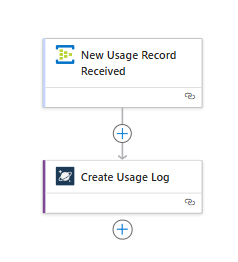

# Azure OpenAI Usage Ingestion

This guid explore the details how AI Hub Gateway is using Logic Apps to ingest usage data from Azure OpenAI API for both streaming and non-streaming requests.

## Prerequisites

The following components are configured part of this accelerator:

- API Management service fully configured with all relevant policies as part of this accelerator
- Logic App service integrated with vnet
- Event hub configured as a logger in API Management
- Cosmos DB account with SQL API that has been configured to store the usage data

## Overview

There is 2 paths for ingesting usage data from Azure OpenAI API:

- **Non-streaming requests**: In this path, API Management publishes the usage data to Event Hub, which is then ingested by Logic App and stored in Cosmos DB.
- **Streaming requests**: In this path, API Management publishes the usage data to ```Application Insights``` custom metrics, which is then ingested by Logic App and stored in Cosmos DB.

## Non-streaming requests

This workflow is triggered by the Event Hub message that is published by API Management. The message is then ingested by Logic App and stored in Cosmos DB.

Here the ingestion is near real-time, as the message is processed once its published to Event Hub.

The primary policy fragment that is used [frag-openai-usage.xml](../infra/modules/apim/policies/frag-openai-usage.xml)



## Streaming requests

This workflow is triggered by scheduled event (by default it runs twice every day).

The workflow uses Cosmos DB to maintain streaming export configurations which control the time range that quired data from Application Insights custom metrics should cover.

> Note: the frequency might be changed depending on how much streaming requests are being made to the API knowing that Azure Monitor query supports maximum of 500,000 records per query. Minimum recommended frequency is once every 1 hour if twice a day is proven not to be sufficient.

The primary policy fragment that is used [frag-openai-usage-streaming.xml](../infra/modules/apim/policies/frag-openai-usage-streaming.xml)


## Logic App workflows

The Logic App workflows source code can be found in [/src/usage-ingestion-logicapp/](../src/usage-ingestion-logicapp/).

This folder contains the following:
- [ai-usage-ingestion](../src/usage-ingestion-logicapp/ai-usage-ingestion) which process usage published to Event Hub
- [ai-usage-ingestion-streaming](../src/usage-ingestion-logicapp/ai-usage-ingestion-streaming) which process usage from Application Insights custom metrics
- [connections.json](../src/usage-ingestion-logicapp/connections.json) which contains the connection details for the Logic App workflows
    - Event Hub connection (in app)
    - Cosmos DB connection (in app)
    - Application Insights connection (managed)