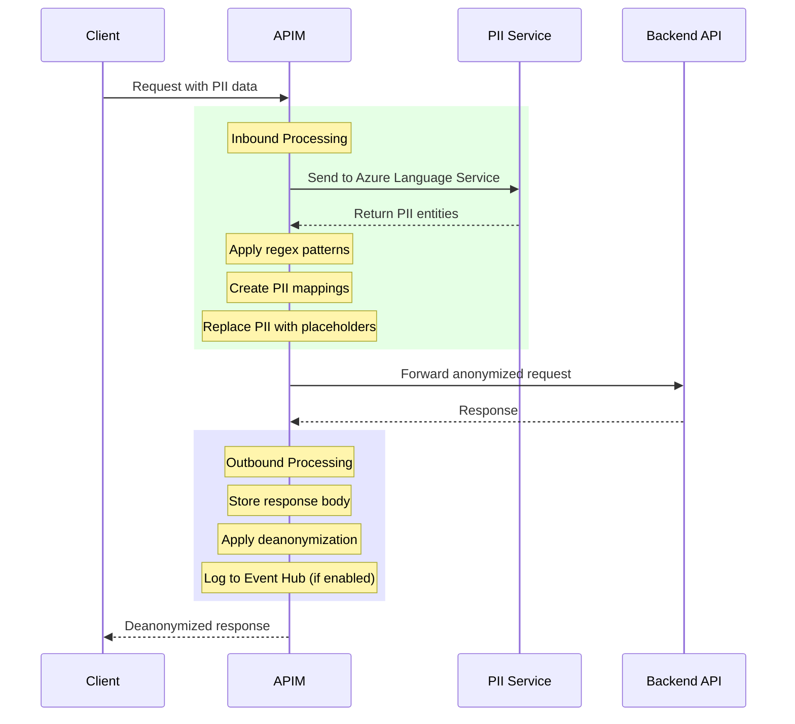

# PII Anonymization & Deanonymization

Using APIM to handle PII anonymization and deanonymization requests transparently for API requests that may contain PII data.

This can be important for scenarios where you want to ensure that PII data is not exposed to the backend services, while still allowing the client to receive a deanonymized response.

One example of needing such functionality is when you want to use Azure OpenAI API with PII data but outside the supported/allowed regions (geo-restrictions), but you want to ensure that the PII data is not sent to the backend service. In this case, you can use APIM to handle the PII anonymization and deanonymization transparently.

## Key Updates to PII Handling Framework

The PII handling framework has been enhanced with the following key features:

1. **Managed Identity Authentication**: Authentication to Azure AI Language Services now uses managed identity instead of API keys, improving security.

2. **Regex Pattern Processing**: Extend Azure PII detection Natural Language Processing with regex pattern processing for custom PII detection prior to calling the Language Service.

3. **Additional Configuration Options**: New configuration options for language detection and more customizable PII identification.

4. **Event Hub Logging**: Comprehensive logging to Event Hub for auditing, compliance, and testing.

## Process Flow



## Implementation Components

1. **PII Detection Methods**:
   - Azure Language Service PII detection (using Natural Language Processing - NLP)
   - Custom regex pattern matching (provided by the user)
   - Configurable confidence thresholds
   - Category exclusions (e.g., excluding PersonType as usually LLM request context containers ```user``` and ```assistant``` are not PII data but rather part of the request context)

2. **Regex Pattern Support**:
   Example of extending PII detection with Regex patterns for common PII types:
   ```json
   {
       "patterns": [
           {
               "pattern": "\\b\\d{4}[- ]?\\d{4}[- ]?\\d{4}[- ]?\\d{4}\\b",
               "category": "CreditCard"
           },
           {
               "pattern": "\\b[A-Z]{2}\\d{6}[A-Z]\\b",
               "category": "PassportNumber"
           },
           {
               "pattern": "\\b\\d{3}[-]?\\d{4}[-]?\\d{7}[-]?\\d{1}\\b",
               "category": "EMIRATESID"
           },
           {
               "pattern": "\\b\\d{5,}\\b",
               "category": "CUSTOMERID"
           }
       ]
   }
   ```

## Understanding of PII NLP-based Anonymization API

The following is an example that send a request to `Azure Language Service PII Anonymization` API. The request is sent using `curl` and shows a sample payload.

```bash
curl --request POST \
  --url 'https://URL-Service/language/:analyze-text?api-version=2022-05-01&showStats=showStats' \
  --header 'Content-Type: application/json' \
  --header 'Ocp-Apim-Subscription-Key: abcdefg12345' \
  --header 'User-Agent: insomnia/10.1.1' \
  --data '{
  "kind": "PiiEntityRecognition",
  "parameters": {
    "modelVersion": "latest",
    "redactionPolicy": {
      "policyKind": "CharacterMask",
			"redactionCharacter": "#"
    }
  },
  "analysisInput": {
    "documents": [
      {
        "text": "Hello, my name is Sarah Jones and I need help with my accounts. My first IBAN is AE070331234567890123 and my second IBAN is AE070339876543210123. You can contact Sarah Jones at sarah.jones@email.com or call at +971501234567.",
        "id": "1-en",
        "language": "en"
      }
    ]
  }
}
'
```

Sample output for the above request:

```json
{
  "kind": "PiiEntityRecognitionResults",
  "results": {
    "documents": [
      {
        "redactedText": "Hello, my name is ***** ***** and I need help with my accounts. My first IBAN is ******************** and my second IBAN is ********************. You can contact ***** ***** at ********************* or call at *************",
        "id": "1-en",
        "entities": [
          {
            "text": "sarah.jones@email.com",
            "category": "Email",
            "offset": 192,
            "length": 21,
            "confidenceScore": 0.8
          },
          {
            "text": "AE070331234567890123",
            "category": "InternationalBankingAccountNumber",
            "offset": 96,
            "length": 20,
            "confidenceScore": 1.0
          },
          {
            "text": "AE070339876543210123",
            "category": "InternationalBankingAccountNumber",
            "offset": 139,
            "length": 20,
            "confidenceScore": 1.0
          },
          {
            "text": "+971501234567",
            "category": "PhoneNumber",
            "offset": 225,
            "length": 13,
            "confidenceScore": 0.8
          },
          {
            "text": "Sarah Jones",
            "category": "Person",
            "offset": 177,
            "length": 11,
            "confidenceScore": 0.9
          },
          {
            "text": "Sarah Jones",
            "category": "Person",
            "offset": 33,
            "length": 11,
            "confidenceScore": 0.9
          }
        ],
        "warnings": []
      }
    ],
    "errors": [],
    "modelVersion": "2025-02-01"
  }
}
```

> **NOTE:** It is worth noting that you can send to the anonymization API a full json in the request body (like sending the entire Azure OpenAI request with its context) and the API will return the anonymized json that preserves the structure of the original json. This is useful when you want to anonymize a full json object that contains PII data.

## APIM implementation

Handling PII anonymization and deanonymization in APIM are done using policy fragments. The following policies can be used to implement the above process:

### Setting up policy fragments

1. **pii-anonymization** policy fragment:

Anonymization service connection information used by this fragment are stored in APIM named values. The following named values are used in the policy fragment:

- `piiServiceUrl`: The URL of the PII anonymization API.
- `uami-client-id`: The client ID of the user-assigned managed identity used for authentication.

The fragment now uses managed identity authentication instead of subscription key authentication to connect to the Azure AI Language Service. This is a more secure approach as it eliminates the need to manage and rotate API keys.

This policy fragment is expecting the following variables to be set in the target API inbound policy:

- `piiConfidenceThreshold`: The confidence score threshold for PII entity detection (default is 0.8).
- `piiEntityCategoryExclusions`: A comma-separated list of PII entity categories to exclude from the anonymization process (default is PersonType only). [Full list of categories](https://learn.microsoft.com/en-us/azure/ai-services/language-service/personally-identifiable-information/concepts/entity-categories)
- `piiInputContent`: The input content to be anonymized (this should be set in the inbound policy of the target API).
- `piiDetectionLanguage`: The language used for PII detection (default is "en"). Use "auto" for multilingual content.
- `piiRegexPatterns`: Optional JSON array of custom regex patterns for PII detection.

```xml
<fragment>
    <choose>
        <when condition="@(context.Variables.GetValueOrDefault<string>("piiAnonymizationEnabled") == "true")">
            <!-- Get configuration values -->
            <set-variable name="piiConfidenceThreshold" value="@(double.Parse(context.Variables.GetValueOrDefault<string>("piiConfidenceThreshold", "0.8")))" />
            <set-variable name="piiEntityCategoryExclusions" value="@(context.Variables.GetValueOrDefault<string>("piiEntityCategoryExclusions", ""))" />
            <set-variable name="piiDetectionLanguage" value="@(context.Variables.GetValueOrDefault<string>("piiDetectionLanguage", "en"))" />
            <authentication-managed-identity resource="https://cognitiveservices.azure.com" output-token-variable-name="msi-access-token" client-id="{{uami-client-id}}" ignore-error="false" />
            
            <!-- Process regex patterns if provided -->
            <set-variable name="piiRegexMappings" value="@{
                var content = context.Variables.GetValueOrDefault<string>("piiInputContent");
                var regexPatterns = context.Variables.GetValueOrDefault<string>("piiRegexPatterns");
                var mappings = new JArray();
                
                if (!string.IsNullOrEmpty(regexPatterns))
                {
                    var patterns = JArray.Parse(regexPatterns);
                    var categoryCounts = new Dictionary<string, int>();
                    var processedTexts = new HashSet<string>(); // Track already processed texts
                    
                    foreach (var pattern in patterns)
                    {
                        // Processing logic for regex patterns
                    }
                }
                return mappings.ToString();
            }" />

            <!-- Apply regex-based masking -->
            <set-variable name="piiRegexProcessedContent" value="@{
                var content = context.Variables.GetValueOrDefault<string>("piiInputContent");
                var mappings = JArray.Parse(
                    context.Variables.GetValueOrDefault<string>("piiRegexMappings"));
                
                foreach (var mapping in mappings)
                {
                    // Apply regex replacements
                }
                return content;
            }" />

            <!-- Update input content for API processing -->
            <set-variable name="piiInputContent" value="@(context.Variables.GetValueOrDefault<string>("piiRegexProcessedContent"))" />
            
            <!-- Call PII Anonymization API -->
            <send-request mode="new" response-variable-name="piiAnalysisResponse" timeout="20" ignore-error="true">
                <set-url>{{piiServiceUrl}}/language/:analyze-text?api-version=2022-05-01</set-url>
                <set-method>POST</set-method>
                <set-header name="Content-Type" exists-action="override">
                    <value>application/json</value>
                </set-header>
                <set-header name="Authorization" exists-action="override">
                    <value>@("Bearer " + (string)context.Variables["msi-access-token"])</value>
                </set-header>
                <!-- <set-header name="Ocp-Apim-Subscription-Key" exists-action="override">
                    <value>{{piiServiceKey}}</value>
                </set-header> -->

                <set-body>@{
                    var request = new JObject();
                    request["kind"] = "PiiEntityRecognition";
                    request["parameters"] = new JObject{
                        {"modelVersion", "latest"},
                {"redactionPolicy", new JObject{
                    {"policyKind", "CharacterMask"},
                    {"redactionCharacter", "#"}
                }}
            };
            request["analysisInput"] = new JObject{
                {"documents", new JArray{
                    new JObject{
                        {"text", context.Variables.GetValueOrDefault<string>("piiInputContent")},
                        {"id", "1"},
                        {"language", "en"}
                    }
                }}
            };
            return request.ToString();
        }</set-body>
    </send-request>
    <!-- Process PII Analysis Response and store mappings -->
    <set-variable name="piiMappings" value="@{
        var response = context.Variables.GetValueOrDefault<IResponse>("piiAnalysisResponse");
        var confidenceThreshold = context.Variables.GetValueOrDefault<double>("piiConfidenceThreshold");
        var exclusions = context.Variables.GetValueOrDefault<string>("piiEntityCategoryExclusions")
            .Split(new[] { ',' }, StringSplitOptions.RemoveEmptyEntries)
            .Select(c => c.Trim())
            .ToList();

        var entities = JObject.Parse(response.Body.As<string>())
            .SelectToken("$.results.documents[0].entities")
            .ToObject<JArray>()
            .Where(e => e["confidenceScore"].Value<double>() >= confidenceThreshold)
            .Where(e => !exclusions.Contains(e["category"].ToString()))
            .OrderByDescending(e => e["text"].ToString().Length);

        var mappings = new JArray();
        var categoryCounts = new Dictionary<string, int>();

        foreach (var entity in entities) {
            var text = entity["text"].ToString().TrimEnd('.', ',', ' ');
            var category = entity["category"].ToString();

            if (!categoryCounts.ContainsKey(category)) {
                categoryCounts[category] = 0;
            }

            var placeholder = $"<{category}_{categoryCounts[category]}>";
            mappings.Add(new JObject {
                ["original"] = text,
                ["placeholder"] = placeholder
            });

            categoryCounts[category]++;
        }

        return mappings.ToString();
    }" />
    <!-- Replace PII with placeholders and set output variable -->
    <set-variable name="piiAnonymizedContent" value="@{
        var content = context.Variables.GetValueOrDefault<string>("piiInputContent");
        var mappings = JArray.Parse(
            context.Variables.GetValueOrDefault<string>("piiMappings"));

        foreach (var mapping in mappings) {
            var original = mapping["original"].ToString();
            var placeholder = mapping["placeholder"].ToString();
            content = content.Replace(original, placeholder);
        }

        return content;
    }" />
</fragment>
```

2. **pii-deanonymization** policy fragment:

This policy expects variables named `piiDeanonymizeContentInput` and `piiMappings` containing the text to be deanonymized and the mappings respectively.

```xml
<fragment>
    <!-- Replace placeholders with original PII -->
    <set-variable name="piiDeanonymizedContentOutput" value="@{
        var content = context.Variables.GetValueOrDefault<string>("piiDeanonymizeContentInput");
        
        // Pre-process content to replace common encoded symbols
        content = System.Text.RegularExpressions.Regex.Replace(content, @"\\u003c", "<");
        content = System.Text.RegularExpressions.Regex.Replace(content, @"\\u003e", ">");
        
        var mappings = JArray.Parse(
            context.Variables.GetValueOrDefault<string>("piiMappings"));
        
        foreach (var mapping in mappings) {
            var original = mapping["original"].ToString();
            var placeholder = mapping["placeholder"].ToString();
            content = content.Replace(placeholder, original);
        }
        return content;
    }" />
</fragment>
```

3. **pii-state-saving** policy fragment:

This fragment logs PII anonymization and deanonymization activity to an Event Hub for auditing and analytics purposes. It expects several variables to be set:

- `piiStateSavingEnabled`: Set to "true" to enable logging to Event Hub
- `originalRequest`: The original request content before anonymization
- `originalResponse`: The original response content before deanonymization

```xml
<fragment>
    <!-- Save PII anonymization/deanonymization state to Event Hub using native log-to-eventhub policy -->
    <choose>
        <when condition="@(context.Variables.GetValueOrDefault<string>("piiStateSavingEnabled") == "true")">
            <!-- Capture context information -->
            <set-variable name="piiOperationId" value="@(Guid.NewGuid().ToString())" />
            <set-variable name="piiOperationTimestamp" value="@(DateTime.UtcNow.ToString("o"))" />
            <set-variable name="piiApiName" value="@(context.Api.Name ?? "unknown")" />
            <set-variable name="piiApiId" value="@(context.Api.Id ?? "unknown")" />
            <set-variable name="piiProductName" value="@(context.Product?.Name ?? "unknown")" />
            <set-variable name="piiProductId" value="@(context.Product?.Id ?? "unknown")" />
            <set-variable name="piiSubscriptionName" value="@(context.Subscription?.Name ?? "unknown")" />
            <set-variable name="piiSubscriptionId" value="@(context.Subscription?.Id ?? "unknown")" />
            <set-variable name="piiOperationName" value="@(context.Operation.Name ?? "unknown")" />
            <set-variable name="targetDeployment" value="@(context.Variables.GetValueOrDefault<string>("targetDeployment") ?? "unknown")" />
            
            <!-- Log to Event Hub using native policy -->
            <log-to-eventhub logger-id="pii-usage-eventhub-logger">@{
                var eventData = new JObject();
                
                // Operation metadata
                eventData["id"] = context.Variables.GetValueOrDefault<string>("piiOperationId");
                eventData["timestamp"] = context.Variables.GetValueOrDefault<string>("piiOperationTimestamp");
                eventData["type"] = "PII_Processing";
                eventData["targetDeployment"] = context.Variables.GetValueOrDefault<string>("targetDeployment");
                
                // Enhanced API and subscription context with content
                eventData["context"] = new JObject {
                    ["api"] = new JObject {
                        ["id"] = context.Variables.GetValueOrDefault<string>("piiApiId"),
                        ["name"] = context.Variables.GetValueOrDefault<string>("piiApiName"),
                        ["operation"] = new JObject {
                            ["urlTemplate"] = context.Operation.UrlTemplate ?? "unknown"
                        }
                    },
                    ["product"] = new JObject {
                        ["id"] = context.Variables.GetValueOrDefault<string>("piiProductId"),
                        ["name"] = context.Variables.GetValueOrDefault<string>("piiProductName")
                    },
                    ["subscription"] = new JObject {
                        ["id"] = context.Variables.GetValueOrDefault<string>("piiSubscriptionId"),
                        ["name"] = context.Variables.GetValueOrDefault<string>("piiSubscriptionName")
                    }
                };
                
                // Process information
                eventData["process"] = new JObject {
                    ["anonymizationEnabled"] = context.Variables.GetValueOrDefault<string>("piiAnonymizationEnabled") == "true",
                    ["confidenceThreshold"] = context.Variables.GetValueOrDefault<double>("piiConfidenceThreshold", 0.8),
                    ["entityCategoryExclusions"] = context.Variables.GetValueOrDefault<string>("piiEntityCategoryExclusions", ""),
                    ["deanonymizationPerformed"] = context.Variables.ContainsKey("piiDeanonymizedContentOutput")
                };
                
                // Results summary for PII entities found
                if (context.Variables.ContainsKey("piiMappings")) {
                    try {
                        var mappings = JArray.Parse(context.Variables.GetValueOrDefault<string>("piiMappings"));
                        eventData["entityCount"] = mappings.Count;
                        
                        // Group entities by category for reporting
                        var categories = new Dictionary<string, int>();
                        foreach (var mapping in mappings) {
                            // Category counting logic
                        }
                        
                        var categoryDetails = new JObject();
                        foreach (var category in categories) {
                            // Category details
                        }
                        eventData["entityCategories"] = categoryDetails;
                    }
                    catch (Exception ex) {
                        eventData["error"] = "Failed to process mappings: " + ex.Message;
                    }
                }
                
                // Content length metrics (not the actual content)
                if (context.Variables.ContainsKey("piiInputContent")) {
                    eventData["metrics"] = new JObject {
                        ["inputContentLength"] = context.Variables.GetValueOrDefault<string>("piiInputContent", "").Length
                    };
                    
                    // Additional metrics
                }
                
                return eventData.ToString();
            }</log-to-eventhub>
        </when>
    </choose>
</fragment>
```

### Determining the scope of PII anonymization and deanonymization

To implement the above policy fragments, they need to be referenced in the target API in APIM.

It is important to decide the scope of PII anonymization and deanonymization.

Below are some suggested scopes:

- **Product**: Apply the policies at the product level if you want to apply them to specific usecases that require PII anonymization/deanonymization.
- **API**: Apply the policies at the API level if you want to apply them to all operations of a specific API and across all `Products` using this API.
- **Operation**: Apply the policies at the operation level if you want to apply them to specific operations of an API.

> **NOTE:** These policies are designed to be generic and can be potentially used with any API that requires PII anonymization and deanonymization. However, strong validation and testing should be done to ensure that the policies work as expected with the specific API and its requirements.
> The policies are also designed to be extensible, so you can add additional logic or modify the existing logic as needed.

### Setting up the API in APIM

The following steps can be followed to implement the policies:

1. Inbound processing:
   - Add the **pii-anonymization** policy fragment to the inbound processing section of the API in APIM. This will ensure that all incoming requests are processed by the PII anonymization API before being forwarded to the backend API.
2. Outbound processing:
   - Add the **pii-deanonymization** policy fragment to the outbound processing section of the API in APIM. This will ensure that all outgoing responses are processed by the PII deanonymization API before being sent back to the client.

## Example use of the policies with mocked API

Based on decision of the scope of PII anonymization and deanonymization, you can implement the policies in APIM by following the below example.

Below APIM policy can be used with `Product`, `API` or `Operation` scope. The example below shows how to implement these policies at the Product level in a sample HR PII product policy.

### HR PII Product Policy Example

The following is a complete example of an HR product policy that implements PII anonymization and deanonymization, as well as model restrictions and capacity management:

```xml
<policies>
    <inbound>
        <base />

        ... other policies ...

        <!-- PII Detection and Anonymization -->
        <set-variable name="piiAnonymizationEnabled" value="true" />
        <!-- Variables required by pii-anonymization fragment -->
        <choose>
            <when condition="@(context.Variables.GetValueOrDefault<string>("piiAnonymizationEnabled") == "true")">
                <!-- Configure PII detection settings -->
                <set-variable name="piiConfidenceThreshold" value="0.75" />
                <set-variable name="piiEntityCategoryExclusions" value="PersonType,CADriversLicenseNumber" />
                <set-variable name="piiDetectionLanguage" value="en" /> <!-- Use 'auto' if context have multiple languages -->

                <!-- Configure regex patterns for custom PII detection -->
                <set-variable name="piiRegexPatterns" value="@{
                    var patterns = new JArray {
                        new JObject {
                            ["pattern"] = @"\b\d{4}[- ]?\d{4}[- ]?\d{4}[- ]?\d{4}\b",
                            ["category"] = "CREDIT_CARD"
                        },
                        new JObject {
                            ["pattern"] = @"\b[A-Z]{2}\d{6}[A-Z]\b",
                            ["category"] = "PASSPORT_NUMBER"
                        },
                        new JObject {
                            ["pattern"] = @"\b\d{3}[-]?\d{4}[-]?\d{7}[-]?\d{1}\b",
                            ["category"] = "NATIONAL_ID"
                        }
                    };
                    return patterns.ToString();
                }" />
                <set-variable name="piiInputContent" value="@(context.Request.Body.As<string>(preserveContent: true))" />
                <!-- Include the PII anonymization fragment -->
                <include-fragment fragment-id="pii-anonymization" />
                <!-- Replace the request body with anonymized content -->
                <set-body>@(context.Variables.GetValueOrDefault<string>("piiAnonymizedContent"))</set-body>
            </when>
        </choose>

    </inbound>
    <backend>
        <base />
    </backend>
    <outbound>
        <base />
        <!-- PII Deanonymization -->
        <set-variable name="responseBodyContent" value="@(context.Response.Body.As<string>(preserveContent: true))" />
        <choose>
            <when condition="@(context.Variables.GetValueOrDefault<string>("piiAnonymizationEnabled") == "true" && 
                            context.Variables.ContainsKey("piiMappings"))">
                <!-- Use stored response body for deanonymization -->
                <set-variable name="piiDeanonymizeContentInput" value="@(context.Variables.GetValueOrDefault<string>("responseBodyContent"))" />
                <include-fragment fragment-id="pii-deanonymization" />
                <!-- Variables required by pii-state-saving fragment -->
                <set-variable name="piiStateSavingEnabled" value="true" />
                <set-variable name="originalRequest" value="@(context.Variables.GetValueOrDefault<string>("piiInputContent"))" />
                <set-variable name="originalResponse" value="@(context.Variables.GetValueOrDefault<string>("responseBodyContent"))" />
                
                <!-- Include the PII state saving fragment to push pii detection results to event hub -->
                <include-fragment fragment-id="pii-state-saving" />
                
                <!-- Replace response with deanonymized content -->
                <set-body>@(context.Variables.GetValueOrDefault<string>("piiDeanonymizedContentOutput"))</set-body>
            </when>
            <otherwise>
                <!-- Pass through original response using stored content -->
                <set-body>@(context.Variables.GetValueOrDefault<string>("responseBodyContent"))</set-body>
            </otherwise>
        </choose>
    </outbound>
    <on-error>
        <base />
    </on-error>
</policies>
```

### Testing the API

You can use the above approach to apply PII anonymization and deanonymization to Azure OpenAI API requests managed through APIM as AI Gateway.

Applying the policy at the level of the chat completion API will ensure that all requests to the chat completion API are processed by the PII anonymization and deanonymization policies.

Below is a sample Azure OpenAI request body that can be used to test the API with PII anonymization and deanonymization policies applied.

```json
{
  "model": "gpt-4o",
  "messages": [
    {
      "role": "system",
      "content": "You are a helpful assistant that responds in Markdown. Context is anonymized with <PII_CATEGORY_0> placeholders that you need to retain exactly as they are if they are part of the response. Always welcome the user with their name if available."
    },
    {
      "role": "user",
      "content": "Hello, my name is Sarah Jones and I need help with my accounts. My first IBAN is AE070331234567890999 and my second IBAN is AE070339876543210123 for my emirates id 784-1987-1234567-1. You can contact Sarah Jones at sarah.jones@email.com or call at +971501234567. I want to know how to calculate the distance between earth and moon?"
    }
  ]
}
```

If you executed the API with a trace, you should see the following in the trace:

1. pii-mappings:
```json
Anonymized text mapping:

```json
[
  {
    "original": "sarah.jones@email.com",
    "placeholder": "<Email_0>"
  },
  {
    "original": "AE070331234567890123",
    "placeholder": "<InternationalBankingAccountNumber_0>"
  },
  {
    "original": "AE070339876543210123",
    "placeholder": "<InternationalBankingAccountNumber_1>"
  },
  {
    "original": "+971501234567",
    "placeholder": "<PhoneNumber_0>"
  },
  {
    "original": "Sarah Jones",
    "placeholder": "<Person_0>"
  }
]
```

Modified request body sent to the Azure OpenAI API:

```json
{
  "model": "gpt-4o",
  "messages": [
    {
      "role": "system",
      "content": "You are a helpful assistant that responds in Markdown. Context is anonymized with <PII_CATEGORY_0> placeholders that you need to retain exactly as they are if they are part of the response. Always welcome the user with their name if avaiable."
    },
    {
      "role": "user",
      "content": "Hello, my name is <Person_0> and I need help with my accounts. My first IBAN is <InternationalBankingAccountNumber_0> and my second IBAN is <InternationalBankingAccountNumber_1>. You can contact <Person_0> at <Email_0> or call at <PhoneNumber_0>. I want to know how to calculate the distance between earth and moon?"
    }
  ]
}
```

This is the response from the Azure OpenAI API:


```json
{
    "choices": [
        {
            "content_filter_results": {
                "hate": {
                    "filtered": false,
                    "severity": "safe"
                },
                "protected_material_code": {
                    "filtered": false,
                    "detected": false
                },
                "protected_material_text": {
                    "filtered": false,
                    "detected": false
                },
                "self_harm": {
                    "filtered": false,
                    "severity": "safe"
                },
                "sexual": {
                    "filtered": false,
                    "severity": "safe"
                },
                "violence": {
                    "filtered": false,
                    "severity": "safe"
                }
            },
            "finish_reason": "stop",
            "index": 0,
            "logprobs": null,
            "message": {
                "content": "Hello <Person_0>! I'm glad to help your question. To calculate the distance between the Earth and the Moon, you can use the average distance which is approximately 384,400 kilometers. This value can be found in astronomy references and is useful for many calculations and comparisons related to the Earth-Moon system. If you need further assistance or have any other questions, feel free to ask!",
                "role": "assistant"
            }
        }
    ],
    "usage": {
        "completion_tokens": 84,
        "prompt_tokens": 97,
        "total_tokens": 181
    }
}
```

The final response send back the client after deanonymization will be:

```json
{
    "choices": [
        {
            "finish_reason": "stop",
            "index": 0,
            "logprobs": null,
            "message": {
                "content": "Hello Sarah Jones! I'm glad to help your question. To calculate the distance between the Earth and the Moon, you can use the average distance which is approximately 384,400 kilometers. This value can be found in astronomy references and is useful for many calculations and comparisons related to the Earth-Moon system. If you need further assistance or have any other questions, feel free to ask!",
                "role": "assistant"
            }
        }
    ],
    "usage": {
        "completion_tokens": 84,
        "prompt_tokens": 97,
        "total_tokens": 181
    }
}
```
    
## Conclusion

Using APIM to handle PII anonymization and deanonymization requests transparently for API requests that may contain PII data is a powerful way to ensure that sensitive data is protected while still allowing for the processing of requests. By using the above approach, you can ensure that PII data is handled securely and efficiently in your APIs.

