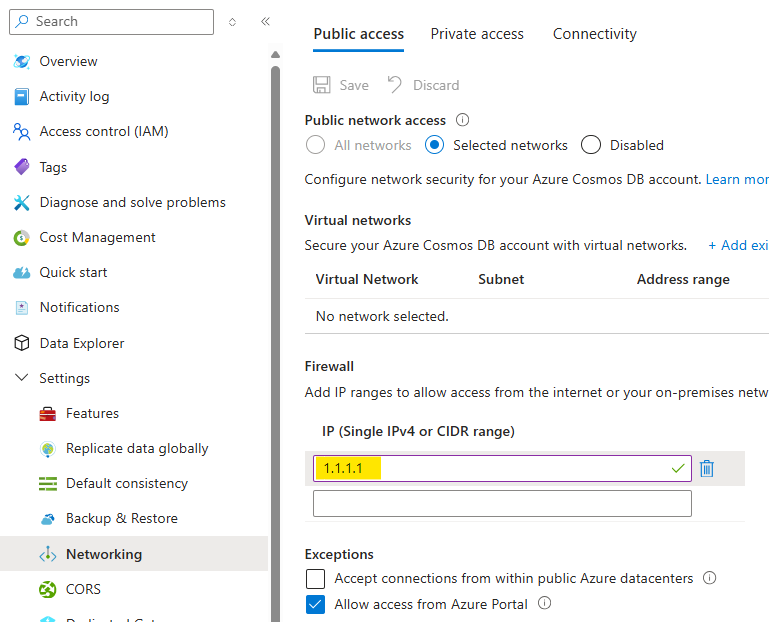
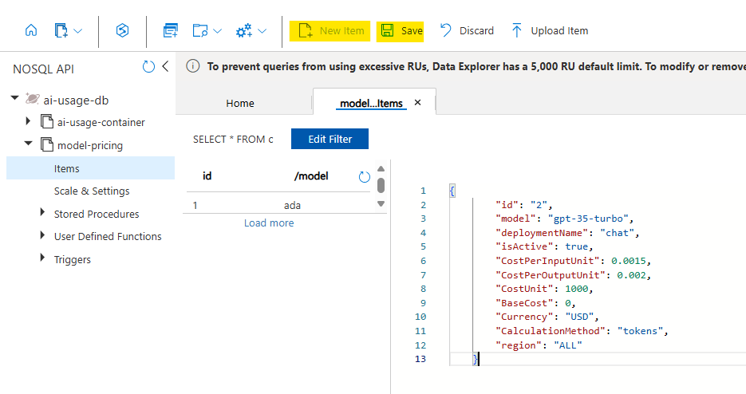
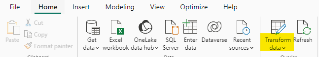
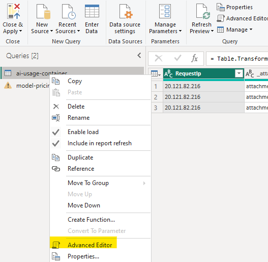
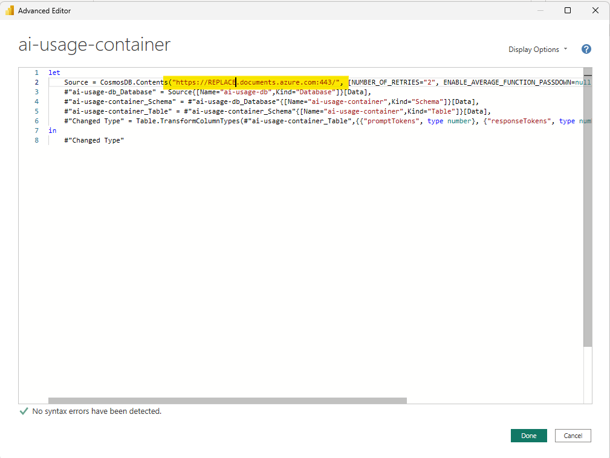
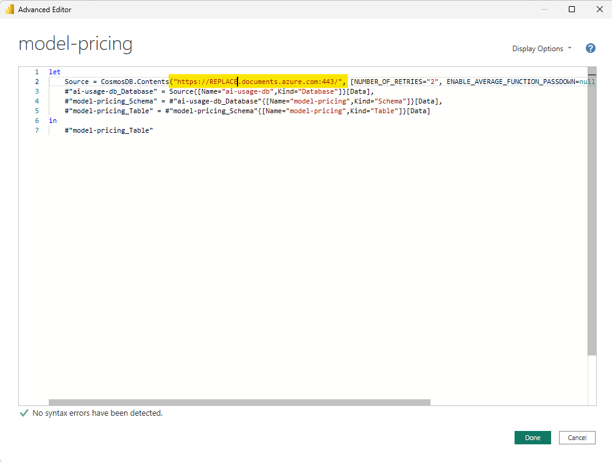

# Power BI Dashboard

Power BI is a business analytics service by Microsoft. It aims to provide interactive visualizations and business intelligence capabilities with an interface simple enough for end users to create their own reports and dashboards.

In this accelerator, we will be using Power BI to create a dashboard that will display the data from the Cosmos DB Database.

## Prerequisites

- Download and install the Power BI Desktop application from the [Microsoft Store on Windows](https://www.microsoft.com/store/productId/9NTXR16HNW1T?ocid=pdpshare) or from [App Store](https://go.microsoft.com/fwlink/?LinkId=526218&clcid=0x409) on Mac.

- Make sure that you can access the Cosmos DB from your local machine (you might need to allow you public IP to access Cosmos DB).

 

- Insert initial data into the model-pricing container (sample data for the model-pricing container can be found in the [/src/usage-reports/model-pricing.json](../src/usage-reports/model-pricing.json)).



> **Note:** Pricing in the sample file is based on the public Azure pricing for East US region (which in many cases similar to other regions). You can review the prices on Azure docs related to the service being used and update the ```model-pricing``` accordingly.

Below is a sample pricing entry for gpt-4o:

```json
{
    "id": "4",
    "model": "gpt-4o",
    "deploymentName": "gpt-4o",
    "isActive": true,
    "CostPerInputUnit": 0.005,
    "CostPerOutputUnit": 0.015,
    "CostUnit": 1000,
    "BaseCost": 0,
    "Currency": "USD",
    "CalculationMethod": "tokens",
    "region": "ALL"
}
```

## Preparing the Power BI Dashboard

Now you can open the [src/usage-reports/AI-Hub-Gateway-Usage-Report-v1-5-Incremetal.pbix](../src/usage-reports/AI-Hub-Gateway-Usage-Report-v1-5-Incremetal.pbix) file in the Power BI Desktop application.

As this PowerBI file is using import mode, you should see some data already there from previously connected data source.

In order to link the dashboard to the Cosmos DB, you need to update the connection string in the Power BI file.

1. Click on "Transform Data" in the Home tab.



2. Right click on the "ai-usage-container" data table and select "Advanced Editor".



3. Replace the Cosmos DB endpoint with the one you have deployed.



4. Repeat the same for model-pricing data table.



5. Click on "Refresh Preview" to force the Power BI to refresh the data.

6. Click on "Close & Apply" to save the changes.

7. Now you should see the data from the Cosmos DB in the Power BI.


8. If you need to get fresh copy of the data, you can click on "Refresh" in the Home tab.

## Activating additional metadata

AI Hub Gateway solution accelerator provides additional metadata that can be used to enhance the Power BI dashboard. This metadata is stored in the Cosmos DB and can be accessed through the Power BI dashboard through additional customization.

The current data model includes the following additional metadata:
- **endUserId**: The ID of the end user making the request.
- **sessionId**: The ID of the user session.
- **appId**: The ID of the application/agent making the request.

To leverage these metadata, recommended approach is to send special headers in the API request to the AI Hub Gateway. This will allow you to track the usage of the AI services by end users, sessions, and applications.

The following APIM policy snippet show example of how to capture these metadata and send them to the AI Hub Gateway:

```xml
<set-variable name="endUserId" value="@(context.Request.Headers.GetValueOrDefault("endUserId", "NA-HEADER"))" />
<set-variable name="sessionId" value="@(context.Request.Headers.GetValueOrDefault("sessionId", "NA-HEADER"))" />
<set-variable name="appId" value="@(context.Request.Headers.GetValueOrDefault("appId", "NA-HEADER"))" />
```

Adding these variable assignment can be included in the ```inbound``` section of the API Policy (if you want it applied to all calls to the API) or in specific APIM Product policy (if you want it applied to specific product only).

OpenAI streaming logs has limited dimensions support, if this metadata is required for OpenAI streaming logs, you can update the openai-usage-streaming policy fragment to include these variables as dimensions.

>**Note:** You can extend data model to include additional metadata that can be captured from the API request. Keep in mind that this will require updates to usage collection policy fragments (like ai-usage, openai-usage and openai-usage-streaming).