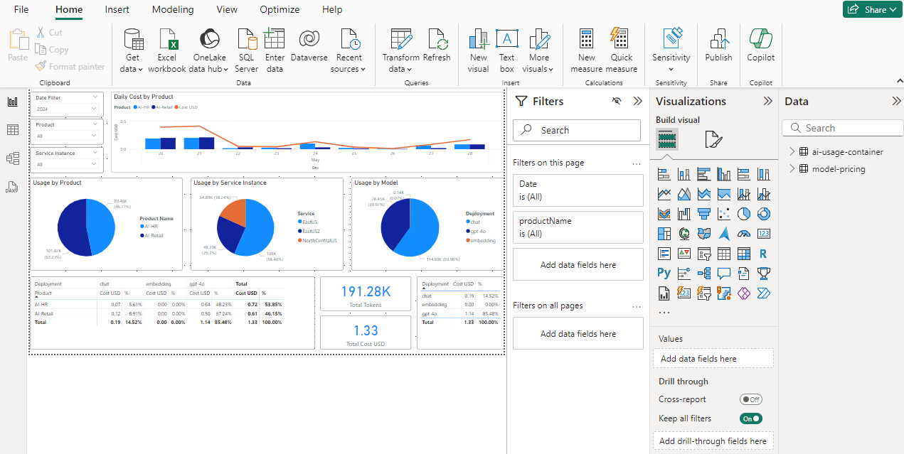

# Power BI Dashboard

Power BI is a business analytics service by Microsoft. It aims to provide interactive visualizations and business intelligence capabilities with an interface simple enough for end users to create their own reports and dashboards.

In this accelerator, we will be using Power BI to create a dashboard that will display the data from the Cosmos DB Database.

## Prerequisites

- Download and install the Power BI Desktop application from the [Microsoft Store on Windows](https://www.microsoft.com/store/productId/9NTXR16HNW1T?ocid=pdpshare) or from [App Store](https://go.microsoft.com/fwlink/?LinkId=526218&clcid=0x409) on Mac.

- Make sure that you can access the Cosmos DB from your local machine (you might need to allow you public IP to access Cosmos DB).

 

- Insert initial data into the model-pricing container (sample data for the model-pricing container can be found in the [/src/usage-reports/model-pricing.json](../src/usage-reports/model-pricing.json)).


> **Note:** Pricing in the sample file is based on the public Azure pricing for East US region (which in many cases similar to other regions). You can review the prices on Azure docs related to the service being used and update the ```model-pricing``` accordingly.

## Preparing the Power BI Dashboard

Now you can open the [src/usage-reports/AI-Hub-Gateway-Usage-Report-v1-4.pbix](../src/usage-reports/AI-Hub-Gateway-Usage-Report-v1-4.pbix) file in the Power BI Desktop application.

As this PowerBI file is using import mode, you should see some data already there from previously connected data source.

In order to link the dashboard to the Cosmos DB, you need to update the connection string in the Power BI file.

1. Click on "Transform Data" in the Home tab.


2. Right click on the "ai-usage-container" data table and select "Advanced Editor".


3. Replace the Cosmos DB endpoint with the one you have deployed.


4. Repeat the same for model-pricing data table.


5. Click on "Refresh Preview" to force the Power BI to refresh the data.

6. Click on "Close & Apply" to save the changes.

7. Now you should see the data from the Cosmos DB in the Power BI.



8. If you need to get fresh copy of the data, you can click on "Refresh" in the Home tab.