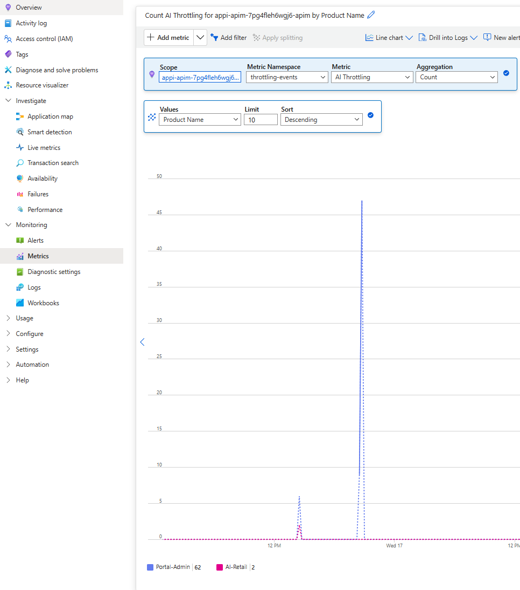
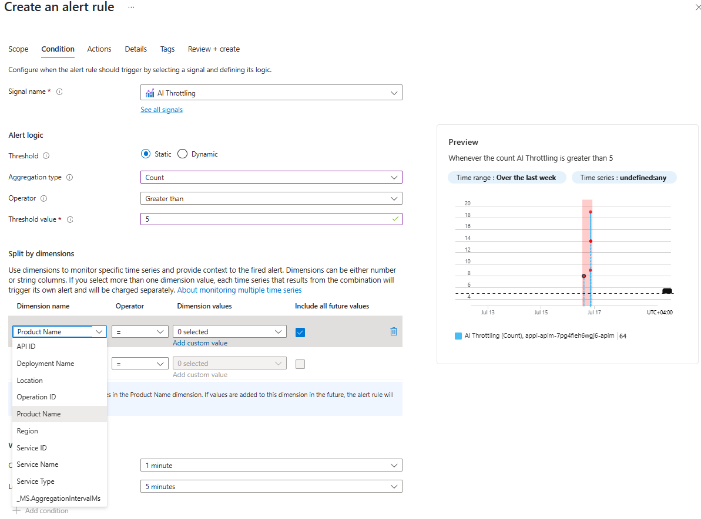

# Throttling Events Handling

One of the key things to consider when working with AI Apps, is throttling.

Throttling can happen due to the fact that AI backend is ran out of capacity (which AI Hub Gateway can help in mitigating by automatically failing back to another instance) or due to implemented capacity control measures in the AI Hub Gateway (preventing certain use cases from exceeding allocated capacity).

## Handling Throttling Events in AI Hub Gateway
In either case, it might be very important to keep an eye on these events especially in production environments.

AI Hub Gateway provides a mechanism that allows you to monitor these events per use case (product), per AI deployment/service and among other dimensions so you can take measures to address these events.

A policy fragement [throttling-events](../infra/modules/apim/policies/frag-throttling-events.xml) is used to raise Application Insights custom metrics for throttling events.

```xml
<fragment>
    <choose>
        <when condition="@(context.Response.StatusCode == 429)">
            <emit-metric name="AI Throttling" value="1" namespace="throttling-events">
                <dimension name="API ID" />
                <dimension name="Operation ID" />
                <!-- <dimension name="Subscription ID" /> -->
                <dimension name="Location" />
                <dimension name="Product Name" value="@(context.Product?.Name?.ToString() ?? "Portal-Admin")" />
                <dimension name="Deployment Name" value="@((string)context.Variables["target-deployment"])" />
                <dimension name="Service Name" value="@((string)context.Variables["service-name"] ?? "NA")" />
            </emit-metric>
        </when>
    </choose>
</fragment>
```

By referencing this policy in ```on-error``` section of an API, it will capture and raise ```429``` too many requests status code as a custom metric in Application Insights.

```xml
<on-error>
    <base />
    <!-- This is used to push custom metrics related to 429 throttleing errors -->
    <!-- It is designed to premit setting up Azure Monitor Alerts notifying the team of potential service degredation -->
    <set-variable name="service-name" value="Azure Open AI" />
    <set-variable name="target-deployment" value="@((string)context.Request.MatchedParameters["deployment-id"])" />
    <include-fragment fragment-id="throttling-events" />
</on-error>
```

It is designed in a way that the fragment is expecting 2 variables to be set by the referencing API to allow it to be used across multiple APIs that has the potentially of being throttled.

## View throttling events in Application Insights

Once the policy is in place, you can view the custom metric in Application Insights under Metrics with ```throttling-events``` namespace and ```AI Throttling``` metric name.

You can also split the metric by the different dimensions to get a better understanding of the throttling events (in the chart below I'm splitting by ```Product Name```).



## Creating Alerts in Azure Monitor

Having a nice dashboard is helpful, but it is even more helpful to have alerts that can notify you when certain throttling thresholds are met.

You can create alerts in Azure Monitor based on the custom metric ```AI Throttling``` and set the threshold that you want to be notified on.



You can create a generic alert that will notify you when the number of throttling events exceeds a certain threshold.

You can also create refined alert that will notify you when the number of throttling events exceeds a certain threshold for a specific product or AI deployment.

## Conclusion

Throttling events can be a sign of potential service degradation and it is important to monitor and address them as soon as possible.

AI Hub Gateway provides a mechanism to monitor these events and take measures to address them.

Although using Alerts can be helpful, it is important to keep in mind the following points:
- Alerts should be used in significant events that require attention not a noisy notification that will be ignored over time.
- Add in place a mechanism to address the issue that caused the throttling event in the first place.
- Keep an eye on the alerts and adjust the thresholds as needed.


