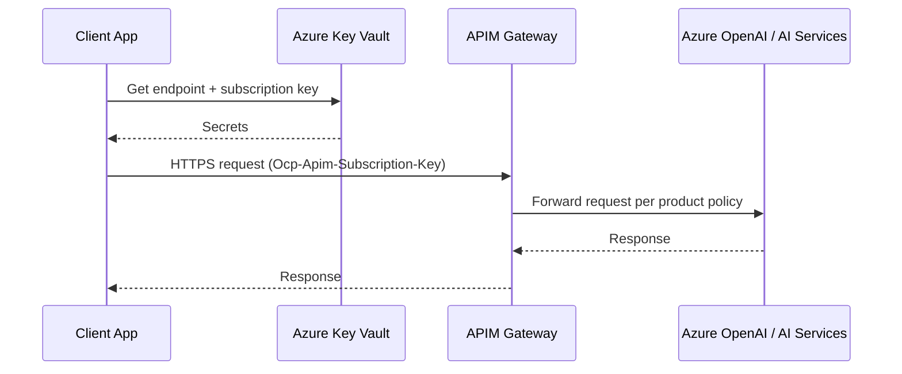
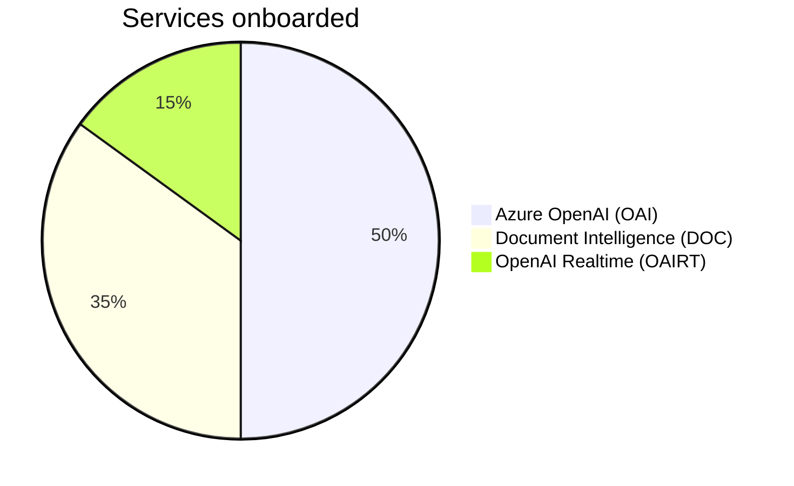
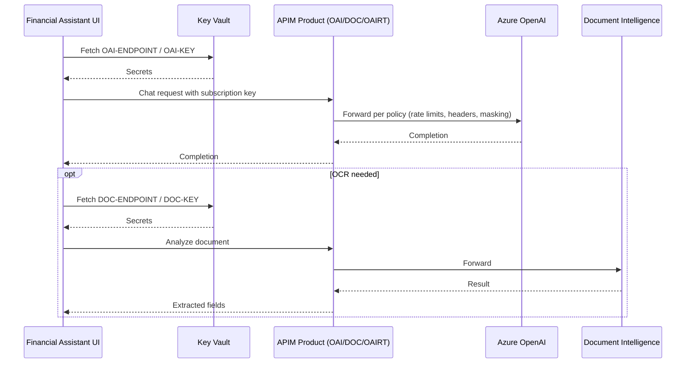

# 🚀 Use Case Onboarding for AI Hub Gateway (Automation)

Part of operating AI Hub Gateway as central AI governance, security and observability, you need to add use-cases and on-board teams to avail access to approved AI services.

This Bicep package simplifies the onboarding process by automating the creation of necessary resources and configurations, but providing a source-controlled parameter file with the use case needs and details.

Automate onboarding of a new use case to your existing APIM-based AI Gateway using a small, reusable Bicep package.

What this delivers
- 📦 Per-service APIM Product named `<serviceCode>-<BU>-<UseCase>-<ENV>`
- 🧩 Adds chosen APIs to the product and applies a default or custom policy
- 🔑 Creates a Subscription `<product>-SUB-01` and captures its primary key
- 🔐 Writes endpoint URL + subscription primary key to your target Key Vault
- 🧪 Optional: Wire your app/Container Apps env vars to these Key Vault secrets

---

## 🗺️ Visual overview

```mermaid
flowchart LR
  subgraph Input["Inputs (parameters)"]
    P1[APIM: subId, rg, name]
    P2[Key Vault: subId, rg, name]
    P3[Use Case: BU, Name, ENV]
    P4[Existing Services → API resource IDs]
    P5[Services selection + optional policy XML]
  end

  subgraph Orchestrator["main.bicep"]
    O1[Build product name]
    O2[Create APIM Product]
    O3[Attach APIs + Policy]
    O4[Create Subscription]
    O5[Store endpoint + key in Key Vault]
  end

  subgraph Runtime["At runtime"]
    A1[App retrieves secrets from Key Vault]
    A2[App calls APIM Gateway]
    A3[APIM forwards to AI Services]
  end

  Input --> Orchestrator --> Runtime
```



### Runtime request flow


---

## 📁 Folder layout
- `main.bicep` – Orchestrates APIM product + subscription + Key Vault secrets per requested AI service
- `modules/`
  - `apimOnboardService.bicep` – Creates product, links APIs, applies policy, creates subscription
  - `apimProduct.bicep` – Reusable product module
  - `apimSubscription.bicep` – Reusable subscription module
  - `kvSecrets.bicep` – Creates/updates Key Vault secrets
- `policies/default-ai-product-policy.xml` – Safe default policy
- `samples/*.parameters.json` – Ready-to-use parameter files (including Financial Assistant)

---

## 🔧 Parameters (main.bicep)

| Name | Type | Required | Description | Example |
|------|------|----------|-------------|---------|
| `apim` | object | ✅ | Target APIM instance identifiers | `{ subscriptionId, resourceGroupName, name }` |
| `keyVault` | object | ✅ | Key Vault for secret storage | `{ subscriptionId, resourceGroupName, name }` |
| `useCase` | object | ✅ | Naming context for the product | `{ businessUnit, useCaseName, environment }` |
| `existingServices` | object | ✅ | Map of service codes to APIM API resource IDs | `{ OAI: { apiResourceIds: ["/subscriptions/.../apis/azure-openai-service-api"] }, ... }` |
| `services` | array | ✅ | Which services to onboard and how to name their secrets | `[ { code: "OAI", endpointSecretName: "OAI-ENDPOINT", apiKeySecretName: "OAI-KEY", policyXml?: "<policies>...</policies>" } ]` |
| `productTerms` | string | ❌ | Terms of use shown in APIM product | "By using this product you agree..." |

Notes
- Endpoint secret value format: `${apimGatewayUrl}/${apiPath}`. The `apiPath` comes from the first API listed for that service code in `existingServices`.

---

## 🧱 What gets created

| Component | Scope | Naming | Notes |
|-----------|-------|--------|-------|
| APIM Product | APIM | `<serviceCode>-<BU>-<UseCase>-<ENV>` | One per service code you include |
| APIM Subscription | APIM | `<product>-SUB-01` | Primary key is captured into Key Vault |
| Key Vault Secrets | KV | `endpointSecretName`, `apiKeySecretName` | One endpoint + one key per service |

Naming examples
- Product: `OAI-Retail-FinancialAssistant-DEV`
- Subscription: `OAI-Retail-FinancialAssistant-DEV-SUB-01`

---

## ✅ Prerequisites

| Area | Requirement |
|------|-------------|
| Identity | Deployer has rights to: read APIM, write APIM Products/Subscriptions, and set Key Vault secrets |
| APIM | APIs already exist in the target APIM; their resource IDs provided via `existingServices` |
| Key Vault | Accessible by deployer; secrets will be upserted |
| Azure CLI | If deploying via CLI: `az` authenticated to the correct subscription |

---

## ⚡ Quickstart
1) Pick or copy a parameter file in `infra/usecase-onboarding/samples` and fill in values.
2) Deploy at subscription scope.

Azure CLI (subscription scope)
```bash
az deployment sub create \
  --name usecase-onboarding \
  --location <region> \
  --template-file infra/usecase-onboarding/main.bicep \
  --parameters @infra/usecase-onboarding/samples/usecase.parameters.json
```

Optional safety check (what-if)
```bash
az deployment sub what-if \
  --location <region> \
  --template-file infra/usecase-onboarding/main.bicep \
  --parameters @infra/usecase-onboarding/samples/usecase.parameters.json
```

---

## 📤 Outputs

| Output | Description |
|--------|-------------|
| `apimGatewayUrl` | APIM gateway base URL |
| `products[]` | List of created products |
| `subscriptions[]` | For each service, the resolved Key Vault secret names for endpoint + API key |

---

## 🧩 Customization tips
- Per-product policy overrides: set `policyXml` on a service item in `services[]`.
- Add/remove services by adjusting `services[]` and ensuring `existingServices` contains the matching API resource IDs.
- For app workloads (e.g., Azure Container Apps), wire env vars to the Key Vault secrets created here.

---

## 💼 Practical example: Financial Assistant onboarding

Business goal
- Build a Retail Banking Financial Assistant that uses Azure OpenAI (chat/completions), Document Intelligence (OCR/extraction), and optional OpenAI Realtime for voice.

Included services in this example


Where to start
- Parameters file (generic placeholders): `infra/usecase-onboarding/samples/financial-assist-usecase.parameters.json`

Key fields (excerpt)
- `useCase`: `{ businessUnit: "Retail", useCaseName: "FinancialAssistant", environment: "DEV" }`
- `existingServices` (must point to APIs already published in APIM):
  - `OAI` → `/apis/azure-openai-service-api`
  - `DOC` → `/apis/document-intelligence-api` (+ legacy if needed)
  - `OAIRT` → `/apis/openai-realtime-ws-api`
- `services`:
  - `{ code: "OAI", endpointSecretName: "OAI-ENDPOINT", apiKeySecretName: "OAI-KEY" }`
  - `{ code: "DOC", endpointSecretName: "DOC-ENDPOINT", apiKeySecretName: "DOC-KEY" }`
  - `{ code: "OAIRT", endpointSecretName: "OAIRT-ENDPOINT", apiKeySecretName: "OAIRT-KEY" }`

Deploy (subscription scope)
```bash
az deployment sub create \
  --name finassist-onboarding \
  --location <region> \
  --template-file infra/usecase-onboarding/main.bicep \
  --parameters @infra/usecase-onboarding/samples/financial-assist-usecase.parameters.json
```

After deployment: app wiring
- Read `OAI-ENDPOINT` and `OAI-KEY` from Key Vault to call the APIM-fronted OpenAI endpoint.
- Likewise for `DOC-ENDPOINT`/`DOC-KEY` and `OAIRT-ENDPOINT`/`OAIRT-KEY`.
- Use the `apimGatewayUrl` combined with each API path to form the full endpoint.

Runtime flow (Financial Assistant)


---

## 🛠️ Troubleshooting
- Deployment fails with authorization errors: ensure your identity has APIM Contributor (or equivalent) and Key Vault Secret Set permissions.
- Product created but missing APIs: confirm `existingServices.*.apiResourceIds` point to valid API resource IDs in the same APIM instance.
- App calls return 401/403: verify you are using the subscription key created for the product and that the product is published.
- Secrets missing in Key Vault: check that secret names in `services[]` are unique and permitted by your KV naming rules.

---

## 📚 See also
- `guides/apim-configuration.md` for APIM setup
- `guides/openai-onboarding.md` and `guides/doc-intell-onboarding.md` for backend service considerations
- `guides/power-bi-dashboard.md` for usage analytics
